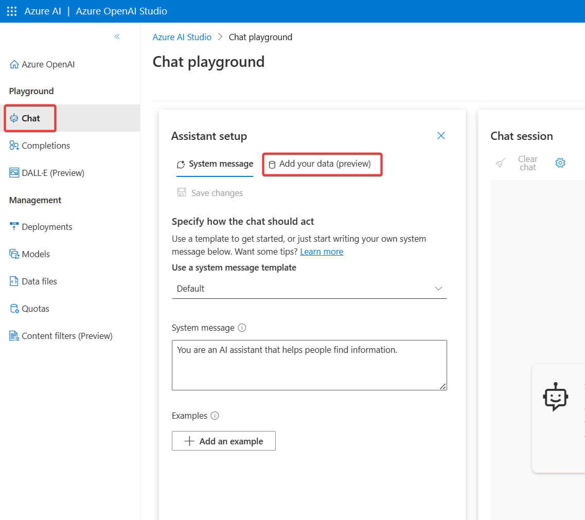

https://learn.microsoft.com/ja-jp/training/modules/use-own-data-azure-openai/

https://learn.microsoft.com/ja-jp/azure/ai-services/openai/use-your-data-quickstart?tabs=command-line&pivots=programming-language-studio

https://learn.microsoft.com/ja-jp/azure/ai-services/openai/concepts/use-your-data

- on your dataを使わない場合
  - 事前トレーニング済みの知識
  - システムプロンプトで与えた知識
  - 例（Few-Shot学習）で与えた知識
  - ユーザーのプロンプトで与えた知識
- on your dataを使う場合
  - 事前トレーニング済みの知識
  - システムプロンプトで与えた知識
  - 例（Few-Shot学習）で与えた知識 ... on your dataとは組み合わせ不可
  - ユーザーのプロンプトで与えた知識
  - Azure Cognitive Searchから得られる知識

手順

- ユーザー プロンプトを受信します。
- プロンプトの関連するコンテンツと意図を特定します。
- そのコンテンツと意図を使用して検索インデックスにクエリを実行します。
- システム メッセージとユーザー プロンプトと共に、検索結果チャンクを Azure OpenAI プロンプトに挿入します。
- プロンプト全体を Azure OpenAI に送信します。
- 応答とデータ参照 (存在する場合) をユーザーに返します。

回答のソースを独自データに限定することもできる

既定で、独自のデータに基づく Azure OpenAI では、モデルがデータのみを使用して応答することが推奨されますが、必要なわけではありません。 この設定は、データを接続するときにオフにできます。その結果、モデルがデータより事前トレーニング済みの知識を使用することを選択する可能性があります

## 微調整（ファインチューニング） vs 独自のデータの使用

ファインチューニング

追加のデータセットを与えてカスタムモデルを作成する

メリット
- 例（Few-Shot学習）を小さくできる
デメリット
- コストが増加する
- 手間がかかる
- 時間がかかる

## 操作

チャットプレイグラウンドから操作する

チャット モデルでは、バージョン gpt-35-turbo (0301)、gpt-35-turbo-16k、gpt-4、gpt-4-32k を使用できます

CompletionsやDALL-Eプレイグラウンドでは使用できない。

