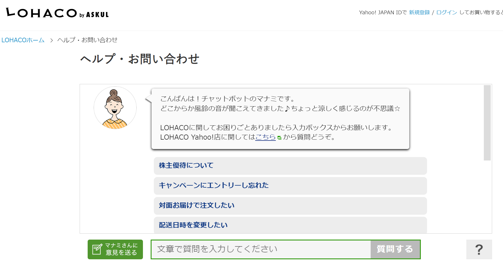
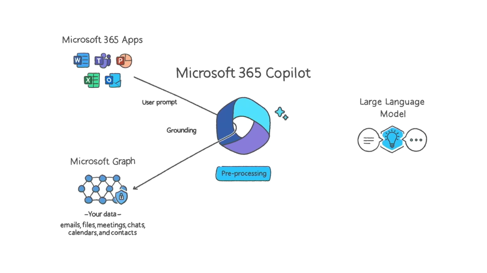
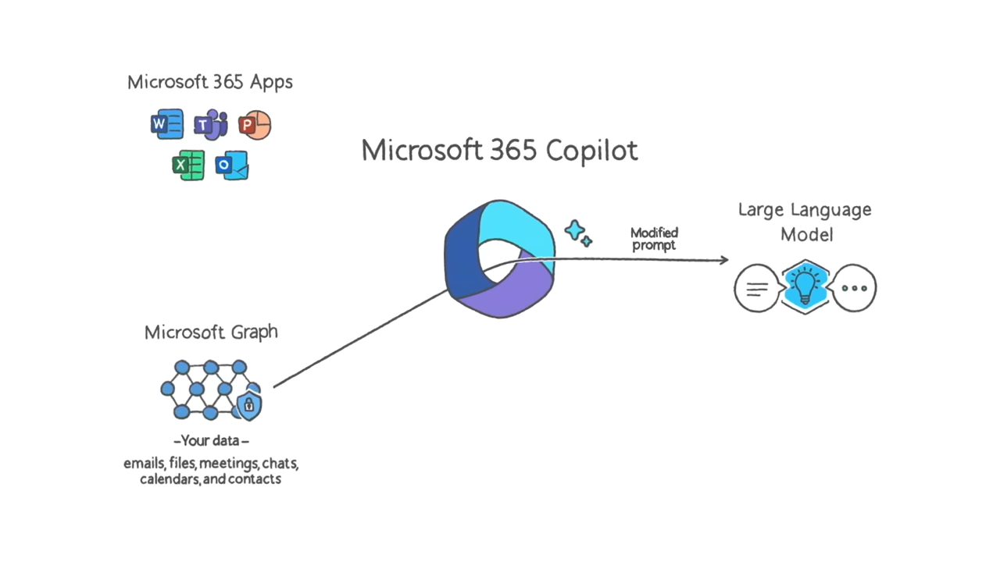

# モジュール1: Azure OpenAI Service の概要


https://learn.microsoft.com/ja-jp/training/modules/explore-azure-openai/

- 機械学習（マシンラーニング）、AI、生成AIについて理解する
- 生成 AI モデルについて理解する
- Azure OpenAI の言語、コード、イメージの機能について理解する
- Azure OpenAI の「責任ある AI 原則」と利用規約について理解する

## 機械学習（マシンラーニング）とは？

Microsoftの機械学習の解説ページ:
https://azure.microsoft.com/ja-jp/resources/cloud-computing-dictionary/what-is-machine-learning-platform

大量のデータをコンピューターに与えて学習させ、データの分類や判断、予測などを行えるようにすること。

たとえば、大量の「犬の画像」と「猫の画像」をコンピューターに学習させることで、犬と猫の画像を認識することができる「機械学習モデル」を構築する（トレーニング）。

```
ユーザー
↓大量の画像データ（ラベルつき）
「機械学習モデル」
```

構築（トレーニング）した「機械学習モデル」に、新しい画像データを与えると、「犬」「猫」といったように画像の分類や認識ができるようになる。

```
ユーザー
↓画像データ↑判定結果（犬/猫）
トレーニング済みの「機械学習モデル」
```

機械学習を活用できる範囲は多岐にわたる。

- [金融: 不正行為の検出](https://www.google.com/search?q=%E9%87%91%E8%9E%8D+%E4%B8%8D%E6%AD%A3%E8%A1%8C%E7%82%BA%E3%81%AE%E6%A4%9C%E5%87%BA+%E6%A9%9F%E6%A2%B0%E5%AD%A6%E7%BF%92)
- [運輸: 配達ルートの最適化、自動運転](https://www.google.com/search?q=%E9%81%8B%E8%BC%B8++%E9%85%8D%E9%81%94%E3%83%AB%E3%83%BC%E3%83%88%E3%81%AE%E6%9C%80%E9%81%A9%E5%8C%96%E3%80%81%E8%87%AA%E5%8B%95%E9%81%8B%E8%BB%A2+%E6%A9%9F%E6%A2%B0%E5%AD%A6%E7%BF%92)
- [医療: 病気の診断](https://www.google.com/search?q=%E5%8C%BB%E7%99%82+%E7%97%85%E6%B0%97%E3%81%AE%E8%A8%BA%E6%96%AD+%E6%A9%9F%E6%A2%B0%E5%AD%A6%E7%BF%92)
- [農業: 田畑の監視](https://www.google.com/search?q=%E8%BE%B2%E6%A5%AD+%E7%94%B0%E7%95%91%E3%81%AE%E7%9B%A3%E8%A6%96+%E6%A9%9F%E6%A2%B0%E5%AD%A6%E7%BF%92)
- その他

対応するAzureサービス: Azure Machine Learning

## 参考: Azure Machine Learningとは？

公式サイト:
https://azure.microsoft.com/ja-jp/products/machine-learning

ドキュメント:
https://learn.microsoft.com/ja-jp/training/modules/prepare-to-develop-ai-solutions-azure/6-understand-capabilities-of-azure-machine-learning

「機械学習モデル」のトレーニング、デプロイ、管理、監視のためのクラウド プラットフォーム。

[2018/12/6 一般提供開始。](https://azure.microsoft.com/ja-jp/updates/azure-machine-learning-service-now-generally-available/)

ユーザー独自の「機械学習モデル」を構築したい場合に使用する。

※コース「[DP-100: Azure でのデータ サイエンス ソリューションの設計と実装](https://learn.microsoft.com/ja-jp/training/courses/dp-100t01)」で、機械学習の詳細について学ぶことができる。

## 言語モデルとは？

- 巨大なデータセット（膨大な量のテキスト）を使用して学習させた、機械学習モデルの一種。
- 文章の並び方（単語の出現）に確率を用いてモデル化したもの。
- 単語列に対し、次に来る単語を確率分布で表したもの。
- より自然な文章の並びに対して高い確率を割り当て、文章として成立しない並びには低い確率を割り当てる。

言語モデルのイメージ:

```
日本の首都は[...]
↓
東京 (95%)
大阪 (10%)
名古屋 (5%)
```

## 大規模言語モデル（large language model、LLM）とは？

https://ja.wikipedia.org/wiki/%E5%A4%A7%E8%A6%8F%E6%A8%A1%E8%A8%80%E8%AA%9E%E3%83%A2%E3%83%87%E3%83%AB

多数のパラメータ（数千万から数十億）を持つ人工ニューラルネットワークで構成されるコンピュータ言語モデルで、膨大なラベルなしテキストを使用して自己教師あり学習または半教師あり学習（英語版）によって訓練が行われる。

2018年頃に登場。

大規模コーパス（自然言語処理の研究に用いるため、自然言語の文章を構造化し大規模に集積したもの）で事前訓練された、数百万から数十億以上のパラメータを持つモデルを指すことが多い。

<!--
大規模モデルが、小規模モデルとは異なる速度で突然に能力を獲得することがある。これは「創発的能力」（英: emergent abilities）として知られている。
-->

## 参考: LLMの種類

- [GPT(Generative Pretrained Transformer)](https://www.google.com/search?q=gpt+%E5%A4%A7%E8%A6%8F%E6%A8%A1%E8%A8%80%E8%AA%9E%E3%83%A2%E3%83%87%E3%83%AB)
- [BERT(Bidirectional Encoder Representations from Transformers)](https://www.google.com/search?q=BERT+%E5%A4%A7%E8%A6%8F%E6%A8%A1%E8%A8%80%E8%AA%9E%E3%83%A2%E3%83%87%E3%83%AB)
- [PALM(Pathways Language Mode)](https://www.google.com/search?q=palm+%E5%A4%A7%E8%A6%8F%E6%A8%A1%E8%A8%80%E8%AA%9E%E3%83%A2%E3%83%87%E3%83%AB)
- [LaMDA(Language Model for Dialogue Applications)](https://www.google.com/search?q=LaMDA+%E5%A4%A7%E8%A6%8F%E6%A8%A1%E8%A8%80%E8%AA%9E%E3%83%A2%E3%83%87%E3%83%AB)
- [LLaMA(Large Language Model Meta AI)](https://www.google.com/search?q=LLaMA+%E5%A4%A7%E8%A6%8F%E6%A8%A1%E8%A8%80%E8%AA%9E%E3%83%A2%E3%83%87%E3%83%AB)
- [Code Llama(Large Language Model Meta AI)](https://www.google.com/search?q=Code+Llama+%E5%A4%A7%E8%A6%8F%E6%A8%A1%E8%A8%80%E8%AA%9E%E3%83%A2%E3%83%87%E3%83%AB)
- [ELMo(Embeddings from Language Model)](https://www.google.com/search?q=ELMo+%E5%A4%A7%E8%A6%8F%E6%A8%A1%E8%A8%80%E8%AA%9E%E3%83%A2%E3%83%87%E3%83%AB)
- [ULMFiT(Universal Language Model Fine-tuning)](https://www.google.com/search?q=ULMFiT+%E5%A4%A7%E8%A6%8F%E6%A8%A1%E8%A8%80%E8%AA%9E%E3%83%A2%E3%83%87%E3%83%AB)
- [Toolformer](https://www.google.com/search?q=Toolformer+%E5%A4%A7%E8%A6%8F%E6%A8%A1%E8%A8%80%E8%AA%9E%E3%83%A2%E3%83%87%E3%83%AB)


## 参考: 日本語に特化した（日本語で学習された）LLM

- [OpenCALM(サイバーエージェント)](https://www.google.com/search?q=OpenCALM)
- [japanese-gpt-neox-3.6b(rinna株式会社)](https://www.google.com/search?q=japanese-gpt-neox-3.6b)
- [Japanese StableLM Alpha 7B(Stability AI)](https://www.google.com/search?q=Japanese+StableLM+Alpha+7B)
- [japanese-large-lm(LINE株式会社)](https://www.google.com/search?q=japanese-large-lm)
- [HyperCLOVA(LINE株式会社)](https://www.google.com/search?q=HyperCLOVA)
- [Weblab-10B(東京大学松尾研究室)](https://www.google.com/search?q=Weblab-10B)

## AI（人工知能）とは？

https://learn.microsoft.com/ja-jp/training/modules/get-started-ai-fundamentals/1-introduction

人間の行動と能力を模倣するソフトウェア。

人の持つ判断・認知・情報処理の一部をコンピューターで実現するもの。

音声の認識、画像の認識、テキストの認識、音声の聞き取り、翻訳などを行える。

AI（人工知能）は、機械学習モデルを利用して実装される（機械学習モデルは、AIの基盤となる）。

## 機械学習とAI（人工知能）は何が違うのか？

https://azure.microsoft.com/ja-jp/resources/cloud-computing-dictionary/what-is-machine-learning-platform

機械学習はAI（人工知能）の一部とみなされる。

https://www.soumu.go.jp/johotsusintokei/whitepaper/ja/r01/html/nd113210.html

AI（人工知能）のうち、人間の「学習」に相当するしくみをコンピューター等で実現するもの。

https://business.ntt-east.co.jp/content/cloudsolution/column-159.html

AI（人工知能）をうまく機能させるための方法の1つが機械学習。

https://cloud.google.com/learn/artificial-intelligence-vs-machine-learning?hl=ja

- AI（人工知能）: 人間の知能を模倣するもの
- 機械学習: モデルを使用して、データから予測を行うもの

https://blogs.nvidia.co.jp/2016/08/09/whats-difference-artificial-intelligence-machine-learning-deep-learning-ai/

- AI（人工知能）: 1950年代に登場したアイデア
- 機械学習: 1980年代に登場した技法。AI（人工知能）に含まれる。

## 生成AI(Generative AI)とは？

https://www.microsoft.com/ja-jp/startups/ai

人工知能が自動的にテキストや画像などのコンテンツを生成する技術。

https://www.nri.com/jp/knowledge/glossary/lst/sa/generative_ai

＞生成AI（または生成系AI）とは、「Generative AI：ジェネレーティブAI」とも呼ばれ、さまざまなコンテンツを生成できるAIのことです。従来のAIが決められた行為の自動化が目的であるのに対し、生成AIはデータのパターンや関係を学習し、新しいコンテンツを生成することを目的としています。

生成AIは、「大規模言語モデル（Large Language Models、LLM）」を使用して作られている。

## 生成AIでは何ができるのか？

https://platform.openai.com/examples

- 文章の生成
- 文章の要約
- 文章からのキーワードの抽出
- 質問への回答
- 翻訳
- 感情分析
- テキストの文法ミスを指摘・修正
- 会議の議事録を生成
- 製品名（案）の生成
- プログラムコードやスクリプトの生成、修正
  - ARMテンプレート、Bicepの生成
  - 設定ファイルの生成
  - SQL文の生成
- 表、スライドの生成
- 小説、漫画、ゲームキャラクター、音楽の生成
- 旅行の計画の生成
- 料理レシピの提案

## 生成AI利用上の一般的な問題点・注意点

- AIに入力した情報は、それらがAI側のサービスに記録されたり、モデルのトレーニングに使用されたりする場合がある
  - 機密情報や個人情報、社外秘の情報などはAIに入力しない。
  - [Azure OpenAI では、モデルの再トレーニングに顧客データは使用されない。](https://learn.microsoft.com/ja-jp/azure/ai-services/openai/faq#----------------------------)
- AIの回答・生成には、誤り、偏り、不適切な提案、著作権の問題などが含まれる場合がある
  - AIの出力を確認して使用するのは利用者の責任となる。
  - [マイクロソフトは商用のCopilotサービスやBing Chat Enterpriseの利用者に対し、AIで生成された出力に関する著作権のリスクを負うという新しいコミットメントを発表。](https://news.microsoft.com/ja-jp/2023/09/12/230912-copilot-copyright-commitment-ai-legal-concerns/)

## ハルシネーション（hallucination、幻覚）とは？

https://ja.wikipedia.org/wiki/%E5%B9%BB%E8%A6%9A_(%E4%BA%BA%E5%B7%A5%E7%9F%A5%E8%83%BD)

人工知能の幻覚（hallucination ハルシネーション）は、人工知能が学習したデータからは正当化できないはずの回答を堂々とする現象。

例えば、テスラの収益に関する知識がないチャットボットがこの現象に陥ると、もっともらしいと判断したランダムな数字（130.6億ドルのような）を内部的にピックアップして、間違っているにもかかわらずテスラの収益は130.6億ドルだと繰り返すようになる。そしてこのとき、人工知能の内部ではこの数字が自身の創造の産物だということに気付いている兆候がみられない。

幻覚ではなく作話（[confabulation、覚えていることにおける隙間を埋める、あり得るが想像上の記憶](https://www.ei-navi.jp/dictionary/content/confabulation/)）という表現を好んで使う研究者もいる。

https://ja.wikipedia.org/wiki/ChatGPT#%E6%9D%B1%E4%BA%AC%E5%A4%A7%E5%AD%A6

2023年4月3日、東京大学は理事・副学長の太田邦史（おおた くにひろ）の署名付き文章で、全学生・教員向けにChatGPT、BingAIやBard等の生成AIの利用に関する注意喚起を行った。この文章では生成AIを『平和的かつ上手に制御して利用すれば』有益であるとする一方で技術的な課題があるとして、今後の社会への悪影響に対する懸念を表明した。また、生成AIの文章には嘘が含まれている可能性が高く、ChatGPTを使いこなすには、相当の専門的な知識が必要であり、回答を批判的に確認し、適宜修正することが必要であると指摘している。

[「ChatGPTの利用前提に全てを見直す方向へかじを切る」、東京大学の太田副学長](https://xtech.nikkei.com/atcl/nxt/column/18/02423/042300009/)

## チャットボットとは？

https://it-trend.jp/words/chatbot

「チャット」と「ボット」を組み合わせた言葉で、人工知能を活用した「自動会話プログラム」のこと。

■例: マナミさん（LOHACO）
https://lohaco.yahoo.co.jp/help/



チャットボットに生成AIを組み合わせることで、チャットボットが自然言語による質問や命令を理解し、応答できるようになった。


■例: AIさくらさん

https://www.tifana.ai/


## 参考: チャットボットの典型的な利用事例

- 社内文書を学習し、社内のノウハウをすばやく検索できるようにするチャットボット
- コンタクトセンターの会話を文字起こし・AIで学習させて、問題の解決方法を提案するチャットボット
- アプリに組み込まれ、ユーザーの作業を支援するチャットボット（コパイロット: 副操縦士）
  - 要約
  - ドキュメント生成
  - コード生成
  - 作業プランの提示

## 参考: Microsoft 365 Copilot





## Azure OpenAI Serviceとは？

https://learn.microsoft.com/ja-JP/azure/ai-services/openai/overview

- OpenAIの大規模言語モデルをサービスとして提供
- Azure内で実行される
- Azureのセキュリティ機能が利用できる
  - Azure AD認証＋ロールによる承認
  - 暗号化
  - プライベートエンドポイント

## 参考:「Azure OpenAI Service」と「Azure Cognitive Services」の関係は？

「Azure Cognitive Services」（コグニティブ サービス）は、画像処理・音声処理・自然言語処理などの「AIパーツ」を提供するサービス。

「Azure OpenAI Service」は「Azure Cognitive Services」の一部。

2023/7以降、「Azure Cognitive Services」という名前はなくなった。AzureのAIサービスはすべて「Azure AI Services」としてまとめられた。

現在「Azure OpenAI Service」は「Azure AI Services」の一部となっている。

```
Azureのサービス
├Azure Cognitive Services
│├画像処理(computer vision)
│├音声処理(speech)
│├自然言語処理(NLP)
│└Azure OpenAI Service
└Azure Applied AI Services
  ├Azure Cognitive Search
  └...
```

↓2023/7以降

```
Azureのサービス
└Azure AI Services
  ├Azure OpenAI Service
  ├画像処理(computer vision): 画像のラベル付け、説明文の生成...
  ├音声処理(speech): 音声認識、読み上げ
  ├自然言語処理(NLP): 言語の検出、翻訳、テキスト要約、感情分析...
  └...
```

## Azure OpenAI Serviceの機能(1)自然言語生成

- コンテンツの生成
- 質問への回答の生成
- 文章の要約
- 翻訳

## Azure OpenAI Serviceの機能(2)コード生成

- C#、Python、Java、JavaScriptなど、さまざまなプログラミング言語のコードを生成

## Azure OpenAI Serviceの機能(3)画像生成

- 入力された文章から、画像を生成

## Azure OpenAI Serviceでは、どのようなLLM（大規模言語モデル）を使用できるのか？

- GPTモデル(GPT-3.5, GPT-4): Completion, Chat Completionなどの生成・対話。
- Embeddings(埋め込み)モデル: 文書の数値ベクトルへの変換。類似文書の検索などに使用。
- DALL-E: 画像の生成。

詳しくはモジュール2で解説。

## Azure OpenAI Serviceはどのように使うのか？

■(1)リソースの作成、モデルのデプロイ・調整

```
開発者
↓
Azure portal (Azureの管理画面)
↓リソースの作成
Azure OpenAI Serviceリソース
└モデル
 ↑モデルのデプロイ、調整
Azure OpenAI Studio
 ↑
開発者
```

■(2)エンドユーザー向けアプリの作成

```
Azure OpenAI Serviceリソース
└モデル
  ↑
OpenAI SDK
  ↑
App Service Webアプリ等
  ↑
エンドユーザー（一般利用者）
```

詳しくはモジュール2以降で解説。

## Azure OpenAI Serviceに入力したデータはどのように扱われるのか？

https://learn.microsoft.com/ja-jp/legal/cognitive-services/openai/data-privacy

ユーザーが入力したデータは、
- Azureの環境で処理される。OpenAI社には提供されない。
- モデルのトレーニングや、Microsoftのサービスの改善には利用されない。
- 他のAzureユーザーはアクセスできない。
- 使用条件に違反する使用（悪用）を監視するために、Azure OpenAI はすべてのプロンプトと生成されたコンテンツを最大 30 日間保存する。
- データの保存時は、デフォルトでは、Microsoftが管理する暗号化キーを使用して暗号化される。
  - オプションで、ユーザーが管理する暗号化キーを使用して2重に暗号化することもできる。

## Azure OpenAI Serviceで禁止されていること（不正使用 abuse）とは？

https://learn.microsoft.com/ja-jp/legal/cognitive-services/openai/code-of-conduct?context=%2Fazure%2Fai-services%2Fopenai%2Fcontext%2Fcontext#integrations-with-azure-openai-service-must-not

一部抜粋:

- ヘイトスピーチ・差別・いやがらせ・詐欺・性的・テロ・暴力に関するコンテンツ生成など。
- 個人または社会に害を及ぼす可能性のあるコンテンツを生成するためにサービスを使用すること。
- [Microsoft’s Acceptable Use Policy（マイクロソフトの利用規約）](https://www.microsoft.com/licensing/terms/ja-JP/product/ForOnlineServices/all)に反すること
  - 不正なアクセスを目的とした利用
  - 暗号通貨マイニング
  - サービスが機能しなかった場合に死亡、重大な人身損害または重大な物理的損害につながる可能性がある用途
  - 法律、規制、政府命令、政令で禁止されている使用、または他者の権利を侵害する使用など。

不正使用監視の詳細:
https://learn.microsoft.com/ja-jp/azure/ai-services/openai/concepts/abuse-monitoring


## 「責任ある AI 原則」 (Responsible AI principles)とは

公式サイト:
https://www.microsoft.com/ja-jp/ai/responsible-ai

ドキュメント:
https://learn.microsoft.com/ja-jp/azure/machine-learning/concept-responsible-ai

Microsoft では、「責任ある AI」という考え方を採用している。主なもの:

- AIシステムではすべての人を公平に扱う必要がある。
  - 性別、民族などで差別をしない。
- AIシステムが、安全かつ確実に実行されるようにする。
  - 自動運転などでは安全性が極めて重要である。
- AIシステムが、プライバシーを尊重する必要がある。
  - AIに入力されたデータのプライバシーを守る。

Microsoft のAIサービスを利用するユーザーにも、Microsoftの「責任ある AI」の考え方に同意し、条件に従ってAIサービスを利用することを求めている。たとえば、Azure Cognitive ServiceやAzure Open AI Serviceのリソースを作成する際に、条件への「同意」を行う必要がある。

## 参考: 責任ある生成AI（Responsible Generative AI）

https://learn.microsoft.com/ja-jp/training/modules/responsible-generative-ai/

- 生成AIは、開発者が意図しない「有害な」情報を出力する可能性がある。
  - 例: レシピを生成するAI
    - AIが生成したレシピに沿って調理したものが有害である可能性がある
      - 食材に対して十分な加熱がされないレシピが生成されるなど
  - 不快、軽蔑的、または差別的なコンテンツを生成する可能性
  - 事実に関する不正確さを含むコンテンツを生成する可能性
  - 違法または非倫理的な行動や慣行を奨励または支持するコンテンツを生成する可能性
- テスト、特定、記録、優先順序付け、文書化して共有
- 軽減策を実施
  - モデルの調整
  - コンテンツフィルタリングの適用
  - 検索拡張生成(RAG)により、信頼できるデータソースを使用する
- 透明性をもたせる
  - テクノロジがどのように構築されているかについて、ユーザーに通知する
- ユーザーからフィードバックを集める（ユーザーがフィードバックを送信できるようにする）
- リリース前にレビューする

## 「透明性ノート」（transparency-note）

※「透過性に関するメモ」、「わかりやすさに関するメモ」などとも

https://learn.microsoft.com/ja-jp/legal/cognitive-services/openai/transparency-note

- 「透明性ノート」は、「責任ある AI 原則」を実践するための Microsoft の広範な取り組みの一環。
- Microsoft の AI テクノロジがどのように機能するか、システムのパフォーマンスと動作に影響を与えるシステム所有者が行う選択、テクノロジ、人材、環境を含むシステム全体について考えることの重要性を理解するのに役立つ文書。
- AIテクノロジがどのように構築されているか、どのようなことができるか、考慮事項、制限事項、ベストプラクティスなどが記載されている。
- 独自のシステムを開発または展開するときに透明性ノートを使用したり、システムを使用する人やシステムの影響を受ける人たちと透明性ノートを共有したりできる

## 知識チェック

https://learn.microsoft.com/ja-jp/training/modules/explore-azure-openai/9-knowledge-check

- 第1問: ChatGPT、OpenAI、Azure OpenAI はどのように関連していますか?
  - OpenAI: [人工知能の開発を行っているアメリカの企業](https://ja.wikipedia.org/wiki/OpenAI)。生成 AI モデルを使用するチャットボットである ChatGPT を開発した。
  - ChatGPT: OpenAI社が提供する、GPTを使用したチャットのサービス。
  - Azure OpenAI: Microsoftが提供するAIサービス。OpenAI の AI モデルの多くにアクセスできる。
- 第2問: あなたはテキストの段落を要約しようとしています。 このワークロードの解決には、どの生成 AI モデル ファミリを使用しますか?
  - GPT
- 第3問: Azure OpenAI で倫理的 AI プラクティスをサポートするために Microsoft が行っている 1 つのアクションとは何ですか?
  - MicrosoftはAIのサービスに対する「透明性ノート」（transparency-note）を提供している。
  - テクノロジがどのように構築されているかについて伝え、その影響を考慮するようユーザーに求めている。
