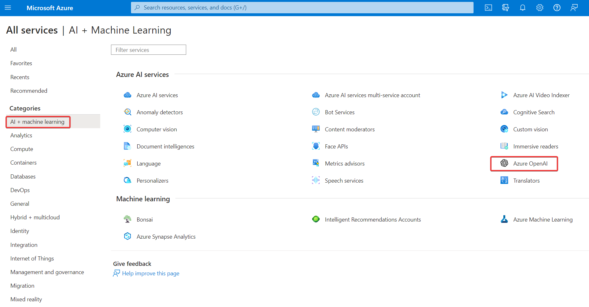
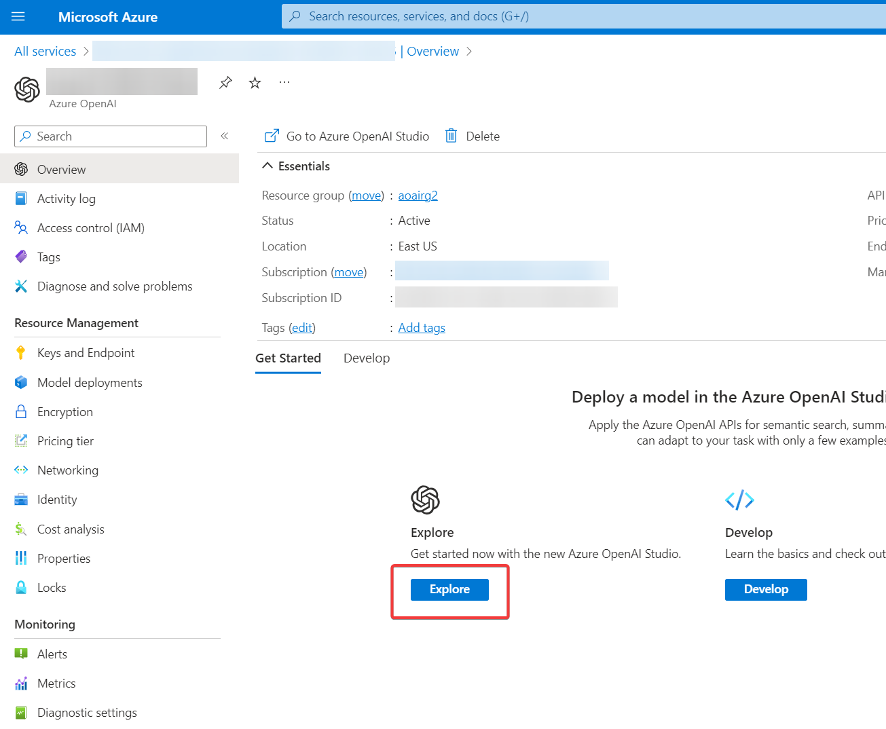
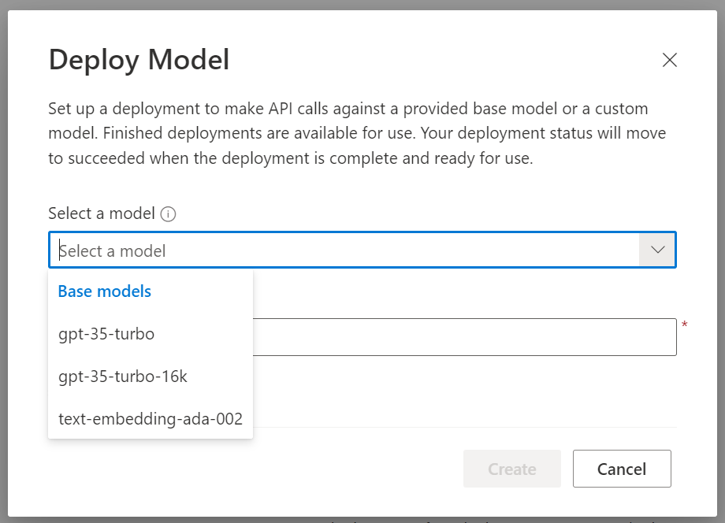
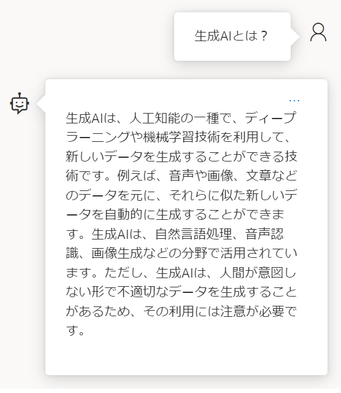
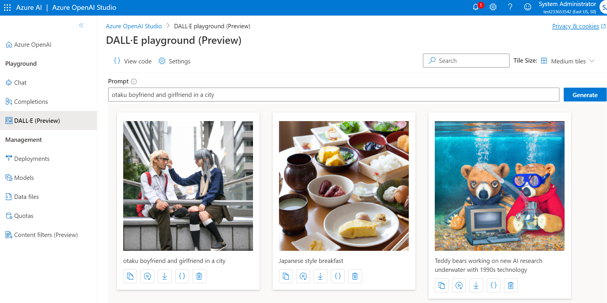

# 講師デモ Azure OpenAIを探索する

[手順書(英語版)](https://microsoftlearning.github.io/mslearn-generative-ai/Instructions/Labs/2-explore-azure-openai.html)

※日本語版はない。

■概要

- Azureアカウントの作成
- Azure OpenAI Serviceを使うために申請を行う
- Azure portalで、Azure OpenAI Serviceリソースを作成
- Azure AI Studioを開く
- gpt-35-turbo モデルを作成する
- Chat プレイグラウンドを使用する
- DALL-E プレイグラウンドを使用する

■手順

- Azureアカウントの作成
  - https://azure.microsoft.com/ja-jp/free/
- Azure OpenAI Serviceを使うために申請を行う
  - https://aka.ms/oaiapply
- Azure OpenAI Serviceリソースの作成
  - https://portal.azure.com
  - 全てのサービス＞AI＞Azure OpenAI
  - 
  - ＋Create
  - リソースグループ、リージョン、名前、価格レベル（Standard S0のみ）を入力/選択
  - ※リージョン: gpt-35-turbo (model version: 0613)をデプロイするため、「Japan East」などではなく「East US」に作る。
  - Next
  - ネットワーク
    - すべて
    - 選択した仮想ネットワークとIPアドレスからのみ
    - プライベートエンドポイント接続のみ
  - タグ
  - レビュー、作成
  - 30秒ほどでデプロイが完了
- Azure AI Studioを開く
  - Azure OpenAI Serviceリソースの「概要」を表示
  - Exploreボタンをクリック
  - 
  - （ https://oai.azure.com (Azure OpenAI Studio) でリソースが表示される）
- gpt-35-turbo モデルを作成する
  - Create new deploymentをクリック
  - 「＋Create new deployment」をクリック
  - デプロイモデルとして「gpt-35-turbo」を選択
  - デプロイメント名を指定
  - 
  - gpt-35-turbo
    - 自然言語とコードを生成・理解するモデル
    - 最大 4096 個のトークンをサポート
  - gpt-35-turbo-16k
    - 最大 16,384 個のトークンをサポート
    - gpt-35-turboの倍のコストがかかる
  - text-embedding-ada-002
    - テキストを数値ベクトル形式に変換して、テキストの類似性を促進できるモデル
- Chat プレイグラウンドを使用する
  - 画面左メニュー Playground から Chat をクリック
  - 画面右「Chat session」の下部のテキストボックスに「生成AIとは？」と入力してエンター
  - `Error: The API deployment for this resource does not exist. If you created the deployment within the last 5 minutes, please wait a moment and try again.` といったエラーが出る場合は、メッセージに従って5分ほど待つ。
  - 
- DALL-E プレイグラウンドを使用する
  - 画面左メニュー Playground から DALL-E をクリック
  - プロンプトに「Teddy bears working on new AI research underwater with 1990s technology」（この例は[Wikipedia](https://ja.wikipedia.org/wiki/DALL-E)より）と入力して「Generate」をクリック
  - ※現状DALL-E playgroundでは英語でのプロンプト入力が必須。
  - 
  - `{}`アイコン（Show code）をクリックすると、この画像を生成するためのプログラムコードが表示される。
