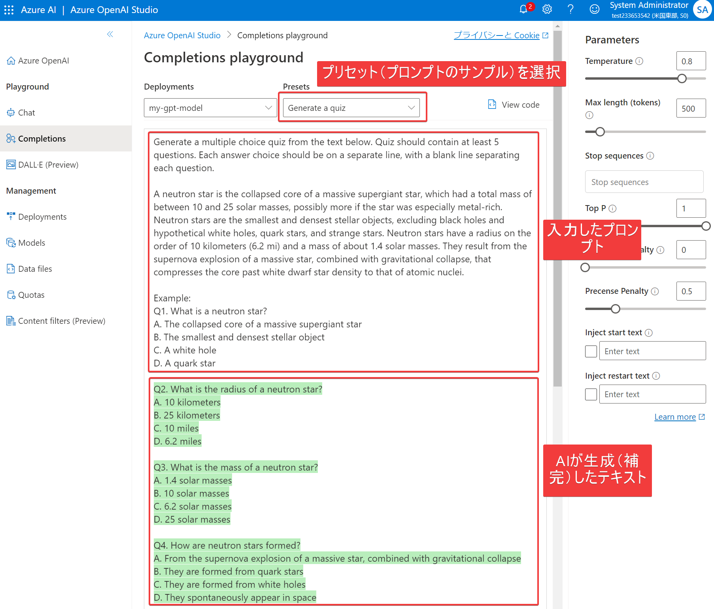
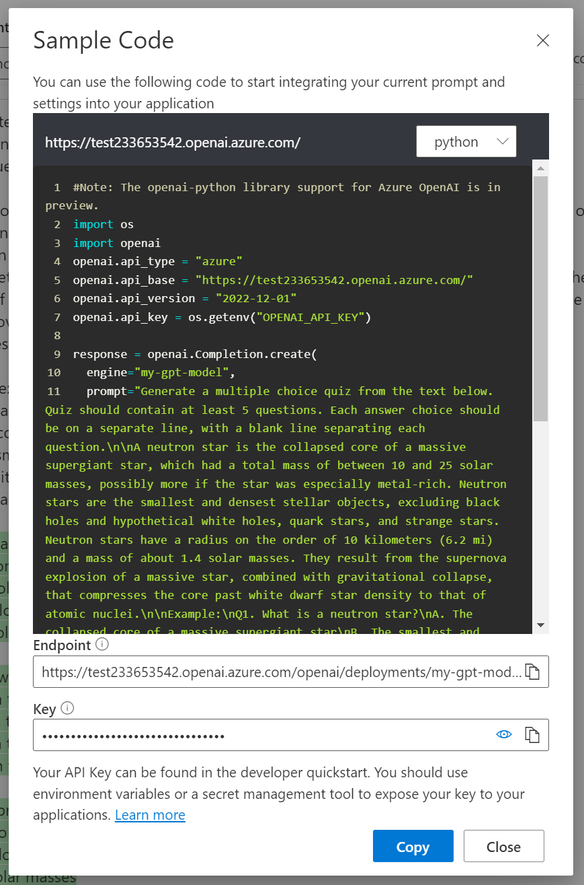

# 講師デモ Azure OpenAI で作業を開始する

[手順書(日本語版)](https://microsoftlearning.github.io/mslearn-openai.ja-jp/Instructions/Labs/01-get-started-azure-openai.html)

[手順書(英語版)](https://microsoftlearning.github.io/mslearn-openai/Instructions/Labs/01-get-started-azure-openai.html)

■概要

- Azure OpenAI Serviceリソースを作成する
  - https://portal.azure.com
  - 全てのサービス＞AI＞Azure OpenAI
  - 
  - ＋Create
  - リソースグループ、リージョン、名前、価格レベル（Standard S0のみ）を入力/選択
  - ※リージョン: gpt-35-turbo (model version: 0613)をデプロイするため、「Japan East」などではなく「East US」に作る。
  - Next
  - ネットワーク
    - すべて
    - 選択した仮想ネットワークとIPアドレスからのみ
    - プライベートエンドポイント接続のみ
  - タグ
  - レビュー、作成
  - 30秒ほどでデプロイが完了
  - gpt-35-turbo (model version: 0301)をデプロイするため、「Japan East」などではなく「East US」に作る。
- モデルをデプロイする
  - モデル: gpt-35-turbo
  - モデル バージョン: 「Auto-update to default（既定値に自動更新）」または「0301 (Default)」を選択。
    - ※0613は Completion に対応しておらず、Completiondで使用するとエラー`Completions call failed: OperationNotSupported. The completion operation does not work with the specified model, gpt-35-turbo. Please choose different model and try again.`となるため。
    - [gpt-35-turbo (model version: 0613)はChat Completions APIのみサポート。](https://learn.microsoft.com/en-us/answers/questions/1340679/azure-openai-getting-completions-call-failed-opera)
    - モデルバージョンはデプロイ後に変更することも可能。
  - デプロイ名: my-gpt-model
- Azure OpenAI Studioの「プレイグラウンド」でAzure OpenAI Serviceの動作を確認する。
  - Completions
    - 「text-in, text-out」インターフェース。
    - Presetsで「Generate a quiz」を選択し、画面下部の「Generate」をクリック
    - 
    - 「Regenerate」（再生成）ボタンをクリックすると、再度プロンプトを送信して別の結果を得ることができる。再生成の結果は最初の生成結果と同じかもしれないし、異なっているかもしれない。
    - 画面右上「View code」（コードの表示）をクリックすると、この処理を行うためのPythonコードなどが表示できる。
  - Chat
    - 「conversation-in, message-out」インターフェース。
    - 「システムメッセージ」（システムロールとも）に、AIの特性、性格、従うべきルールなどを与えることができる。例: 「あなたはAIアシスタントです。常に日本語で回答してください。」
    - 「Chat Session」の下部のテキストボックスに「ユーザーメッセージ」を入力して、チャットに質問などを送信できる。例: 「BingではChatGPTを使用できますか？」
    - Examplesに、例を入力できる。User: 「BingではChatGPTを使用できますか？」、Assistant: 「はい、BingではChatGPTを使用できます。Bingのチャット機能を使って、ChatGPTによるAIアシスタントと会話することができます。」
- プロンプトとパラメータを調節する
  - 温度
    - 0～1で調節できる。
    - 温度を低くすると、回答の幅が狭くなる（同じ問に対して同じ答えを返すようになる）。
    - 温度を高くすると、回答に幅が出る（いろんなパターンの文章を生成しやすくなる）。
  - 最大長（トークン）
    - 1～4000で調節できる。
    - 1回の回答で返すトークン（文字の量）を制限。
    - 1トークンは（おおよそ）英語4文字。
- コード生成
  - Chatで、「C#のint型配列をクイックソートするプログラムを書いてください。」などと指示する。
  - ※現在Codexのモデル（code-davinci-002など）はレガシモデルとなっていてデプロイできない。
  - 代替モデルとして gpt-3.5-turbo-instruct が追加された。https://zenn.dev/microsoft/articles/b050574ad7dfe2
