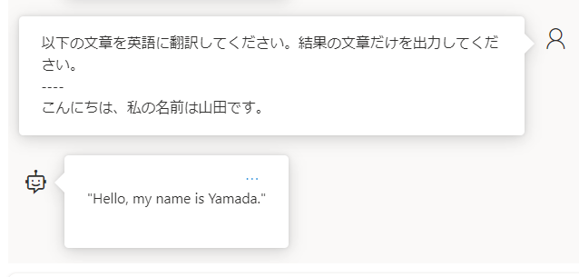

# モジュール4: Azure OpenAI Service を使用してプロンプト エンジニアリングを適用する

https://learn.microsoft.com/ja-jp/training/modules/apply-prompt-engineering-azure-openai/

■プロンプト（prompt）とは？

AIシステムに対する指示・命令。

基本的には（人間の相手に作業を依頼するように）自然言語で命令すればよい。

ただし、AIが生成するコンテンツには若干のランダム性があり、同じプロンプトから必ず同じ出力が得られるとは限らない。

また、AIのモデルが更新されるにつれ、同じプロンプトに対して異なる結果が返されるようになることがありうる。

■プロンプトエンジニアリング(prompt engineering)とは？

https://learn.microsoft.com/ja-jp/azure/ai-services/openai/concepts/prompt-engineering

https://learn.microsoft.com/ja-jp/azure/ai-services/openai/concepts/advanced-prompt-engineering

大規模言語モデルをより適切に活用するようにプロンプトを設計・最適化するプロセス。

AIに対し、何をしてほしいのかをうまく伝えるテクニック。

最適な結果が得られるよう、プロンプトを工夫する。

AIを使いこなすに当たって重要なスキル。

プロンプトエンジニアリングでは、試行錯誤や実験を通じて、最適なプロンプトを見つけることが重要。

目的やAIモデルが異なる場合、別の形のプロンプトが適切である場合がある。

■手法(1)セクションマーカーを使う

セクションマーカー（ `----` など） を使用して、コンテンツ（処理すべき文章）と命令を分ける。

プライマリ コンテンツ(primary content): モデルによって処理または変換される何らかのテキスト。

指示(instructions):モデルに対する命令。




`以下の文章を英語に翻訳してください。結果の文章だけを出力してください。`が命令。

`----`がセクションマーカー。

`こんにちは、私の名前は山田です。`がコンテンツ（プライマリコンテンツ）。

■参考: セクションマーカーの書き方は？

https://zenn.dev/zawawahoge/articles/4519112f1ad5ed

`-` または `=` を4以上の2の冪乗(べきじょう、2^2=4, 2^3=8, 2^4=16 など)文字数分だけ書くのがおすすめ。

```
----
--------
----------------
--------------------------------
====
========
================
================================
```

これらはいずれも 1 トークンとしてカウントされる。

■手法(2)明確な命令から開始する(Start with clear instructions)

プロンプトを明確な命令から開始する。AIモデルに対して、何をしてほしいかを最初に明確に伝える。

■手法(3)最後に命令を繰り返す（Repeat instructions at the end）

プロンプトの最後で命令を繰り返す（または、重要な命令を最後に伝える）ことが有効な場合がある（最新性バイアス）。

```
Your task is to verify if the statement "Several sources mention a chance of another large eruption" is supported by a specific quote from the following set of snippets.
（あなたのタスクは、「複数の情報源が再び大規模な噴火の可能性について言及している」という記述が、以下の一連のスニペットからの特定の引用によって裏付けられているかどうかを検証することです。）
----
SNIPPETS（スニペット）
[1] 14 percent chance of megaquake hitting Seattle, experts say
SEATTLE - There's a 14 percent chance of a magnitude 9 Cascadia earthquake hitting Seattle in the next 50 years, the U.S. Geological Survey estimates. "Unfortunately, we are unable to...

[2] Earthquake experts lay out latest outlook for Seattle's 'Really Big One’
“We say that there's approximately a 14% chance of another approximately magnitude-9 earthquake occurring in the next 50 years,” said a geophysicist at the University of Washington...
----
Is the statement "Several sources mention a chance of another large eruption" directly implied or stated by the snippets?
（「複数の情報筋が再び大規模な噴火の可能性について言及している」という記述は、スニペットによって直接暗示されているのか、それとも述べられているのでしょうか?）
```

最初の1行 `Your task is to verify if the statement "Several sources mention a chance of another large eruption" is supported by a specific quote from the following set of snippets.` が、「最初の明確な命令」。

最後の1行 `Is the statement "Several sources mention a chance of another large eruption" directly implied or stated by the snippets?` が、「最後に繰り返された命令」。


■手法(4)サポート コンテンツ (supporting content)を指定する

https://learn.microsoft.com/ja-jp/azure/ai-services/openai/concepts/prompt-engineering#supporting-content

モデルが何らかの方法で出力に影響を与えるために利用できる情報。ヒントのような情報。

例:

```
Workshop list:

Planning Workshop Kickoff Please join us to kick off our workshop!
Hear from our leaders about cross group priorities and learnings for the year ahead...
----
My Important Topics: prompt engineering, search, GPT models
----
Summarize the workshops above, grouped by my important topics:
```

`My Important Topics: prompt engineering, search, GPT models`が、サポートコンテンツ。

■手法(5)基礎（根拠付け）コンテキスト(grounding context / grounding data)を指定する


https://learn.microsoft.com/ja-jp/azure/ai-services/openai/concepts/advanced-prompt-engineering?pivots=programming-language-chat-completions#provide-grounding-context

（モデルが持っている知識からではなく）システムメッセージに、情報源となるテキストを指定し、そこからのみ答えさせる方法。

例:

システムメッセージ:
```
あなたは、情報の検索を支援する AI アシスタントです。 以下のテキストからのみ回答を提供し、100 語以下で応答してください。
----
Microsoft では、より多くのユーザーが AI を使用して利益が得られるように、創造性を発揮し、生産性を高め、スキルを向上させる新しい方法を常に探しています。 これにより、お客様は...その結果、モデルが有害な応答を生成する可能性が低くなります。
----
100 語以下で回答します。 可能な限り箇条書きリストを使用します。
```

`"Microsoft では、より多くのユーザーが AI を使用して利益が得られるように、創造性を発揮し、生産性を高め、スキルを向上させる新しい方法を常に探しています。 これにより、お客様は...その結果、モデルが有害な応答を生成する可能性が低くなります。"`の部分が基礎（根拠付け）コンテンツ。

■手法(6)キュー (Cues)を指定する。


キュー (Cue) は、モデルの出力の "ジャンプスタート" として機能し、モデルを目的の出力に誘導するのに役立ちます。 多くの場合、これはプレフィックスであり、それに基づきモデルを構築できます。

例:

```
Performance reviews are a core component of our Performance & Development approach at Contoso...

Summarize the above email message:

The key takeaway of the message is
```

`Performance reviews are a core component of our Performance & Development approach at Contoso...`がプライマリコンテンツ。

`Summarize the above email message:`が指示。

`The key takeaway of the message is`がキュー。

■手法(7)システムメッセージ (system messages) とユーザーメッセージ (user messages)を使い分ける


システムメッセージ:
- AIに対して、指示や制限を行う
- AIのパーソナリティ（個性）、回答の生成方法などを設定する
- 応答を導くのに役立つ指示、視点、またはその他の情報をモデルに与える。

ユーザーメッセージ:
- AIと対話するユーザーが入力するメッセージ。
- システムメッセージの設定に従って処理される。


■手法(8)会話履歴を指定する

■手法(9)フューショット学習 (few-shot learning)を使用する

https://www.promptingguide.ai/jp/techniques/fewshot

少数の例文を提示する。

参考: https://atmarkit.itmedia.co.jp/ait/articles/2308/03/news016.html


■手法(10)タスクを分割する(break task down)

https://learn.microsoft.com/ja-jp/azure/ai-services/openai/concepts/advanced-prompt-engineering?pivots=programming-language-chat-completions#break-the-task-down

タスクを、より小さなステップに分割する。

```
段落を読んでください。
---
段落
John Smith は Lucy Smith と結婚しています。 5 人の子供がいて、Microsoft でソフトウェア エンジニアとして働いています。
---
次に、ファクト クレームを抽出してください。

最後に、これらをファクトチェックするクエリを発行してください。クエリを発行する場合は、関数 SEARCH("query") を使用します。

ファクト クレーム:

```

上記の例では、「（1）段落を読む」「（2）ファクトクレームを抽出する」「（3）ファクトクレームをチェックするクエリを発行する」の3つに、タスクを分割して、指示を出している。

`John Smith は Lucy Smith と結婚しています。 5 人の子供がいて、Microsoft でソフトウェア エンジニアとして働いています。`はプライマリコンテンツ。

`段落を読んでください。`、`次に、ファクト クレームを抽出してください。`、`最後に、これらをファクトチェックするクエリを発行してください。クエリを発行する場合は、関数 SEARCH("query") を使用します。`は指示。

最後の `ファクト クレーム:` はキュー(Cues)。

■手法(11)思考の連鎖(chain of thought prompting)を行わせる

https://www.promptingguide.ai/jp/techniques/cot


「タスクを分割する」では、ユーザーがタスクを分けて指示をするが、「思考の連鎖」では、この部分もAIに実施させる。ステップバイステップで（段階的に、ステップを分けて）考えるように指示を出す。

```
シドニーで開催されたオリンピックで最も表彰された (メダル数が最大の) 個人アスリートは誰でしたか? 応答でステップバイステップのアプローチを取り、ソースを引用し、最終的な回答を次の形式で伝える前に推論を行います。

回答は次のとおりです: <name>
```

`応答でステップバイステップのアプローチを取り`や`最終的な回答を次の形式で伝える前に推論を行います`という部分が、「思考の連鎖」を指示している部分。

応答例:
```
ステップ 1: シドニーオリンピックの年を特定します。 シドニー オリンピックは 2000 年に開催されました。

ステップ 2: 2000 年のシドニー オリンピックで複数のメダルを獲得した個人アスリートのリストを見つけます。

オリンピックの公式 Web サイトによると、2000 年シドニー オリンピックで複数のメダルを獲得した個人アスリートが何人かいました。 注目すべき名前の一部を次に示します。
• Ian Thorpe (オーストラリア) - 金 3 個、銀 2 個、銅 0 個
• Pieter van den Hoogenband (オランダ) - 金 2 個、銀 0 個、銅 2 個
• Lenny Krayzelburg (アメリカ) - 金 3 個、銀 0 個、銅 0 個
• Inge de Bruijn (オランダ) - 金 3 個、銀 1 個、ブロンズ 0 個

ステップ 3: 最もメダルの多いアスリートを特定します。 2000 年シドニー オリンピックで複数のメダルを獲得した個人アスリートのリストを確認した後、最もメダルの多いアスリートは、オーストラリアの Ian Thorpe であり、合計 5 個のメダル (金 3 個と銀 2 個) を獲得したことがわかります。

したがって、回答は次のとおりです: Ian Thorpe
```

■知識チェック

https://learn.microsoft.com/ja-jp/training/modules/build-language-solution-azure-openai/6-knowledge-check

- 第1問: 開発者が Azure OpenAI モデルのパフォーマンスを最適化するにはどうすればよいですか?
  - 明確でわかりやすい指示を出す
- 第2問: プロンプトのシステム メッセージの目的は何ですか?
  - 応答を導くのに役立つ指示、視点、またはその他の情報をモデルに与える
- 第3問: AI モデルに会話履歴を提供する目的は何ですか?
  - モデルが同様の方法で応答できるようになり、ユーザーはその後のクエリで以前のコンテンツを参照できるようになる


https://learn.microsoft.com/ja-jp/training/modules/apply-prompt-engineering-azure-openai/6-knowledge-check
