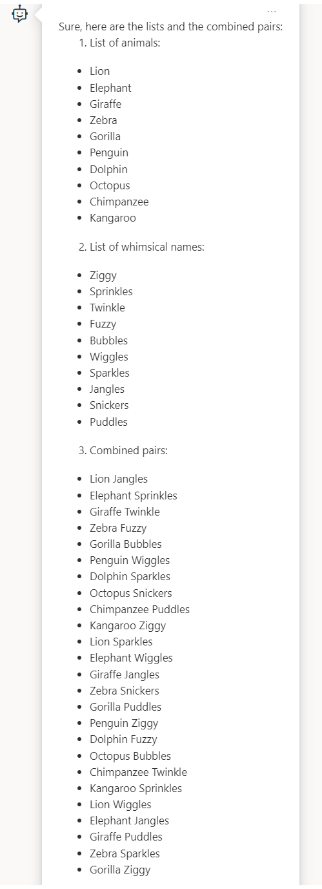
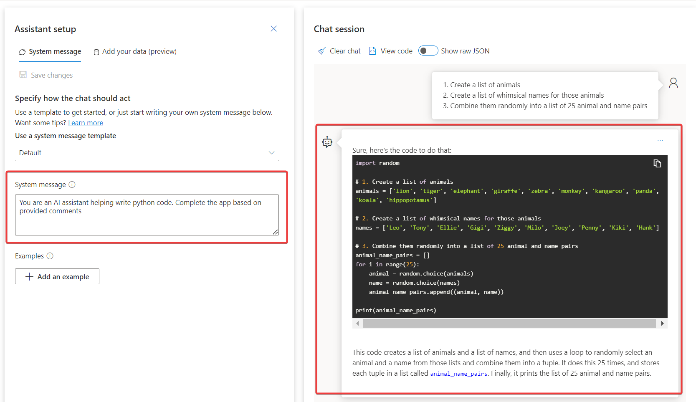
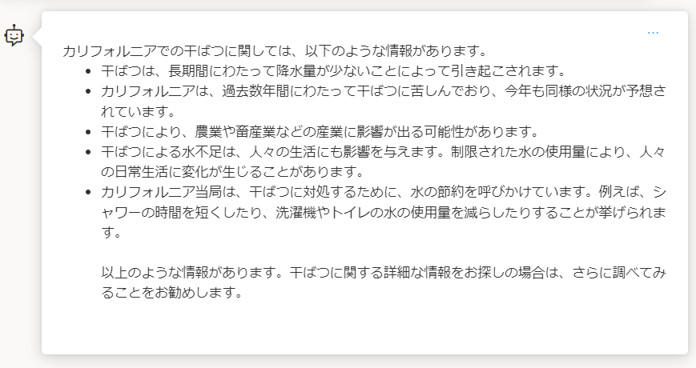
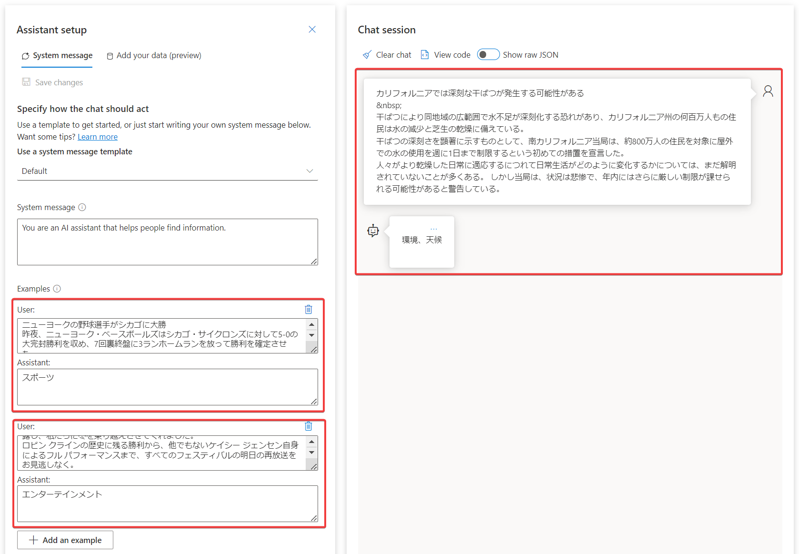

# 講師デモ アプリでプロンプト エンジニアリングを利用する

[手順書(日本語)](https://microsoftlearning.github.io/mslearn-openai.ja-jp/Instructions/Labs/03-prompt-engineering.html)

[手順書(英語)](https://microsoftlearning.github.io/mslearn-openai/Instructions/Labs/03-prompt-engineering.html)

■概要

- リソースを作成する（前のデモと同様）
- モデルをデプロイする（前のデモと同様）


■(1)Pythonコードを出力するようにシステムメッセージを指定する

チャットで以下のプロンプトを入力する。

```
1. Create a list of animals
2. Create a list of whimsical names for those animals
3. Combine them randomly into a list of 25 animal and name pairs
```
出力例


次に、システムメッセージに`You are an AI assistant helping write python code. Complete the app based on provided comments`と設定し、再度チャットに同じプロンプトを入力する。すると、出力がPythonコードとなる。



■(2)テキストの分類をするように、フューショット学習を使う

システムメッセージをデフォルトに戻す。

以下のようなプロンプトを入力する。

```
カリフォルニアでは深刻な干ばつが発生する可能性がある

干ばつにより同地域の広範囲で水不足が深刻化する恐れがあり、カリフォルニア州の何百万人もの住民は水の減少と芝生の乾燥に備えている。
干ばつの深刻さを顕著に示すものとして、南カリフォルニア当局は、約800万人の住民を対象に屋外での水の使用を週に1日まで制限するという初めての措置を宣言した。
人々がより乾燥した日常に適応するにつれて日常生活がどのように変化するかについては、まだ解明されていないことが多くある。 しかし当局は、状況は悲惨で、年内にはさらに厳しい制限が課せられる可能性があると警告している。
```

すると、AIはカリフォルニアの干ばつに関する一般的な知識やアドバイスを回答する。



次に、システムメッセージの下の Examples に、UserとAssistant の会話例をいくつか入れて、入力に対して分類を行いラベルをつけるように学習させる。

```
ユーザー:

ニューヨークの野球選手がシカゴに大勝
昨夜、ニューヨーク・ベースボールズはシカゴ・サイクロンズに対して5-0の大完封勝利を収め、7回裏終盤に3ランホームランを放って勝利を確定させた。
マリオ・ロジャース投手はニューヨーク代表として96球を投げ、わずか2安打を記録し、今年最高のパフォーマンスをマークした。
シカゴ・サイクロンズは２回と５回に２安打を放ったが、走者をホームに還すことができなかった。

アシスタント:

ニュース
```

```
ユーザー:

オスカーでの楽しい瞬間
先週のオスカーでは、何かが起こった!
あるスキャンダルが話題をさらったとはいえ、今年のアカデミー賞は私たちを喜びで満たし、時には涙を流す瞬間もたくさんあった。
これらの俳優や女優たちは、素晴らしい笑いとともに真に感情的な演技を披露し、私たちに冬を乗り越えさせてくれました。
ロビン クラインの歴史に残る勝利から、他でもないケイシー ジェンセン自身によるフル パフォーマンスまで、すべてのフェスティバルの明日の再放送をお見逃しなく。

アシスタント:

エンターテインメント
```

そして、最初のプロンプトを再度チャットに入力すると、今度は「環境、天候」といったラベルを出力するようになる。



■(3)プロンプトをファイルから読み込ませるアプリを実行する

