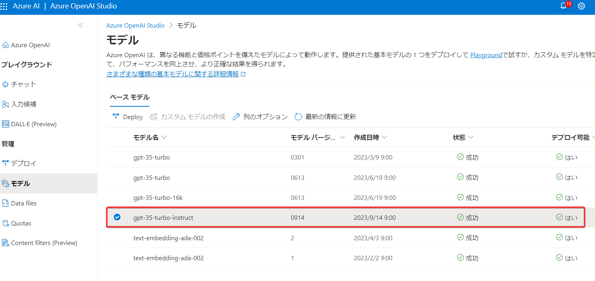

# Azure OpenAI Service レガシ モデル

https://learn.microsoft.com/ja-jp/azure/ai-services/openai/concepts/legacy-models

このページに書かれているモデルは「レガシ モデル」とされている。

- 2023 年 7 月 6 日以降の新しいデプロイでは使用できません。
- 2023 年 7 月 6 日より前に作成されたデプロイは、2024 年 7 月 5 日まで利用できます。
- 2024 年 7 月 5 日の廃止前に、交換モデル(replacement models)に移行することをお勧めします。

## Codexモデル

https://learn.microsoft.com/ja-jp/azure/ai-services/openai/how-to/work-with-code

このページで紹介されている「code-davinci-002」は、GPT-3.5モデルの一種だが、「レガシ モデル」とされているので、現在は新しくデプロイできない。

交換モデル(The replacement for the GPT-3.5 models)は、「GPT-3.5 Turbo Instruct」とされている。

## gpt-3.5-turbo-instruct について

https://texal.jp/2023/09/20/openai-releases-gpt-3-5-turbo-instruct/

OpenAIが新しい言語モデル「gpt-3.5-turbo-instruct」を静かに公開したようだ。

2023/10現在、Azure OpenAI Serviceでもこのモデルが使用可能となっている。

## GPT-3.5-Turbo-Instruct

https://chatgpt-lab.com/n/n2ed70597dfbf

2023年9月19日、OpenAIが新たなAIモデル、GPT-3.5-Turbo-Instructをリリースしました。このモデルは、過去のInstructGPTシリーズと同じ訓練方法(RLHF)を採用しつつ、旧来のモデル（例：text-davinci-003）を置き換える形で登場しました。既存の「GPT-3.5-Turbo」とは違ってチャットに特化したモデルではないため、モデルが広範な自然言語処理タスクを扱うことを可能にします。

このモデルはGPT-3.5-Turboと同様に高速な処理能力を持っていることも報告されています。これは、リアルタイムの対話システムやタスク処理などで大きな利点となります。価格面でも、他のGPT-3.5 Turboモデルと同等の設定がされています。InstructGPTの特性として、ユーザーからの指示や質問に対して明瞭かつ正確な回答ができることが挙げられ、翻訳、複雑な設計の説明など多岐にわたる活用を可能にします。この新モデルの登場は、AIが更に私たちの日常生活に影響を与えるきっかけとなるでしょう。

## 参考

Azure OpenAI Service のレガシーモデルと今後のモデル選択戦略
https://zenn.dev/microsoft/articles/b050574ad7dfe2
