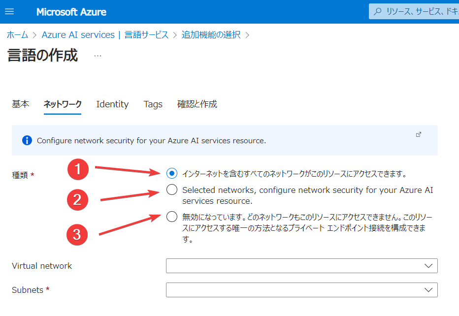

# Azure AI サービスをセキュリティで保護する


## 認証

(1) キー認証
  - リソース作成時に「キー」（アクセスキー）が払い出される
  - アプリ側にそのキーを持たせておく
    - キーの漏洩に注意する必要がある
  - アプリがリソースの機能を呼び出す際、そのリクエストにキーを含める
  - リソース側では正しいキーが送信されてきた場合にのみ処理を実行する

```
オンプレPC
├環境変数 / 設定ファイル
│└キー
└アプリ
  ↓
  ↓ キーを送信
  ↓
Azure AI Languageリソース
```

(2) Entra ID認証＋ロールによる承認
  - アプリに「マネージドID」または「サービスプリンシパル」を割り当てる
  - リソース側には適切なロールを割り当てる
  - キーの漏洩の心配がない

マネージドIDを利用する例:
```
Azure App Serviceリソース app1 (マネージドID: app1)
└アプリ
  ↓
  ↓ 
  ↓
Azure AI Languageリソース（app1 ← 「Cognitive Service User」ロール）
```

サービスプリンシパルを利用する例:
```
オンプレサーバー app2 (サービスプリンシパル: app2)
└アプリ
  ↓
  ↓ 
  ↓
Azure AI Languageリソース（app2 ← 「Cognitive Service User」ロール）
```

## ネットワーク



```
仮想ネットワーク vnet1
|└サブネット
|  └仮想マシン VM1
|
|ピアリング
|
仮想ネットワーク vnet2
└サブネット
  └仮想マシン VM2
    ↓
    ↓
    ↓
Azure AI Languageリソース
    ↑
    ↑
    ↑
インターネット上のクライアント
```

②の場合
```
仮想ネットワーク
└サブネット
  ├仮想マシン
  │↓
  └サービスエンドポイント
    ↓
    ↓
    ↓
Azure AI Languageリソース
    ↑
    ↑接続できない
    ↑
インターネット上のクライアント
```

③の場合
```
仮想ネットワーク
└サブネット
  ├仮想マシン
  │↓
  └プライベートエンドポイント
    ↓
    ↓
    ↓
Azure AI Languageリソース
    ↑
    ↑
    ↑
インターネット上のクライアント
```
