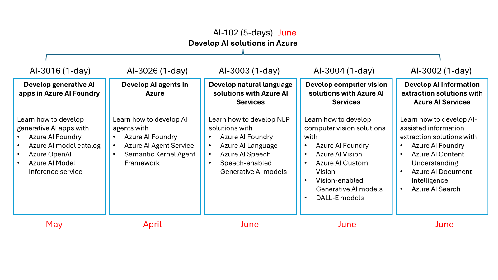

# AI-102 Develop AI solutions in Azure

https://learn.microsoft.com/ja-jp/training/courses/ai-102t00

5日間コース

- 開始時のご案内
- 1日目
  - Azure AI Foundry
  - Azure AI model inference
- 2日目
  - Azure AI Agent Service
  - Semantic Kernel Agent Framework
- 3日目
  - Azure AI Language
  - Azure AI Speech
  - Speechに対応した生成AIモデル
    - whisper
    - gpt-4o-transcribe
    - gpt-4o-mini-transcribe
    - tts
    - tts-hd
    - gpt-4o-mini-tts
- 4日目
  - Azure AI Vision
  - Azure AI Custom Vision
  - Visionに対応した生成AIモデル
    - gpt-4.1
    - gpt-4.1-nano
    - gpt-4.1-mini
    - o4-mini
    - o3
    - o1
    - dall-e-3
    - gpt-image-1
- 5日目
  - Azure AI Document Intelligence
  - Azure AI Content Understanding
  - Azure AI Search
- 終了時のご案内
  - 認定試験対策

