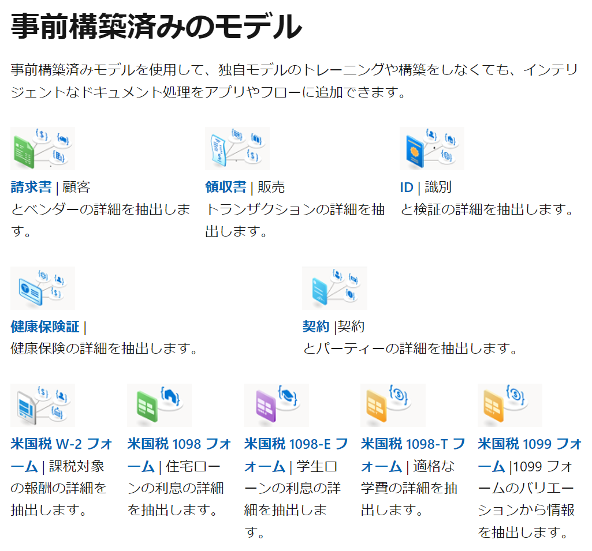

# Azure AI Document Intelligence

旧「Azure AI Form Recognizer」

高度な機械学習を応用して、テキスト、キーと値のペア、テーブル、構造をドキュメントから自動的かつ正確に抽出する AI サービス。

「Azure AI Document Intelligenceスタジオ」から動作を確認できる。
https://documentintelligence.ai.azure.com/studio

事前構築済みのモデルを使用して、ドキュメントから必要な情報をすばやく抽出できる。

■日本の免許証（等）への対応

基本的にAzure AI Document Intelligence(Azure AI Form Recognizer)は米国の免許証（等）のフォーマットを想定しているため、事前構築済みのモデルでは日本の免許証（等）を正しく読み取ることができない。

「カスタム抽出モデル」を構築することで、新しいフォーマットにも対応することができる。
https://qiita.com/fsdg-k-m/items/db40215f19eda7a4d01c
