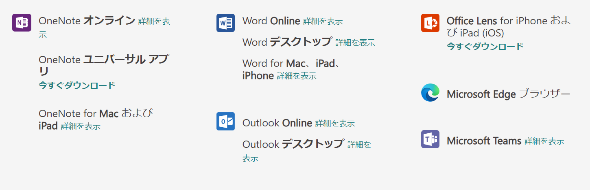

# Azure AI Immersive Reader（イマーシブ リーダー）

https://learn.microsoft.com/ja-jp/azure/ai-services/immersive-reader/

■概要

テキストの読解を補助する機能をアプリケーションに埋め込むしくみ。

テキストが大きな文字で表示され、なぞりながら読み上げされる。

学習用、あるいは文章や文字を読むことが困難な人向けの機能。

■デモサイト

https://www.onenote.com/learningtools

■マイクロソフト製品への組み込み

マイクロソフトの多数の製品にImmersive Reader機能が組み込まれている。

