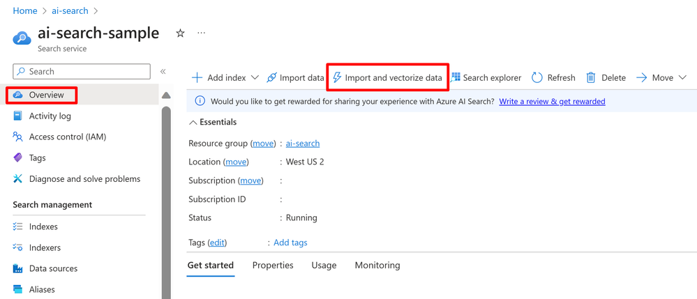
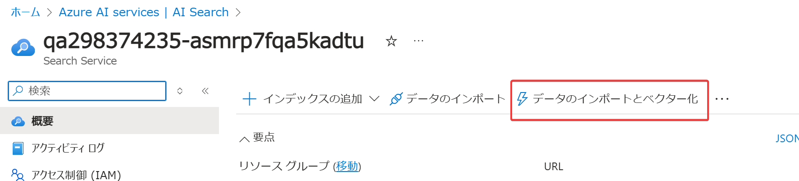

# 統合ベクトル化（Integrated vectorization）

※「統合ベクター化」や「垂直統合」とも。

Azure AI Searchの新機能。組み込みのプル インデクサーによる取り込み中のデータのチャンク化とベクトル化、およびベクタライザーによるテキスト クエリのベクトル化を可能にする。

Azure Blob Storage、SQL Database、Azure Cosmos DB、Azure Data Lake Gen2などのさまざまな Azure ソースからのデータ取り込み中の自動チャンク化とベクトル化が容易になった。

テキスト クエリを自動的にベクトル化する機能が組み込まれているため、クライアント アプリケーションのコーディング ロジックが実質的に不要になった。

2023/11/15 パブリックプレビュー。
https://techcommunity.microsoft.com/t5/ai-azure-ai-services-blog/announcing-the-public-preview-of-integrated-vectorization-in/ba-p/3960809

2024/8/22 一般提供開始
https://techcommunity.microsoft.com/t5/ai-azure-ai-services-blog/integrated-vectorization-with-azure-openai-for-azure-ai-search/ba-p/4206836

ブログ(「統合ベクトル化」のパブリックプレビュー。データソースとしてAzure Blob Storageを使用する例)
https://techcommunity.microsoft.com/t5/ai-azure-ai-services-blog/announcing-the-public-preview-of-integrated-vectorization-in/ba-p/3960809

ブログ（データソースとしてAzure SQL Databaseを使用する例）
https://devblogs.microsoft.com/azure-sql/vector-search-with-azure-sql-database/

ドキュメント
https://learn.microsoft.com/ja-jp/azure/search/vector-search-integrated-vectorization

クイックスタート
https://learn.microsoft.com/ja-jp/azure/search/search-get-started-portal-import-vectors

Microsoft社員 Taishi Miyata さんによる解説
https://qiita.com/tmiyata25/items/ef231ea340e681a44970

■チャンク化

大きなドキュメントを小さな塊（チャンク chunk）に分割すること。

Embeddings APIでは、入力テキストの最大長は 8,192 トークン（約6,000語に相当）なので、大きなドキュメントは事前にそれ以下のサイズのチャンクに分割し、それぞれのチャンクに対してベクトル化を行う必要がある。

■プルインデクサー

https://learn.microsoft.com/ja-jp/azure/search/search-indexer-overview

Azure AI Search の インデクサーのこと。Azure AI Searchのインデクサーは、データソースから、データを「プル」（読み取り）し、インデックスに情報を追加する。

なお、C#などのコードやREST APIを使用して、インデックスにデータを「プッシュ」することもできる（Azure portalでは「プッシュ」はできない）。https://learn.microsoft.com/ja-jp/azure/search/search-what-is-data-import