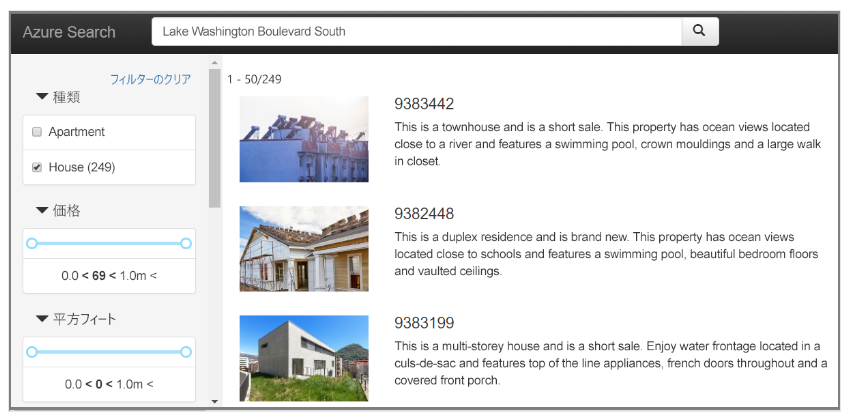

■Azure AI Searchとは？

 (名称変更 Azure Search → Azure Cognitive Search → Azure AI Search)

さまざまな種類のデータ ソースに対するリッチな検索機能を組み込むためのインフラストラクチャ、API、およびツールを開発者に提供する、クラウド検索サービス。

ドキュメントから「検索インデックス」を作成し、高速な検索を実現。

2015/3/5 Azure Searchとして 一般提供開始。
https://azure.microsoft.com/en-us/updates/general-availability-azure-search/

2019/10 Azure Cognitive Searchに名称変更。
https://learn.microsoft.com/ja-jp/azure/search/search-faq-frequently-asked-questions#-azure-search-----azure-cognitive-search-----azure-ai-search-----------

2023/10 Azure AI Searchに名称変更。
https://qiita.com/nohanaga/items/0637ea6fe8e01a98e4fc

■検索インデックス search index

https://learn.microsoft.com/ja-jp/azure/search/search-what-is-an-index

大量のドキュメントに対する高速な検索ができるように、検索に必要な情報を抽出したもの。

Azure AI Searchは、検索インデックスに対して検索処理を実行する（元のデータに対する検索は行わない）。データに対してインデックスを事前に作っておく必要がある。

```
ユーザー
↓キーワード検索
Azure AI Search
└検索インデックス search index
    ↑ インデックス作成 ↓ 検索結果から移動(キー: Blobのパスなど)
   データソース: Azure Blob Storageに配置された大量のPDFなど
```

インデックスのサイズが小さいほうが、検索パフォーマンスが良くなる。


■データソース

https://learn.microsoft.com/ja-jp/azure/search/search-data-sources-gallery

- ストレージアカウント
  - Azure Blob Storage
  - Azure Table Storage
  - Azure Files (プレビュー)
- Azure Data Lake Storage Gen2
- データベース
  - Azure SQL Database
  - Azure Database for MySQL (プレビュー)
  - Azure Cosmos DB
    - Azure Cosmos DB for NoSQL
    - Azure Cosmos DB for Apache Gremlin (プレビュー)
    - Azure Cosmos DB for MongoDB (プレビュー)
- 同じテナント内にある SharePoint サイト (プレビュー)

サードパーティの Microsoft パートナーから提供される「データコネクター」を使用することで、さらに多くのデータソースに対応できる。

https://learn.microsoft.com/ja-jp/azure/search/search-data-sources-gallery#data-sources-from-our-partners

以下、対応データソースの例（一部）:

- Amazon S3
- Amazon RDS
- ファイルシステム（Windows, Linux, Mac）
- Googleドライブ
- OneDrive
- MySQL
- Oracle
- PostgreSQL
- Salesforce
- SAP ERP
- SAP HANA
- ServiceNow
- Twitter
- Slack

■フルテキスト検索（全文検索）

https://learn.microsoft.com/ja-jp/azure/search/search-lucene-query-architecture

- フルテキスト検索は、検索インデックスに格納されているプレーン テキストと照合する情報取得のアプローチ。
- 「クエリ文字列」を指定すると、検索エンジンはそれらの用語に基づいて検索を実行する。
- 「クエリ文字列」とは `windows` のような単語、`windows update` のような複数の単語、`is live events subtitles on by default for teams?` といったような文（質問文）。
- 検索を効率化するために、「クエリ文字列」の字句解析が行われる
  - すべての用語の小文字化
  - "the" などのストップ ワードの削除
  - プリミティブな原形への用語の単純化
- 一致する語句が見つかると、検索エンジンにより、ドキュメントが取得され、関連度の順でドキュメントがランク付けされて上位の結果が返される。
- ランク付けでは「BM25」というアルゴリズムが使用される。


■Apache Lucene

Azure AI Search は、フルテキスト検索に、オープンソースの検索エンジン「Apache Lucene」（アパッチ ルシーン）の機能の一部を使用している。

https://lucene.apache.org/

Azure AI Search は、Apache Luceneの「Simple Query Parser」による検索と、「Lucene Query Parser」による高度なクエリをサポートしている。

https://learn.microsoft.com/ja-jp/azure/search/query-simple-syntax

https://learn.microsoft.com/ja-jp/azure/search/query-lucene-syntax

■フィルタリング（$filter クエリ）

フィルタリングを使用すると、検索結果から、条件に一致しないものを除外できる。

Azure AI Search では、「OData (Open Data Protocol)」を使ったフィルタリングもサポートしている。

https://learn.microsoft.com/ja-jp/azure/search/search-query-odata-filter#examples

比較演算子 (eq, ne, gt, lt, ge, le), 論理演算子(and, or, not)などを組み合わせたフィルタリングが可能。

|比較演算子|意味|
|-|-|
|eq|等しい equal|
|ne|等しくない not equal|
|gt|より大きい greater than|
|lt|より小さい less than|
|ge|以上 greater than or equal|
|le|以下 less than or equal|

フィルタリングの例:

基本料金が $200 未満の部屋が少なくとも 1 つある 4 つ星以上のホテルをすべて探す。

```
$filter=Rooms/any(room: room/BaseRate lt 200.0) and Rating ge 4
```

その他の例:
https://learn.microsoft.com/ja-jp/azure/search/search-query-odata-filter#examples

■参考: OData

https://www.odata.org/

> OData (Open Data Protocol) は、ISO/IEC 承認の OASIS 標準であり、RESTful API の構築と使用に関する一連のベスト プラクティスを定義します。OData を使用すると、リクエスト ヘッダーとレスポンス ヘッダー、ステータス コード、HTTP メソッド、URL 規則、メディア タイプ、ペイロード形式、クエリ オプションなどを定義するさまざまなアプローチを気にすることなく、RESTful API を構築しながらビジネス ロジックに集中できます。OData は、変更の追跡、再利用可能なプロシージャの機能/アクションの定義、非同期/バッチ リクエストの送信に関するガイダンスも提供します。

https://erp.dentsusoken.com/blog/sap-odata-vol-88/

> OData（Open Data Protocol）は、Microsoft社が策定したREST APIの標準プロトコルで、HTTPを使用してWEBサーバー等とブラウザ等でデータのやりとりをするための手順などを定めた規格です。

いくつかのソフトウェアではODataがサポートされている。
- [SAP](https://erp.dentsusoken.com/blog/sap-odata-vol-88/)
- [Claris FileMaker](https://help.claris.com/ja/odata-guide/content/index.html)


■ファセット ナビゲーション

https://learn.microsoft.com/ja-jp/azure/search/search-faceted-navigation

Azure AI Searchは「ファセットナビゲーション」をサポートしている。



例: 価格.com の パソコンの検索 https://kakaku.com/pc/

- ノートパソコン
- CPU: Ryzen 7
- 画面サイズ: 14.5型(インチ)～17型(インチ)未満
- など

https://accessible-usable.net/2020/07/entry_200727.html

＞たとえばオンラインショッピングの商品検索で、膨大な検索結果をさまざまな側面 (価格帯、メーカー名やブランド名、商品種別、などの切り口) から絞り込むことができる機能です。

＞ファセット (facet) とはもともと宝石のカット面という意味ですが、そこから派生して、物事の側面や切り口を意味するようにもなっています。なお英語圏では、faceted navigation と同義で guided navigation と呼ばれることもあります。

■フィールド属性

https://learn.microsoft.com/ja-jp/azure/search/search-what-is-an-index#field-attributes

検索で各フィールドをどのように扱う必要があるのかを指定する。

- searchable
  - フルテキスト検索可能
- filterable
  - $filter クエリでフィルタリングが可能
- sortable
  - 並べ替えが可能
- facetable
  - [「ファセット ナビゲーション」を提供](https://learn.microsoft.com/ja-jp/azure/search/search-faceted-navigation) 例: kakaku.com
- retrievable
  - 検索結果でこのフィールドを返すことができる

**不要なフィールド属性を追加する（有効化する）と、インデックスのサイズが増え、検索パフォーマンスが落ちる。**


■フィールド属性の設定例

※賃貸物件のデータベースの「物件テーブル」を想定

要件:
- 物件名・所在地・設備リスト・担当者コメントのフルテキスト検索ができること。
  - 賃料と築年数は（数値なので）フルテキスト検索は不要
- 賃料と築年数でフィルタリングができること。
  - 例: 賃料10万以上15万以下 など
- 検索結果を、賃料 または 築年数 の昇順・降順でソートできること
- 設備リストで検索結果の絞り込みを行っていけること。
  - 例: ある条件での検索結果 120件中、WiFiあり物件が100件、宅配ボックスあり物件が50件、などと表示し、クリックするとドリルダウン（絞り込み）されていくこと
  - ※「設備リスト」列には `wifi,delivery-box` のように、その物件で利用可能な設備のタグが複数含まれているものとする。データ型 `Collection(Edm.String)`
- 物件名・所在地・設備・賃料・築年数が、検索結果一覧に表示されること
  - 設備と担当者コメントは検索結果一覧には表示されないが、検索結果一覧のある物件をクリックすると、その物件の詳細ページには、設備と担当者コメントが表示されればよい

| フィールド     | searchable | filterable | sortable | facetable | retrievable |
| -------------- | ---------- | ---------- | -------- | --------- | ----------- |
| 物件名         | ✔         |            |          |           | ✔          |
| 所在地         | ✔         |            |          |           | ✔          |
| 賃料           |            | ✔         | ✔       |           | ✔          |
| 築年数         |            | ✔         | ✔       |           | ✔          |
| 設備           | ✔         |            |          | ✔        |             |
| 担当者コメント | ✔         |            |          |           |             |


■AIエンリッチメントとは？

https://learn.microsoft.com/ja-jp/azure/search/cognitive-search-concept-intro

そのままの形式ではフルテキスト検索できないコンテンツに対して、機械学習モデルを適用することで、コンテンツを検索可能にすること。

たとえばPDFや画像などに対して「AIエンリッチメント」を行うことで、画像に対するキーワード検索などを実行できるようになる。

```
画像やPDF
↓AIエンリッチメント
画像の説明文など
↓
検索インデックス
```

