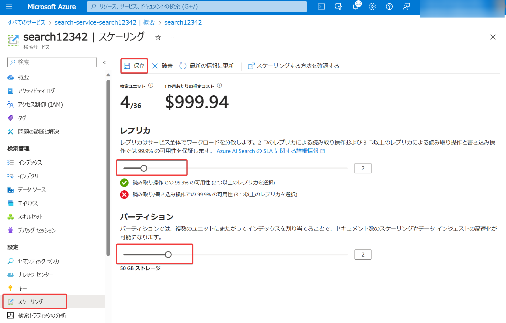

# Azure AI Searchのスケーリング

リソースの作成時、または作成後に、パーティション数やレプリカ数を調節できる。

■パーティション

インデックスを分散配置する物理ストレージ。各パーティションは固定のストレージサイズを持つ。例: Standard S1: 160 GB, Standard S2: 512 GB

複数のパーティションを使うことで最大ストレージ容量が増える。つまり、より多くの検索インデックスを作成できる。

複数のパーティションを使って読み取り/書き込み操作を分散させることでパフォーマンスが向上する。

読み取り＝検索インデックスを利用した検索など

書き込み＝検索インデックスの作成・更新など

- 価格レベルにより、最大パーティション数は異なる
- 1, 2, 3, 4, 6, 12個

■レプリカ

ワークロードを分散させ、可用性とパフォーマンスを高めるしくみ。

https://learn.microsoft.com/ja-jp/azure/search/search-reliability#high-availability

https://learn.microsoft.com/ja-jp/azure/search/search-reliability#availability-zone-support

- レプリカはインデックスのコピー。
- 最低1
- 最大1（Free）、3（Basic）、12（Standard以上）
- レプリカが2個以上ある場合は、クエリについて 99.9% の可用性が保証される。
- レプリカが3個以上ある場合は、クエリとインデックス作成について 99.9% の可用性が保証される。
- Standard以上の場合、可用性ゾーンに対応するリージョンでは、各レプリカは自動的に複数の可用性ゾーンに分散配置される。

https://learn.microsoft.com/ja-jp/azure/search/search-capacity-planning#estimate-with-a-billable-tier

レプリカを追加するとパフォーマンスが向上する。ただし、厳密に線形に向上するわけではなく、たとえば 3 つのレプリカを追加しても、スループットが 3 倍になるとは限らない。

■検索ユニット (Search Unit または Scale Unit, SU)

レプリカまたはパーティションのいずれかとして割り当てられている請求単位。

検索ユニット数＝レプリカ数 ✕ パーティション数。

たとえば2レプリカ、2パーティションの場合、4検索ユニットが割り当てられるため、1検索ユニットを使用する場合に比べて4倍の料金がかかる。

参考: 東日本リージョン、Standard S1で、SUあたりの価格は $0.45/時間（$324.12/月）。
