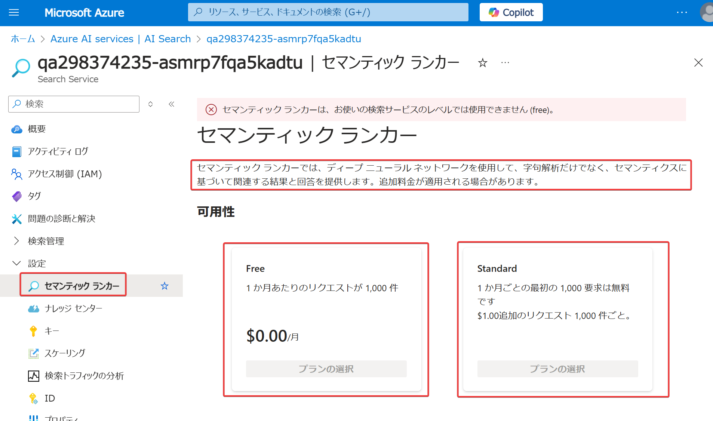

■セマンティック ランキング（元「セマンティック検索」）

2022/10 （セマンティック検索として）プレビュー。
https://blog.johtani.info/blog/2021/07/01/semantic-search-in-azure-cognitive-search/

2023/11/15 （セマンティックランキングとして）一般提供開始
https://techcommunity.microsoft.com/t5/ai-azure-ai-services-blog/announcing-general-availability-of-vector-search-and-semantic/ba-p/3978525

詳しい解説（Bing検索エンジンで培われた技術がベースとなっている）
https://www.microsoft.com/en-us/research/blog/the-science-behind-semantic-search-how-ai-from-bing-is-powering-azure-cognitive-search/

「セマンティック ランク付け」、「セマンティック優先度付け」とも。

AI を使用して検索結果を再スコア付けし、セマンティック関連性の高い（意味的に近い）結果をリストの先頭に移動する機能。

たとえば"what hotel has a good restaurant on site (良い館内レストランがあるホテルはどこか)"というクエリを実行すると、「hotel」「restaurant」「site」などのキーワードが含まれるドキュメントが検索される。

「セマンティック ランク付け」を有効にしてクエリを実行すると、検索結果がランク付けされ、関連度の高い順に並び替えされ、「良い館内レストランがあるホテル」のドキュメントが検索上位に並ぶようになる。

使用するにはBasic以上の価格レベルを選択してAzure AI Searchリソースを作成し、リソースの設定で「セマンティック ランキング」を有効化する必要がある。

セマンティック ランキング有効化の際には「Free」と「Standard」を選べる（これはリソース自体の価格レベルとは別のもの）。

インデックスに「セマンティック構成」という設定が追加されるだけなので、既存のインデックスを作り直す必要がない。
