# ラボ01 言語サービス（言語の検出）

Cognitive Servicesを使用して、入力された文章が何語で書いてあるか判定する（言語の検出）。

## Cognitive Services マルチサービスアカウントの作成

Azure portalで作成します。
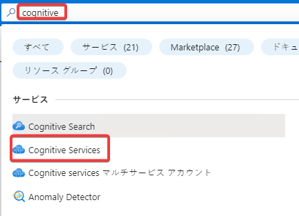
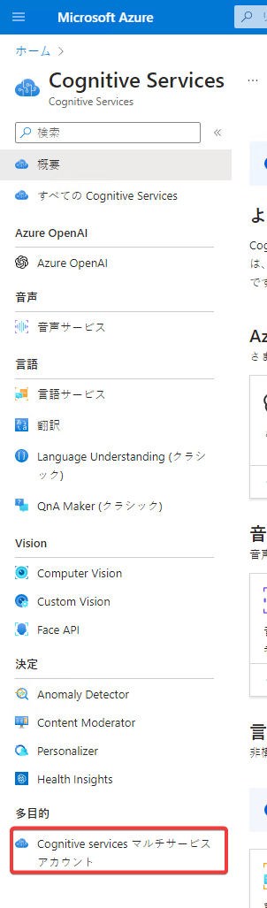

- 画面上部検索で「Cognitive Services」と検索
- 画面左のメニューで「Cognitive servicesマルチサービスアカウント」をクリック
- +作成
- リソースグループ 新規作成、cogrg
- 名前 cog(乱数)
  - ※「(乱数)」はキーボードから適当に数字を10桁ほど打ち込みます。cog823738629837といった名前になります。
  - 打ち込み後エンターキーを押すと、名前に関する赤字（エラー）が消えます
- 価格レベル Standard S0
- リージョン East US
- 「このボックスをオンにすることにより・・」: チェック
- 「確認と作成」
- 「作成」
- リソースの作成が進行します。しばらく待ちます。
- 「リソースに移動」

左のメニューから「キーとエンドポイント」をクリックし、「キーの表示」をクリックします。以下の情報をメモ帳などに記録しておきます。

- Cognitive Servicesリソースの名前（画面左上に表示）
  - cog823738629837 （例）
- キー1
  - fe8e701348530482538945845a2483ff （例）
- エンドポイント
  - https://cog012039482.cognitiveservices.azure.com/ （例）
- 場所/地域
  - eastus

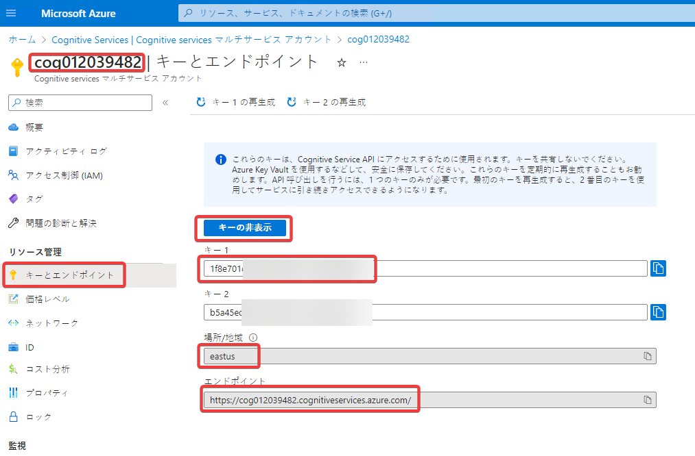

## プロジェクトの作成

Windows PowerShellで、以下を実行。

```sh
cd ~/Documents
mkdir lab01
cd lab01
dotnet new worker
rm Worker.cs
code .
```

`Do you trust ... ?` → `Yes`

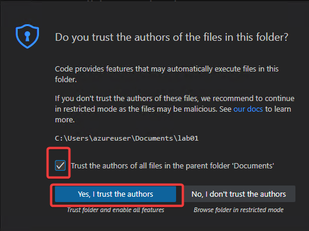

## パッケージの追加

「ターミナル」を開く

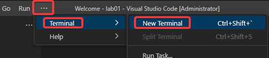

「ターミナル」内で以下を実行

```sh
dotnet add package Microsoft.Extensions.Configuration.UserSecrets
dotnet add package Azure.AI.TextAnalytics
dotnet add package CognitiveServices.Translator.Client
dotnet add package ConsoleAppFramework
```

※貼り付け後エンターキーを押して、すべてのコマンドを実行してください。

## キーとエンドポイントの追加

以下のコマンドを実行します。「キー」などの部分は、コピーしておいたものに置換します。

```sh
dotnet user-secrets set 'CognitiveServices:SubscriptionKey' 'キー'
dotnet user-secrets set 'CognitiveServices:Name' 'Cognitive Servicesリソースの名前'
dotnet user-secrets set 'CognitiveServices:Endpoint' 'エンドポイント'
dotnet user-secrets set 'CognitiveServices:SubscriptionRegion' '場所/地域'
```

設定後、以下のコマンドで、設定を確認します。

```
dotnet user-secrets list
```

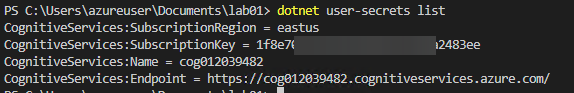

## `.editorconfig`の作成

`LanguageCommands.cs`クラスで発生する[警告CA1822](https://learn.microsoft.com/ja-jp/dotnet/fundamentals/code-analysis/quality-rules/ca1822)を抑制します。（このクラスのメソッドは非staticである必要があるため）

プロジェクト内（Program.csなどがある場所）に`.editorconfig`ファイルを作成します。

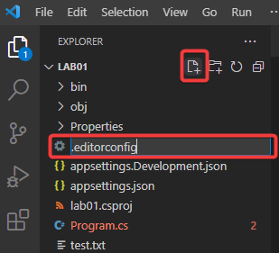

<!--
https://learn.microsoft.com/ja-jp/dotnet/fundamentals/code-analysis/quality-rules/ca1822
-->

```
root = true

[*.cs]
# supress 'Member ... does not access instance data and can be marked as static'
dotnet_diagnostic.CA1822.severity = none
```

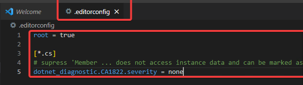

ファイルを保存します。（以下同様。ファイルを編集したら保存してください）

## `Properties/launchSettings.json`の設定

プログラム起動時に表示される「ビルドしています...」（`Building...`）の表示を抑制します。

<!--
https://stackoverflow.com/questions/65923063/purpose-of-dotnetrunmessages-in-launchsettings-json
-->

```json
{
    ...
      "dotnetRunMessages": false,
    ...
}
```
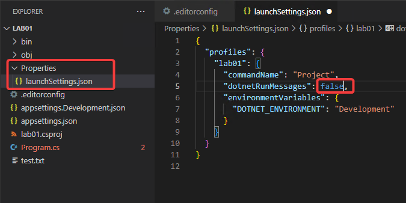

## `Program.cs` のコーディング

プログラムの起動部分を記述します。

```cs
using Azure;
using Azure.AI.TextAnalytics;
using CognitiveServices.Translator.Extension;

ConsoleApp
.CreateBuilder(args)
.ConfigureServices((context, services) =>
{
    var key = context.Configuration["CognitiveServices:SubscriptionKey"] ?? "";
    var endpoint = new Uri(context.Configuration["CognitiveServices:Endpoint"] ?? "");
    var cred = new AzureKeyCredential(key);
    var client = new TextAnalyticsClient(endpoint, cred);
    services.AddSingleton(client);
    services.AddCognitiveServicesTranslator(context.Configuration);
})
.Build()
.AddCommands<LanguageCommands>()
.Run();
```
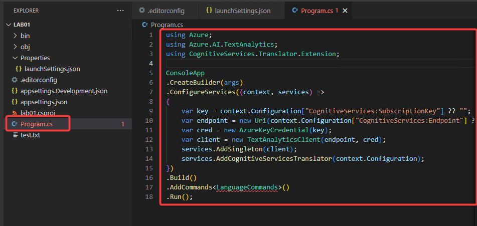


※`LanguageCommands`の部分がエラーとなりますが問題ありません。この後`LanguageCommands.cs`を作成するとエラーが解消されます。

## `LanguageCommands.cs` のコーディング

言語の検出（`DetectLanguage`）を行う処理を記述します。

`LanguageCommands.cs` を作成

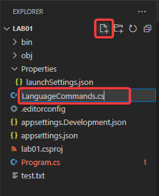

```cs
using Azure.AI.TextAnalytics;

class LanguageCommands : ConsoleAppBase
{
    public void Detect(TextAnalyticsClient client, string text)
    {
        DetectedLanguage detectedLanguage = client.DetectLanguage(text);
        Console.WriteLine("Language:");
        Console.WriteLine($"\t{detectedLanguage.Name},\tISO 639-1: {detectedLanguage.Iso6391Name}\n");
    }
}
```

※[ISO 630-1: 言語コードの規格](https://ja.wikipedia.org/wiki/ISO_639-1)。ja=日本語 / en=English など。検出された言語の情報の一部として出力される。

## 実行

ターミナル内から以下を実行します。

```
dotnet run detect --text 'おはようございます'
```

`--text`部分に指定した文章の言語が判定されます。

実行結果例:
```sh
Language:
        Japanese,       ISO 639-1: ja
```

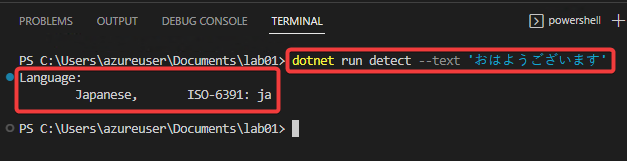

他にもいくつかの言語で試してみてください。

```
# 中国語で「ありがとう」
dotnet run detect --text '谢谢'

# フランス語で「今何時？」
dotnet run detect --text 'Quelle heure est-il'
```

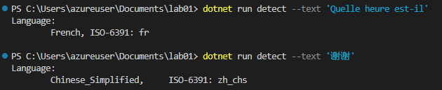