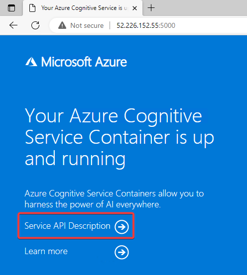
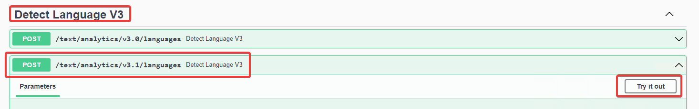
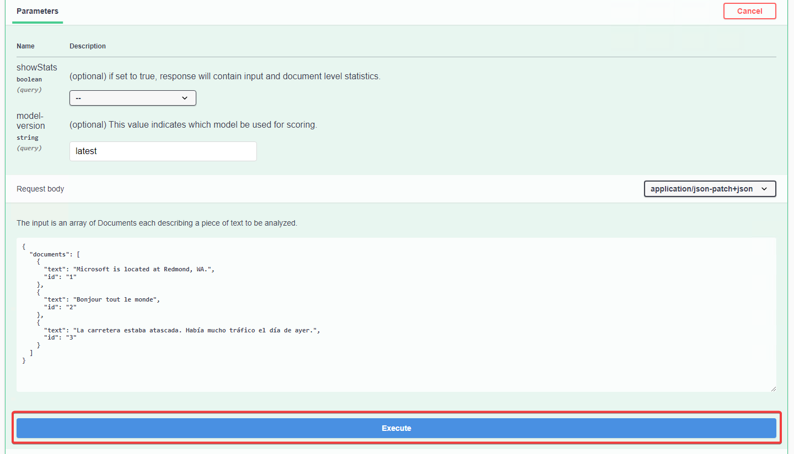
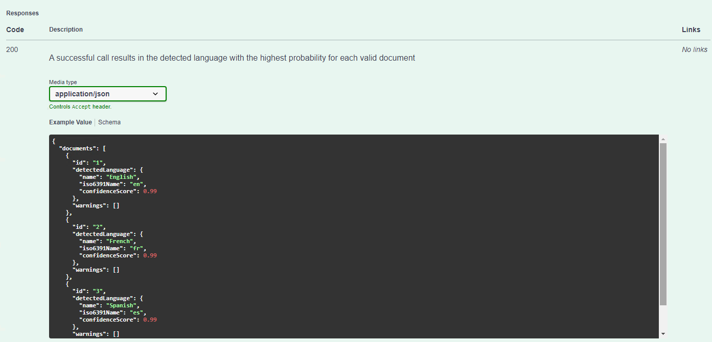
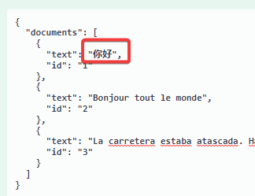
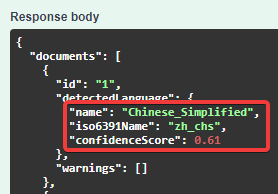

# ラボ04 Cognitive Servicesコンテナーの作成

Azure Cognitive Services には、Docker コンテナーのイメージが用意されている。

Azure で使用できるものと同じ API を、コンテナーが稼働する任意の環境（例: オンプレミス、Azure、他のクラウド）で実行できる。

コンテナーには「課金引数」を指定する必要がある。

（コンテナー内のサービスの使用状況が「課金引数」で指定した場所へと送信される）

https://learn.microsoft.com/ja-jp/azure/cognitive-services/language-service/language-detection/how-to/use-containers#billing-arguments

```
ユーザー
↓ リクエスト↑判定結果
Docker コンテナー（言語判定をここで実行）
↓ 課金情報
Cognitive Serviceアカウント
```

このラボでは、Dockerコンテナーを「Azure Container Instances」上で実行する。

## リクエストとレスポンスの例

コンテナーに向かって、以下のようなリクエストを送る:

```json
{
    documents": [
        {
        "text": "Microsoft is located at Redmond, WA.",
        "id": "1"
        },
        {
        "text": "Bonjour tout le monde",
        "id": "2"
        },
        {
        "text": "La carretera estaba atascada. Había mucho tráfico el día de ayer.",
        "id": "3"
        }
    ]
}
```

するとコンテナー内で言語の判定が行われ、以下のようなレスポンスが得られる:

```json
{
  "documents": [
    {
      "id": "1",
      "detectedLanguage": {
        "name": "English",
        "iso6391Name": "en",
        "confidenceScore": 0.99
      },
      "warnings": []
    },
    {
      "id": "2",
      "detectedLanguage": {
        "name": "French",
        "iso6391Name": "fr",
        "confidenceScore": 0.99
      },
      "warnings": []
    },
    {
      "id": "3",
      "detectedLanguage": {
        "name": "Spanish",
        "iso6391Name": "es",
        "confidenceScore": 0.99
      },
      "warnings": []
    }
  ],
  "modelVersion": "latest"
}
```

## スクリプト(1)の準備

以下のスクリプトをコピーしてメモ帳などに貼り付けする。

```sh
apikey='Cognitive Servicesのキー'
endpoint='Cognitive Servicesのエンドポイント'
```

「Cognitive Servicesのキー」「Cognitive Servicesのエンドポイント」の部分を、前のラボで作成した「Cognitive Servicesマルチサービスアカウント」リソースの対応する値に変更する。

変更後のスクリプトをコピー。

スタートメニューからGit Bashを起動。※以降のコマンドはこのウィンドウ内で実行。このウィンドウはこのラボが終了するまで閉じない。

スクリプトをGit Bashウィンドウ内に貼り付けて実行する。※貼り付けは「Shift＋Insert」、または「右クリック＞Paste」で行う。貼付け後エンターキーを押して、貼り付けたコマンドを実行する。

以下のコマンドを実行して、変数の値を表示し、正しく設定されたかどうか確認する。

```
echo $apikey

echo $endpoint
```

## スクリプト(2)の実行

以下のスクリプトをGit Bashウィンドウ内に貼り付けて実行する。

```sh
# リソースグループ名
groupname=rg$(date '+%s')
echo $groupname

# Azure Container Instanceの「コンテナーグループ」名
aciname=aci$(date '+%s')
echo $aciname

location='eastus'

# リソースグループを作成
az group create -n $groupname -l $location

# Azure Container Instanceの「コンテナーグループ」を作成
ip=$(az container create \
--image mcr.microsoft.com/azure-cognitive-services/textanalytics/language:3.0.58166773-onprem-amd64 \
--name $aciname \
--location $location \
--resource-group $groupname \
--cpu 1 \
--memory 8 \
--ports 5000 \
--restart-policy OnFailure \
--secure-environment-variables "ApiKey=$apikey" "Billing=$endpoint" 'Eula=accept' \
--ip-address public \
--query 'ipAddress.ip' -otsv)

# Azure Container Instanceの「コンテナーグループ」のIPアドレス(+ポート番号)を表示
echo http://$ip:5000
```

Azure Container Instanceの「コンテナーグループ」が作成される。

※実行が完了するまで10分ほどかかる。

実行が完了すると、コンテナーにアクセスするためのアドレスが表示される。（`http://1.2.3.4:5000` といった形式）

表示されたアドレスをコピーする。

## リクエストを送信する

Webブラウザーで、コピーしたアドレスにアクセスする。以下のようなページが表示される。



「Service API Description」をクリック。

「Detect Language V3」の「/text/analytics/v3.1/languages」の「Try it out」をクリック。



サンプルデータがテキストボックス内に入力されている。そのまま「Execute」をクリック。



以下のように、サンプルデータに含まれる言語の判定結果が表示される。



## サンプルデータを変更して実行

例: 「你好（ニーハオ）」（中国語で「こんにちは」）





## コンテナーの削除

Azure Container Instances コンテナーグループは、起動状態のままだと課金が行われるため、削除する。

コンテナーグループを削除することで、その中のリソースをすべてまとめて削除できる。

以下のコマンドを実行。

```sh
az group delete --no-wait --yes --resource-group $groupname
```
