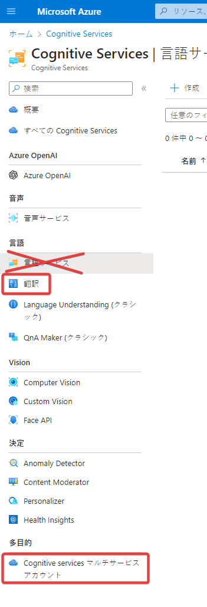
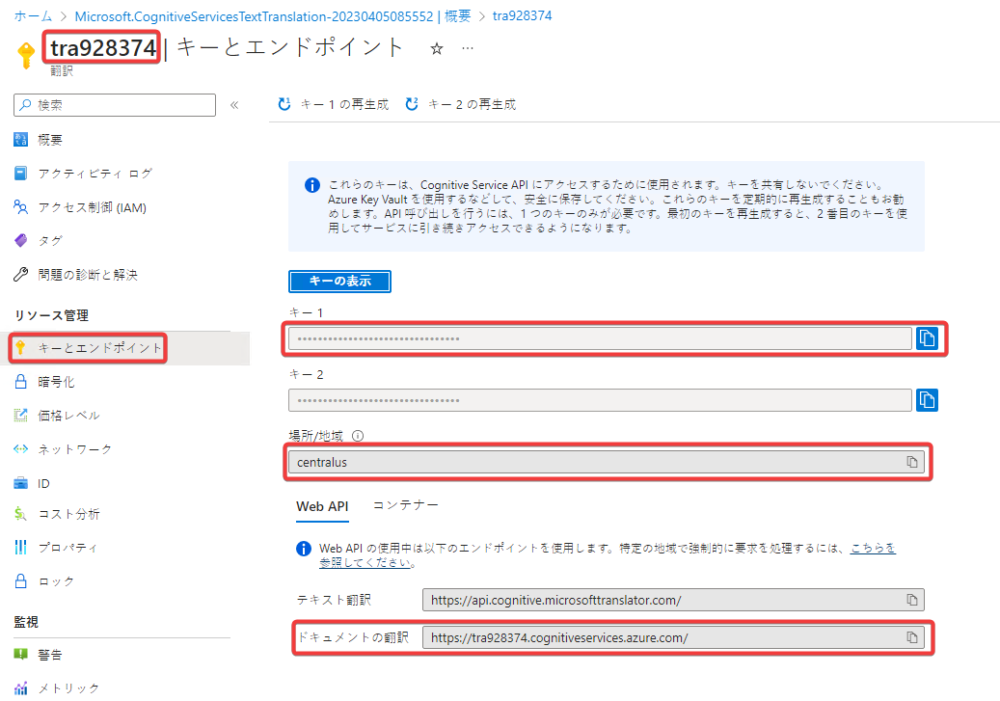
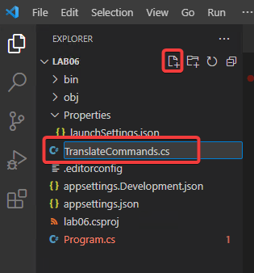

# ラボ06 言語サービス（翻訳）

Cognitive Servicesを使用して、入力された文章を別の言語に翻訳します。

## Cognitive Services リソースの作成

Azure portalで必要なリソースを作成。以下のいずれかを使用。

- Cognitive Services マルチサービスアカウント
- 言語＞翻訳 リソース

「言語サービス」のリソースは翻訳には使えないので注意。



「翻訳 リソース」を使用する場合は、以下の部分をコピーします。



## .NET (C#) プロジェクトの作成

新しく「lab06」というプロジェクトを作成。必要なNugetパッケージの追加などを行う。

```
cd ~/Documents
mkdir lab06
cd lab06
dotnet new worker
rm Worker.cs
dotnet add package Azure.Extensions.AspNetCore.Configuration.Secrets
dotnet add package Azure.AI.TextAnalytics
dotnet add package ConsoleAppFramework
dotnet add package Azure.Identity
dotnet add package CognitiveServices.Translator.Client
echo "root = true
[*.cs]
# supress 'Member ... does not access instance data and can be marked as static'
dotnet_diagnostic.CA1822.severity = none
" > .editorconfig
code .
```

## キーとエンドポイントの追加

作成済みのCognitive Servicesリソースの4情報を「ユーザーシークレット」としてセット。

```sh
dotnet user-secrets set 'CognitiveServices:SubscriptionKey' '...'
dotnet user-secrets set 'CognitiveServices:Name' '...'
dotnet user-secrets set 'CognitiveServices:Endpoint' '...'
dotnet user-secrets set 'CognitiveServices:SubscriptionRegion' '...'
```

## `Properties/launchSettings.json`の設定

https://stackoverflow.com/questions/65923063/purpose-of-dotnetrunmessages-in-launchsettings-json

```json
{
    ...
      "dotnetRunMessages": false,
    ...
}
```

## `Program.cs` のコーディング

```cs
using CognitiveServices.Translator.Extension;

ConsoleApp
.CreateBuilder(args)
.ConfigureServices((context, services) =>
{
    services.AddCognitiveServicesTranslator(context.Configuration);
})
.Build()
.AddCommands<TranslateCommands>()
.Run();
```

## `TranslateCommands.cs` のコーディング

`TranslateCommands.cs` を作成



以下のように変更して保存。

```cs
using CognitiveServices.Translator;
using CognitiveServices.Translator.Translate;

class TranslateCommands : ConsoleAppBase
{
    public void Translate(ITranslateClient client, string text, string from, string to)
    {
        {
            var response = client.Translate(
                new RequestContent(text),
                new RequestParameter
                {
                    From = from,
                    To = new[] { to },
                    IncludeAlignment = true
                });
            Console.WriteLine(response.First().Translations.First().Text);
        }
    }
}
```

## 実行(翻訳)

```sh
dotnet run translate --text 'おはようございます' --from ja --to en
```

実行結果例
```
Good morning
```

他にもいろいろな言語を試してみましょう。
