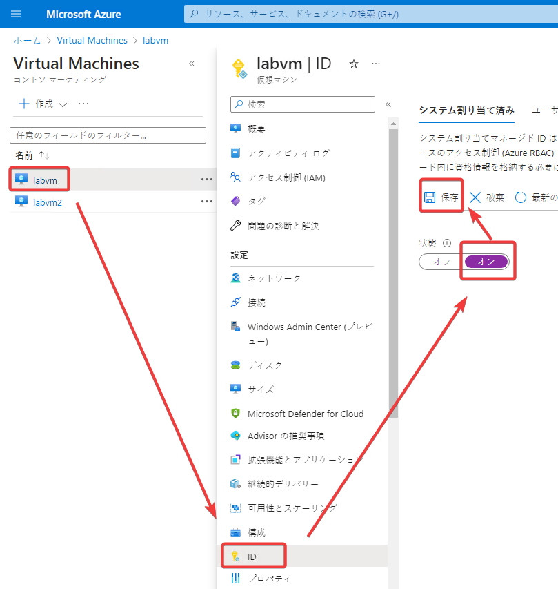

# ラボ7 Text-to-Speech アプリの作成


Cognitive Servicesを使用して、入力された文章から音声ファイル（～.wav）を作成します。

## リソースの作成

Cognitive Servicesの「音声サービス」リソースを作成します。

- リソースグループ: （適当なのものを指定）
- リージョン: 米国東部（など、どこでもよい）
- 名前: （適当なのものを指定）
- 価格レベル: F0

「確認と作成」、「作成」

作成したら、リソースに移動します。「概要」が表示されます。

画面右側「JSONビュー」をクリックします。


リソースIDをコピー。あとで使うのでメモ帳などに控えておく。


「キーとエンドポイント」をクリックし、「場所/地域」（リージョン）をコピー。あとで使うのでメモ帳などに控えておく。


## VM（仮想マシン）のマネージドIDの有効化

※すでに有効化している場合はスキップします。

開発環境として使用しているVM（仮想マシン）「labvm」のマネージドIDを有効化します。

VMを表示し、「ID」を開き、「システム割り当て済み」の状態を「オン」にして保存します。



確認が出たら「はい」をクリックします。

## ロールの割り当て

VM（仮想マシン）「labvm」のマネージドIDに、
`Cognitive Services User` （Cognitive Services ユーザー）ロールを割り当てます。

参考: [Cognitive Services の Speech のロール](https://learn.microsoft.com/ja-jp/azure/cognitive-services/speech-service/role-based-access-control#roles-for-speech-resources)

さきほど作成した「音声サービス」リソースを表示。

アクセス制御＞＋追加＞ロールの割り当ての追加


割り当ての種類：「職務ロール」、次へ

ロール: 「Cognitive Services ユーザー」の行をクリック、次へ


アクセスの割り当て先: 「マネージドID」を選択

＋メンバーを選択する

マネージドID: すべてのシステム割り当てマネージドID

labvmをクリック、「選択」


「レビューと割り当て」を2回クリック。

## プロジェクトの作成

`lab07`というプロジェクトを作成します。

Windows PowerShellを開き、以下のスクリプトを貼り付けて実行します。

```
cd ~/Documents
mkdir lab07
cd lab07
dotnet new worker
rm Worker.cs

dotnet add package Microsoft.Extensions.Configuration.UserSecrets
dotnet add package ConsoleAppFramework
dotnet add package Azure.Identity
dotnet add package Microsoft.CognitiveServices.Speech
echo "root = true
[*.cs]
# supress 'Member ... does not access instance data and can be marked as static'
dotnet_diagnostic.CA1822.severity = none
" > .editorconfig
code .
```

Visual Studio Codeが開き、`lab07`プロジェクトのフォルダが読み込まれます。


■ `appsettings.json`

`appsettings.json` を開き、以下の内容とする。

`region` の値 "..."の部分は、先ほどコピーしておいた、Cognitive Servicesの「音声サービス」リソースの「場所/地域」（リージョン）とする。

`resourceId` の値 "..."の部分は、先ほどコピーしておいた、Cognitive Servicesの「音声サービス」リソースのリソースIDとする。

`voiceName` の値はお好みで`ja-JP-KeitaNeural` や `ja-JP-NanamiNeural`とする。参考: [voiceNameの一覧](https://learn.microsoft.com/ja-jp/azure/cognitive-services/speech-service/language-support?tabs=tts#supported-languages) （「テキスト読み上げ」タブ内の`ja-JP`の行）

```json
{
  "speech": {
    "language": "ja-JP",
    "output": "output.wav",
    "region": "...",
    "resourceId": "...",
    "voiceName": "ja-JP-NanamiNeural"
  }
}
```

■ `Program.cs` のコーディング

```cs
using SpeechServiceExtensions;

ConsoleApp.CreateBuilder(args)
.ConfigureServices((context, services) =>
{
    var speechSection = context.Configuration.GetSection("speech");
    services.AddSpeechSynthesizer(speechSection);
})
.Build().AddCommands<Commands>().Run();
```

■ `SpeechServiceExtensions.cs` のコーディング

`SpeechServiceExtensions.cs`を新規作成。

```cs
using Azure.Core;
using Azure.Identity;
using Microsoft.CognitiveServices.Speech;
using Microsoft.CognitiveServices.Speech.Audio;

namespace SpeechServiceExtensions;

public static class SpeechServiceExtensions
{
    public static void AddSpeechSynthesizer(this IServiceCollection services, IConfigurationSection section)
    {
        var credential = new DefaultAzureCredential();
        var resourceId = section["resourceId"];
        var context = new TokenRequestContext(
            new[] { "https://cognitiveservices.azure.com/.default" });
        var token = credential.GetToken(context).Token;
        var authorizationToken = $"aad#{resourceId}#{token}";

        var speechConfig = SpeechConfig.FromAuthorizationToken(
            authorizationToken, section["region"]);
        speechConfig.SpeechSynthesisLanguage = section["language"];
        speechConfig.SpeechSynthesisVoiceName = section["voiceName"];

        var audioConfig = "speaker" == section["output"] ?
            AudioConfig.FromDefaultSpeakerOutput() :
            AudioConfig.FromWavFileOutput(section["output"]);

        services.AddSingleton(speechConfig);
        services.AddSingleton(audioConfig);
        services.AddSingleton<SpeechSynthesizer>();
    }
}
```

■ `Commands.cs` のコーディング

`Commands.cs`を新規作成。

```cs
using Microsoft.CognitiveServices.Speech;

class Commands : ConsoleAppBase
{
    private readonly SpeechSynthesizer _synthesizer;
    public Commands(SpeechSynthesizer synthesizer) =>
        _synthesizer = synthesizer;

    public async Task Speech(string message)
    {
        await _synthesizer.SpeakTextAsync(message);
    }
}
```

■実行

すべてのファイルを保存、

Visual Studio Codeのターミナルを開く。

ターミナル内で以下を実行

```
dotnet run speech --message 'おはようございます'
```

すると、プロジェクト内に`output.wav`という音声ファイル（[WAVファイル](https://ja.wikipedia.org/wiki/WAV)）が生成される。


■コマンドライン引数でvoiceNameを変える

```
dotnet run speech --message 'おはようございます' --speech:voiceName='ja-JP-KeitaNeural'

dotnet run speech --message 'おはようございます' --speech:voiceName='ja-JP-NanamiNeural'
```

■コマンドライン引数で出力先ファイルを変える

```
dotnet run speech --message 'おはようございます' --speech:output='output2.wav'
```