# ラボ09 「会話言語理解(CLU)」リソースの作成

Cognitive Servicesリソースを作成し、それを使用して「Clock」というプロジェクトを作成する。

このプロジェクトにモデル「Clock」を作成し、現在の日付や時刻を尋ねる質問の文章を理解できるように、トレーニングする。

■はじめに

このラボはわりと時間がかかります。（慣れていれば30分程度、慣れていなければ60分程度）

途中、延長するか聞かれた場合は「はい」を選んでください。


■ラボ9を起動

- 仮想デスクトップ(Windows)にログイン
- Webブラウザーを開き、Azure portalにサインイン
- 日本語化

■手順書

以降、次のページをラボ環境内のブラウザで開き、参照してください。

https://github.com/hiryamada/notes/blob/main/AI-102/lab09cs.md

※ラボ環境右側の手順書は、このラボではこれ以降使用しません。

■Cognitive Servicesリソースの作成

「言語サービス」に、「会話言語理解(CLU)」が含まれているので、「言語サービス」リソースを作成する。


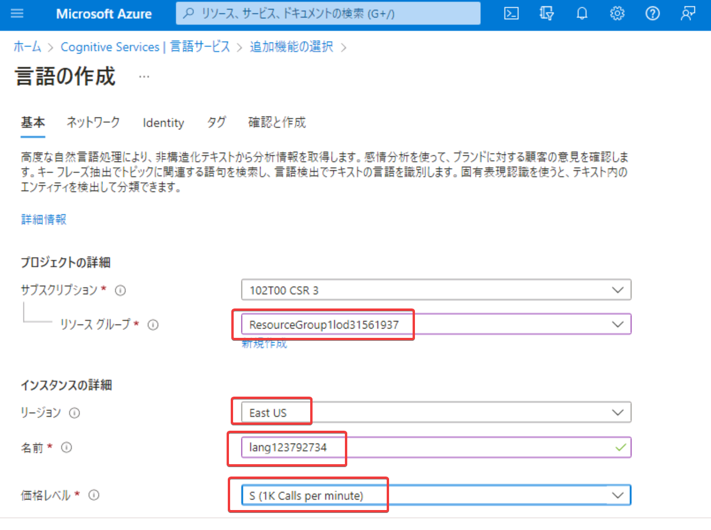


作成したら「キーとエンドポイント」画面に移動し、「キー1」の値と「エンドポイント」の値をコピーして、メモ帳などに控えておく。次のラボで使用する。

■Language Studioにアクセス

https://language.cognitive.azure.com

画面右上でサインイン、リソースを選択。


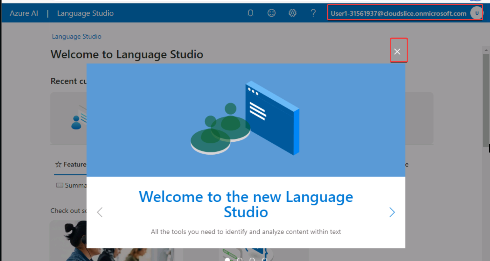

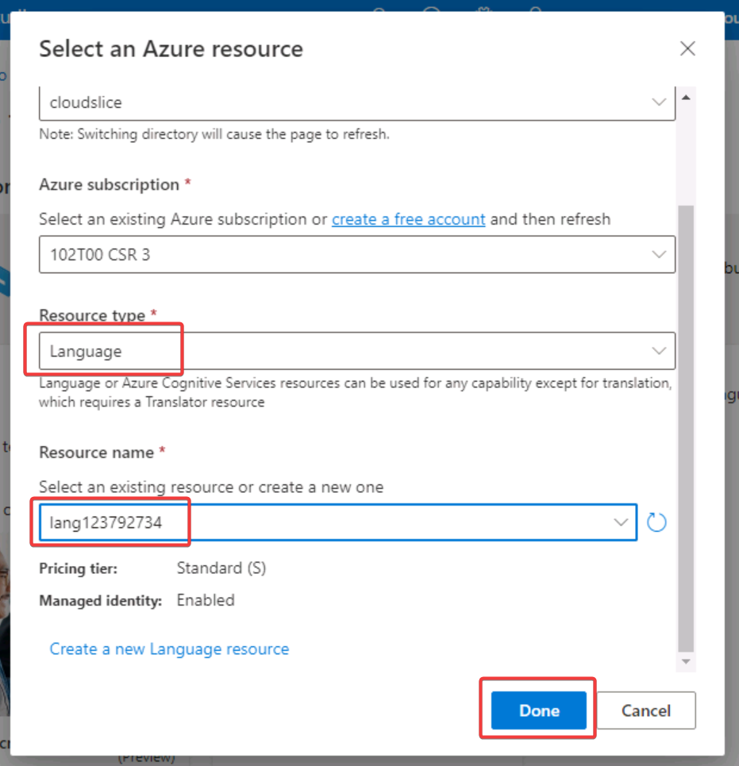

日本語化


■「会話言語理解」プロジェクトの作成

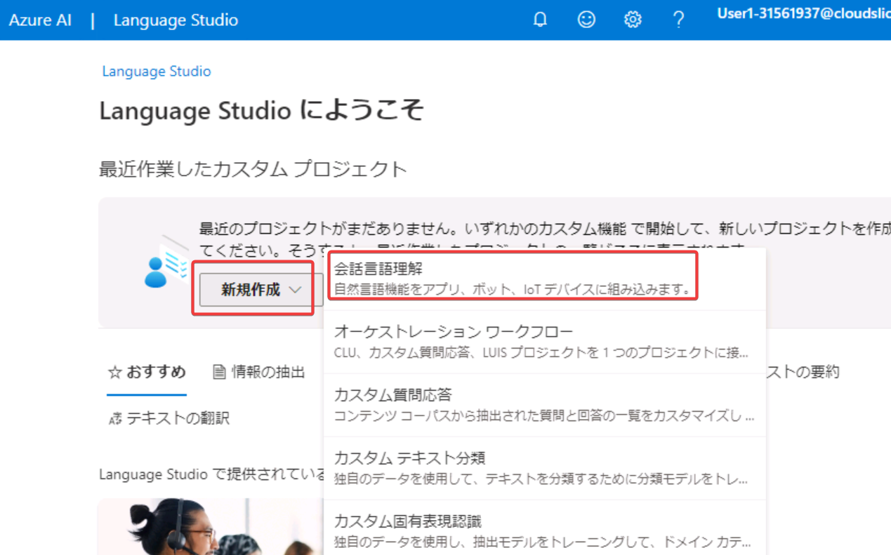

プロジェクト名: `Clock` ※大文字で始める

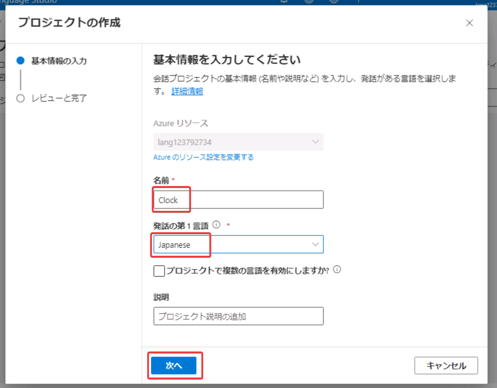


■「意図」(intent)を追加

<!--
参考: https://learn.microsoft.com/ja-jp/azure/cognitive-services/language-service/conversational-language-understanding/how-to/build-schema#add-intents
-->

意図「GetDate」を追加


「発話の例」を書き込む


- 今日は何日？
- 今日は？
- 何日ですか？
- 何日？
- 今日の日付は？
- 日付は？
- 何月何日？
- 今何日？
- 日付


意図「GetTime」を追加し、「発話の例」を書き込む


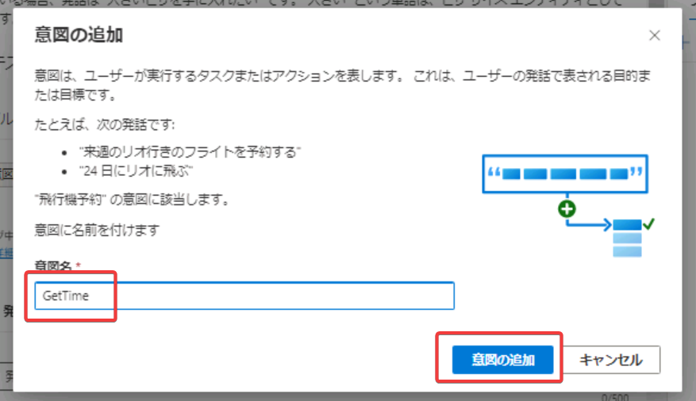


- 何時？
- 何時何分？
- 今何時？
- 今何時ですか？
- 何時ですか？
- 現在時刻
- 現在時刻は？
- 現在時刻を教えてください


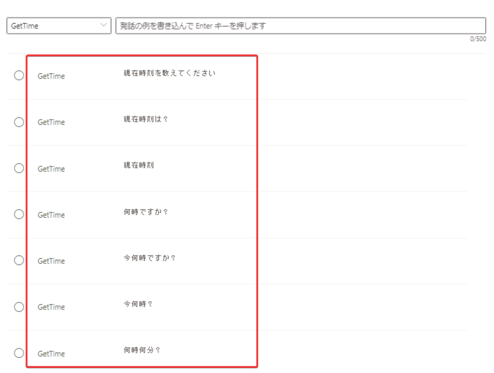

最後に「変更の保存」をクリック。

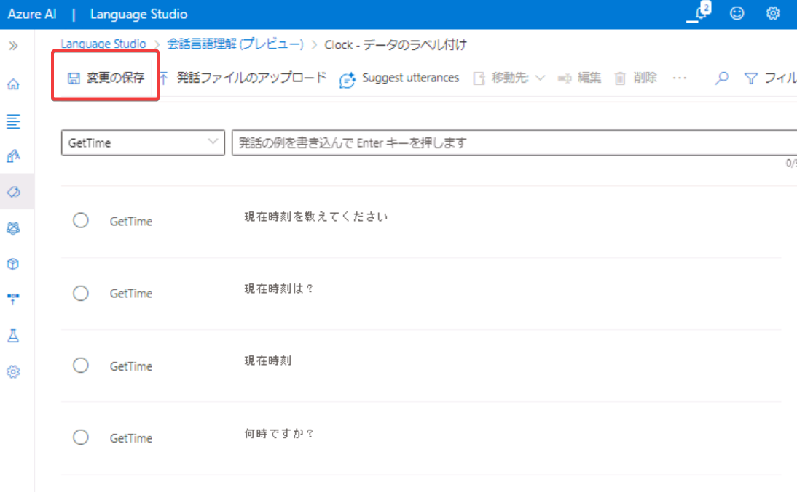

■トレーニング ジョブの開始

<!--
参考: https://learn.microsoft.com/ja-jp/azure/cognitive-services/language-service/conversational-language-understanding/how-to/train-model?tabs=language-studio#training-modes
-->

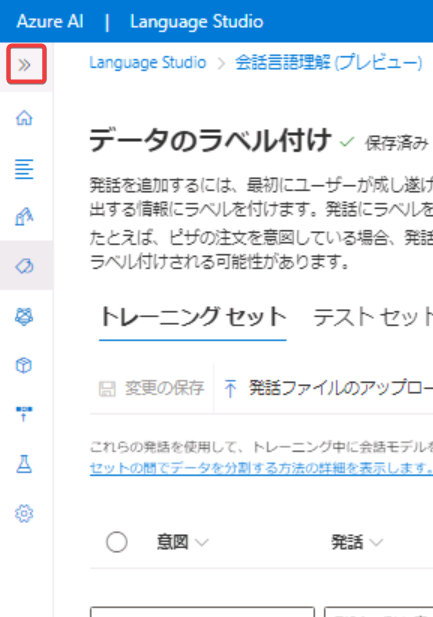


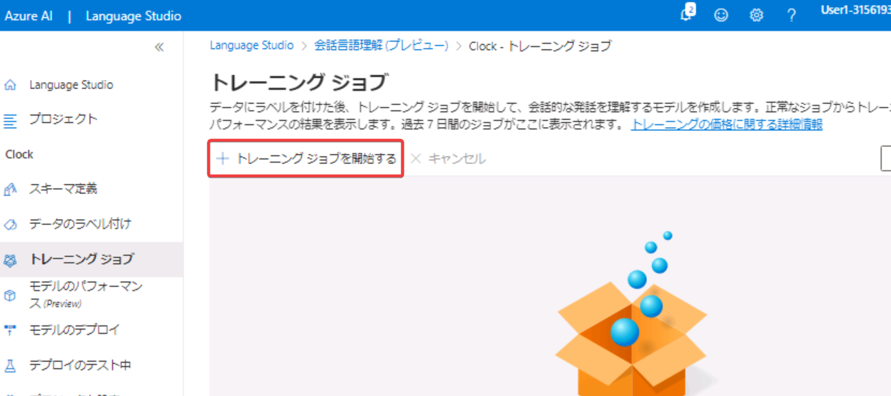

- モデル名: `Clock` ※大文字で始める
- トレーニングモード: 高度なトレーニング ※「標準トレーニング」は英語の場合のみ使用可能。

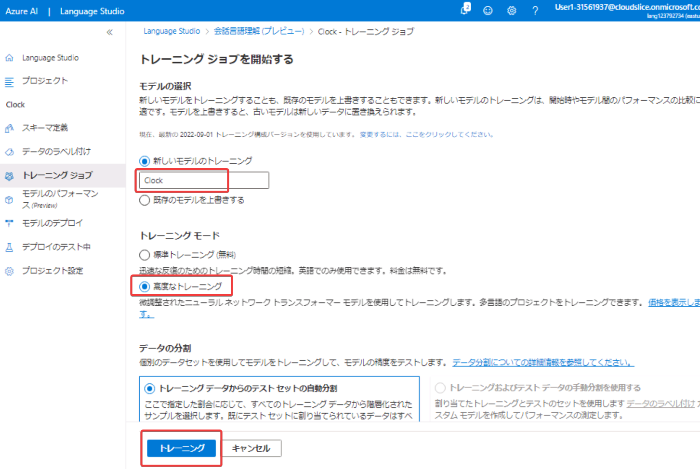

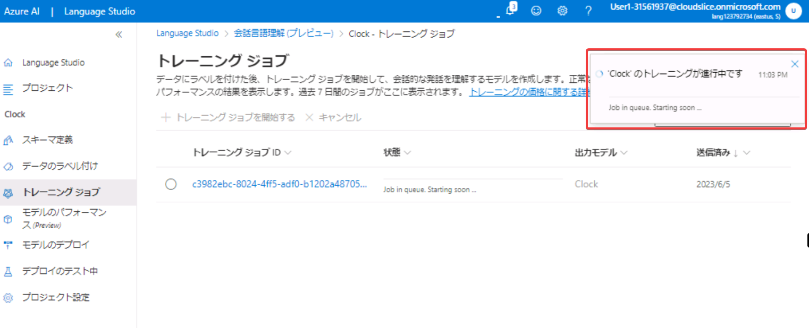

トレーニングジョブが「キュー」に入ると、「Job in queue. Starting soon ...」 などと表示される。

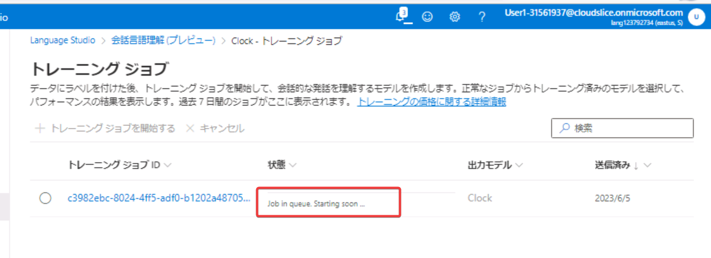

※トレーニングジョブが「キュー」に入ると、あとはトレーニングは自動で進行する。始まるまで10分ほど時間がかかる（ここで休憩をおとりください。）

<!-- 15:04 start -->

トレーニングが開始されると、「Training - 0% complete, Evaluation - 0% complete.」などと表示される。


トレーニングが完了（成功）すると、「トレーニングに成功しました」などと表示される。


※トレーニングは15分ほどかかるので、この画面はこのままにしておき、別の作業を進めます。


## .NET 7.0 をインストール

Webブラウザーの新しいタブで以下を開き、.NET 7をダウンロードしてインストールします。

https://dotnet.microsoft.com/en-us/download


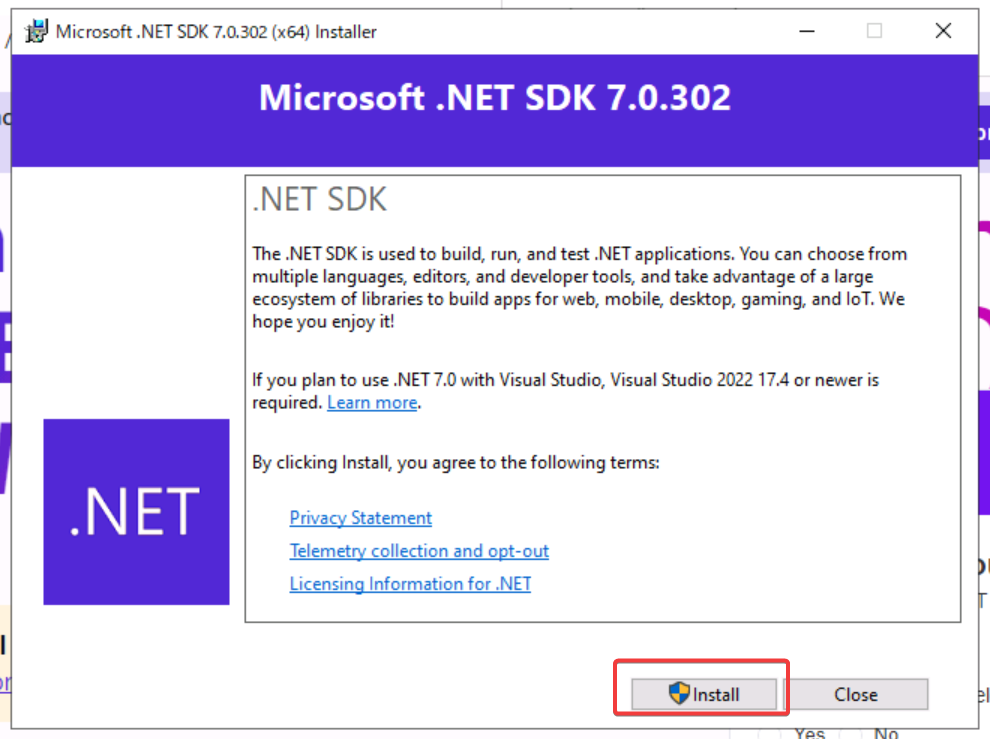


## プロジェクトの作成

Visual Studio Codeを起動。


ターミナルを起動
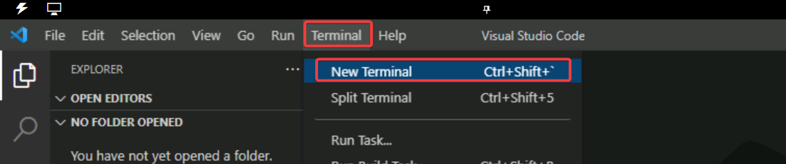

Git Bashに切り替え


以下のコマンドを全部コピーし、Git Bash内に貼り付け

```
cd ~/Documents
mkdir lab10
cd lab10
dotnet new worker
rm Worker.cs

dotnet add package Microsoft.Extensions.Configuration.UserSecrets
dotnet add package ConsoleAppFramework
dotnet add package Azure.AI.Language.Conversations --version 1.0.0

echo "root = true
[*.cs]
# supress 'Member ... does not access instance data and can be marked as static'
dotnet_diagnostic.CA1822.severity = none
" > .editorconfig
code -r .
```

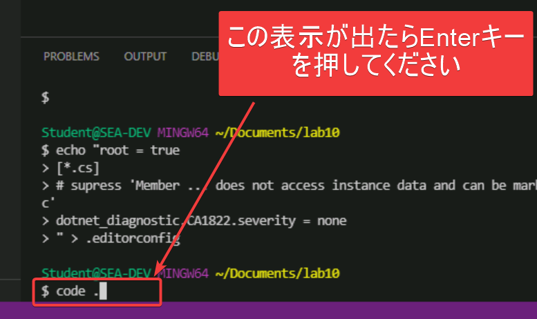

Visual Studio Codeで、プロジェクトのフォルダが開かれる。

## ユーザーシークレットの追加

Visual Studio Codeのターミナルを開く。


Git Bashに切り替え

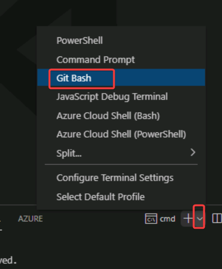

以下のコマンドの、「キー」と「エンドポイント」の部分を、前のラボでコピーしておいた文字列に置換して、ターミナル内で実行。

```
dotnet user-secrets set 'CognitiveServices:SubscriptionKey' 'キー'
dotnet user-secrets set 'CognitiveServices:Endpoint' 'エンドポイント'
```

## `Properties/launchSettings.json`の変更

dotnetRunMessagesの値をfalseに変更し、保存。

```json
{
...
      "dotnetRunMessages": false,
...
}
```

プログラム実行時の「Building...」という出力が抑制される。

## `Program.cs`のコーディング

```cs
using Azure;
using Azure.AI.Language.Conversations;

ConsoleApp
.CreateBuilder(args)
.ConfigureServices((context, services) =>
{
    var endpoint = new Uri(context.Configuration["CognitiveServices:Endpoint"] ?? "");
    var credential = new AzureKeyCredential(context.Configuration["CognitiveServices:SubscriptionKey"] ?? "");
    var client = new ConversationAnalysisClient(endpoint, credential);
    services.AddSingleton(client);
})
.Build()
.AddCommands<Commands>()
.Run();
```

## `Commands.cs`のコーディング

`Commands.cs`を新規作成。

```cs
using Azure.AI.Language.Conversations;
using System.Text.Json;
using Azure;
using Azure.Core;
class Commands : ConsoleAppBase
{
    public void Clock(ConversationAnalysisClient client, IConfiguration config, string input)
    {
        System.Console.WriteLine(input);
        string projectName = "Clock";
        string deploymentName = "Clock";
        var data = new
        {
            analysisInput = new
            {
                conversationItem = new
                { text = input, id = "1", participantId = "1", }
            },
            parameters = new
            {
                projectName,
                deploymentName,
                vervose = true,
                // Use Utf16CodeUnit for strings in .NET.
                stringIndexType = "Utf16CodeUnit",
            },
            kind = "Conversation",
        };
        Response response = client.AnalyzeConversation(RequestContent.Create(data));
        if (response.ContentStream == null)
        {
            Console.WriteLine("stream is null");
            return;
        }
        using JsonDocument result = JsonDocument.Parse(response.ContentStream);
        JsonElement conversationalTaskResult = result.RootElement;
        JsonElement conversationPrediction = conversationalTaskResult.GetProperty("result").GetProperty("prediction"); var topIntent = conversationPrediction.GetProperty("topIntent").GetString();
        Console.WriteLine($"Top intent: {topIntent}");
        switch (topIntent)
        {
            case "GetDate": GetDate(); break;
            case "GetTime": GetTime(); break;
            default: Console.WriteLine("can't detect intent"); break;
        }
    }
    private void GetDate()
    {
        Console.WriteLine("はい、今日の日付をお答えします。");
        Console.WriteLine(DateTime.Now.ToShortDateString());
    }
    private void GetTime()
    {
        Console.WriteLine("はい、現在時刻をお答えします。");
        Console.WriteLine(DateTime.Now.ToShortTimeString());
    }
}
```

解説: 前のラボで作成した「会話言語理解(CLU)」プロジェクトのモデルを使用して、ユーザーの「発話」（input）から意図（intent）を決定し、それに応じた処理を行う。

## OSのタイムゾーンの調整

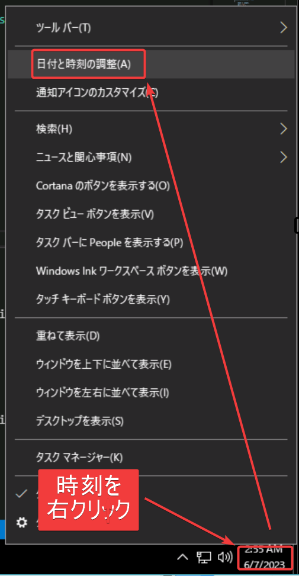


## CLUのトレーニングの状況を確認

トレーニングがまだ完了していなければ、ここで待ちます。

トレーニングが完了したら、次に進みます。

## モデルのデプロイ

画面左「モデルのデプロイ」をクリック

「デプロイの追加」をクリック

「新しいデプロイ名を作成する」、デプロイ名「Clock」

モデル: 「Clock」

「デプロイ」

数秒ほどでデプロイが完了する。

## 実行

Visual Studio Code ターミナルで、以下を実行。

CLUによって、`--input` で指定したテキストから「意図」が認識され、「意図」に対応した操作（日付または時刻の表示）が行われる。

`--input` 以下に指定しているテキストは、トレーニングで指定したものに近い形式のものであればよく、トレーニングで指定していない形式でも、多くの場合は正しい「意図」が認識される。

```
dotnet run clock --input "今日は何日？"
dotnet run clock --input "何日ですか？"
dotnet run clock --input "何日？"
dotnet run clock --input "今日は何日か教えてください"

dotnet run clock --input "現在の時間は？"
dotnet run clock --input "今何時ですか？"
dotnet run clock --input "何時？"
dotnet run clock --input "今何時でしょうか・・・？"
dotnet run clock --input "汝、今何時"
```

実行例


なお、`--input`のテキストによっては、モデルが意図を誤って認識することもありうる。

より多くのトレーニングを行うことで、モデルが意図を正確に認識できる確率が高くなる。

## 以上

おつかれさまでした！

