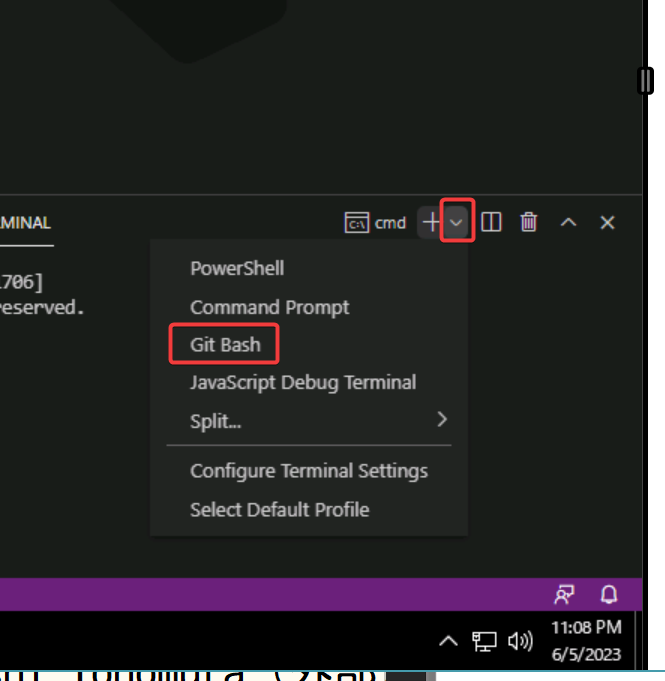

# ラボ10 「会話言語理解(CLU)」を使用するアプリの作成

前のラボ([ラボ9](lab09.md))で作成したモデルを使用して、自然言語による命令を理解するアプリを作成する。

## .NET 7.0 をインストール


https://dotnet.microsoft.com/en-us/download


## プロジェクトの作成

Visual Studio Codeを起動。


ターミナルを起動


Git Bashに切り替え


以下のコマンドを全部コピーし、Git Bash内に貼り付け

```
cd ~/Documents
mkdir lab10
cd lab10
dotnet new worker
rm Worker.cs

dotnet add package Microsoft.Extensions.Configuration.UserSecrets
dotnet add package ConsoleAppFramework
dotnet add package Azure.AI.Language.Conversations --version 1.0.0

echo "root = true
[*.cs]
# supress 'Member ... does not access instance data and can be marked as static'
dotnet_diagnostic.CA1822.severity = none
" > .editorconfig
code .
```


Visual Studio Codeで、プロジェクトのフォルダが開かれる。

## ユーザーシークレットの追加

Visual Studio Codeのターミナルを開く。


Git Bashに切り替え


以下のコマンドの、「キー」と「エンドポイント」の部分を、前のラボでコピーしておいた文字列に置換して、ターミナル内で実行。

```
dotnet user-secrets set 'CognitiveServices:SubscriptionKey' 'キー'
dotnet user-secrets set 'CognitiveServices:Endpoint' 'エンドポイント'
```

## `Properties/launchSettings.json`の変更

dotnetRunMessagesの値をfalseに変更し、保存。

```json
{
...
      "dotnetRunMessages": false,
...
}
```

プログラム実行時の「Building...」という出力が抑制される。

## `Program.cs`のコーディング

```cs
using Azure;
using Azure.AI.Language.Conversations;

ConsoleApp
.CreateBuilder(args)
.ConfigureServices((context, services) =>
{
    var endpoint = new Uri(context.Configuration["CognitiveServices:Endpoint"] ?? "");
    var credential = new AzureKeyCredential(context.Configuration["CognitiveServices:SubscriptionKey"] ?? "");
    var client = new ConversationAnalysisClient(endpoint, credential);
    services.AddSingleton(client);
})
.Build()
.AddCommands<Commands>()
.Run();
```

## `Commands.cs`のコーディング

`Commands.cs`を新規作成。

```cs
using Azure.AI.Language.Conversations;
using System.Text.Json;
using Azure;
using Azure.Core;
class Commands : ConsoleAppBase
{
    public void Clock(ConversationAnalysisClient client, IConfiguration config, string input)
    {
        System.Console.WriteLine(input);
        string projectName = "Clock";
        string deploymentName = "Clock";
        var data = new
        {
            analysisInput = new
            {
                conversationItem = new
                { text = input, id = "1", participantId = "1", }
            },
            parameters = new
            {
                projectName,
                deploymentName,
                vervose = true,
                // Use Utf16CodeUnit for strings in .NET.
                stringIndexType = "Utf16CodeUnit",
            },
            kind = "Conversation",
        };
        Response response = client.AnalyzeConversation(RequestContent.Create(data));
        if (response.ContentStream == null)
        {
            Console.WriteLine("stream is null");
            return;
        }
        using JsonDocument result = JsonDocument.Parse(response.ContentStream);
        JsonElement conversationalTaskResult = result.RootElement;
        JsonElement conversationPrediction = conversationalTaskResult.GetProperty("result").GetProperty("prediction"); var topIntent = conversationPrediction.GetProperty("topIntent").GetString();
        Console.WriteLine($"Top intent: {topIntent}");
        switch (topIntent)
        {
            case "GetDate": GetDate(); break;
            case "GetTime": GetTime(); break;
            default: Console.WriteLine("can't detect intent"); break;
        }
    }
    private void GetDate()
    {
        Console.WriteLine("はい、今日の日付をお答えします。");
        Console.WriteLine(DateTime.Now.ToShortDateString());
    }
    private void GetTime()
    {
        Console.WriteLine("はい、現在時刻をお答えします。");
        Console.WriteLine(DateTime.Now.ToShortTimeString());
    }
}
```

解説: 前のラボで作成した「会話言語理解(CLU)」プロジェクトのモデルを使用して、ユーザーの「発話」（input）から意図（intent）を決定し、それに応じた処理を行う。

## OSのタイムゾーンの調整


## 実行

Visual Studio Codeのメニュー＞Terminal＞New Terminalで、ターミナルを開く。

```
dotnet run clock --input "今日は何日？"
dotnet run clock --input "何日ですか？"
dotnet run clock --input "何日？"
dotnet run clock --input "今日は何日か教えてください"

dotnet run clock --input "現在の時間は？"
dotnet run clock --input "今何時ですか？"
dotnet run clock --input "何時？"
dotnet run clock --input "今何時でしょうか・・・？"
dotnet run clock --input "汝、今何時"
```

実行例


なお、`--input`のテキストによっては、モデルが意図を誤って認識することもありうる。

より多くのトレーニングを行うことで、モデルが意図を正確に認識できる確率が高くなる。