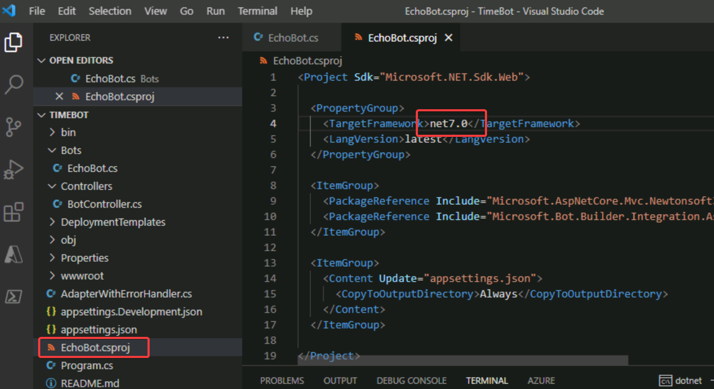

# ラボ13 ボット(TimeBot)の作成

このラボでは、現在の時刻を答えるボット(TimeBot)を開発します。

このボットの開発には、[.NET SDK](https://learn.microsoft.com/ja-jp/dotnet/core/sdk)と、[Bot Framework Emulator](https://learn.microsoft.com/ja-jp/azure/bot-service/bot-service-debug-emulator?view=azure-bot-service-4.0&tabs=csharp)を使用します。

.NET SDKは、.NETを使用して様々なアプリケーション（コンソールアプリ、Webアプリ、ボットなど）を開発するためのSDK（ソフトウェア開発キット）です。C#などのプログラミング言語を使用してアプリを開発します。

Bot Framework Emulator は、開発したボットを実行する際に使用します。

## ラボの起動

ラボ13番を起動します。

このラボではAzure portalは使用しません。

## .NET 7等のセットアップ

Windowsのスタートボタンを右クリックし、`Windows PowerShell (管理者)`を起動し、以下を実行します。

```ps
Set-ExecutionPolicy Bypass -Scope Process -Force; [System.Net.ServicePointManager]::SecurityProtocol = [System.Net.ServicePointManager]::SecurityProtocol -bor 3072; iex ((New-Object System.Net.WebClient).DownloadString('https://raw.githubusercontent.com/hiryamada/ai-102-lab9/main/init.ps1'))
```

これにより以下が行われます。

- .NET SDK 7.0 がインストールされます。
- OSのタイムゾーンが日本時間に設定されます。

セットアップ完了まで5分程度かかります。完了を待たず、次のステップを進めます。

<!--
## Bot Framework Emulatorの起動、更新

ラボ環境にはBot Framework Emulator がインストールされています。デスクトップ上のアイコン`Bot Framework Emulator`（丸いアイコン）をダブルクリックして起動します。

新しいバージョンが利用可能な場合は、以下のようなダイアログが表示されます。


この場合は`Install this update and restart Emulator.`を選択して`Update`をクリックします。
-->

## Bot Framework Emulatorのインストール

以下のページからインストーラー（BotFramework-Emulator-VERSION-windows-setup.exe）をダウンロードしてインストールします。

https://github.com/Microsoft/BotFramework-Emulator/releases/latest

ダウンロードしたインストーラーを実行します。


完了すると Bot Framework Emulatorが起動します。

## Botのプロジェクトを作成

Visual Studio Codeを起動。

ターミナルを開く。


ターミナル内で以下を実行。

```
cd Documents
dotnet new install Microsoft.Bot.Framework.CSharp.EchoBot
dotnet new echobot -n TimeBot
cd TimeBot
code -r .
```

`code -r .` で実行が止まった場合は、最後にエンターキーを押す。

Visual Studio Codeのウィンドウがリロードされ、TimeBotのフォルダが開かれる。


## コードを変更する

`Bots/EchoBot.cs`を開く。

ファイル冒頭に`using System;` という1行を追加する。

`OnMessageActivityAsync`メソッドと`OnMembersAddedAsync`メソッドがある。


`OnMessageActivityAsync`メソッドを以下に書き換える

```c#
protected override async Task OnMessageActivityAsync(ITurnContext<IMessageActivity> turnContext, CancellationToken cancellationToken)
{
    // var replyText = $"Echo: {turnContext.Activity.Text}";
    // await turnContext.SendActivityAsync(MessageFactory.Text(replyText, replyText), cancellationToken);

    string inputMessage = turnContext.Activity.Text;
    string responseMessage = "Ask me what the time is.";
    if (inputMessage.ToLower().StartsWith("what") && inputMessage.ToLower().Contains("time"))
    {
        var now = DateTime.Now;
        responseMessage = "The time is " + now.Hour.ToString() + ":" + now.Minute.ToString("D2");
    }
    await turnContext.SendActivityAsync(MessageFactory.Text(responseMessage, responseMessage), cancellationToken);
}
```


ファイルを保存。

## フレームワークのバージョン指定

プロジェクトのフレームワーク（`TargetFramework`）を `net6.0` から `net7.0` に更新。



ファイルを保存。

## コードを起動する

Visual Studio Codeで統合ターミナルを開く。

メニュー ＞ Terminal ＞ New Terminal

ターミナル内で以下を実行。

```
dotnet run
```

しばらくすると以下のようなログが表示される。

```
info: Microsoft.Hosting.Lifetime[14]
      Now listening on: http://localhost:3978
info: Microsoft.Hosting.Lifetime[0]
      Application started. Press Ctrl+C to shut down.
info: Microsoft.Hosting.Lifetime[0]
      Hosting environment: Development
info: Microsoft.Hosting.Lifetime[0]
      Content root path: C:\Users\azureuser\Documents\AI-102-AIEngineer\13-bot-framework\C-Sharp\TimeBot
```

`http://localhost:3978`でボットが動いていることがわかる。

Webブラウザーで`http://localhost:3978`にアクセスすると、このボットにアクセスするための詳細が表示される。

## Bot Framework Emulatorで、ボットの動きを確認する

- Bot Framework Emulatorを起動する。
- Open Botをクリック
- Bot URLに`http://localhost:3978/api/messages`を入力し`Connect`
- 画面下部の`Type your message`というテキストボックスに`what time`と入力すると、ボットが現在時刻を表示する。

