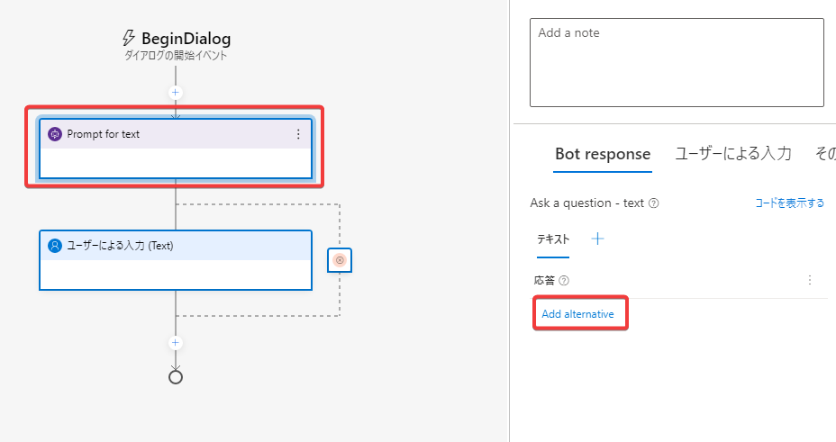
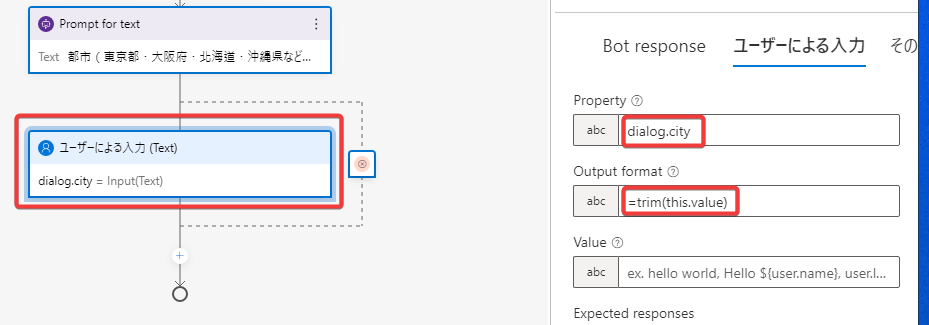
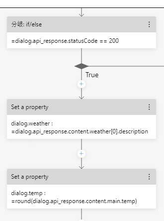
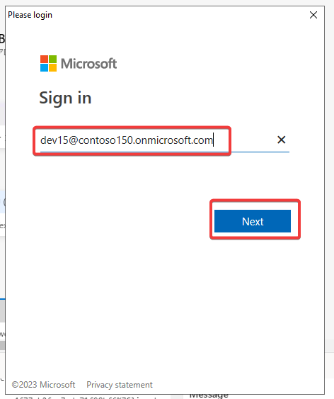

# ラボ14 チャットボット(WeatherBot)の作成

■概要

Bot Framework Composerを使用して、指定された都市(「東京都」や「大阪府」など)の現在の天気と気温を調べるチャットボット「WeatherBot」を開発します。


天気の情報を取得するために、[OpenWeather](https://openweathermap.org/)というサービスを使用します。

Bot Framework Composer は、コードを記述せず、高度な会話型ボットをすばやく簡単に構築できる、グラフィカル デザイナーです。

開発したボットをAzure Bot ServiceにデプロイしてAzure上でも動作を確認します。

■ラボの起動

- ラボ環境にアクセス https://esi.learnondemand.net/
- Microsoftアカウントでサインイン
- ラボ 12 を起動
- 手順書（カスタマイズ）に従って作業を進めます。

■ヒント

- **ラボ14番では必要なAzureリソースが作成できないため、ここではワークアラウンドとしてラボ12番を起動します。**

■YouTube動画

AI-102 ラボ14 Bot Framework Composer を使用したボットの作成
https://youtu.be/U4CPu0DGMzg


■手順書（カスタマイズ）


## OpenWeather APIキーの準備

キーの取得方法

- https://openweathermap.org/price にアクセス
- 「Free」の「Get API key」をクリック
- ユーザー名、Eメール、パスワードなどの必要な情報を入力し、「Create Account」をクリック
- 入力したEメールアドレス宛てに、APIキーが送信されてくる。

## ラボの起動

ラボ12番を起動します。

- WebブラウザーでAzure portal にサインイン
- 日本語化

## リソースプロバイダーを登録

Azure App Service / Azure Bot Service リソースを作成できるように、サブスクリプションにリソースプロバイダーを登録します。

- サブスクリプションを表示
- リソースプロバイダーを表示
- Microsoft.Web を検索、登録
- Microsoft.BotService を検索、登録

<!--
## Bot Framework Emulator のインストール

Bot Framework Composerで開発したボットを実行するには、[Bot Framework Emulator](https://learn.microsoft.com/ja-jp/azure/bot-service/bot-service-debug-emulator?view=azure-bot-service-4.0&tabs=csharp)が必要。

Bot Framework Emulator（の最新版）は 以下のページからインストーラー（BotFramework-Emulator-VERSION-windows-setup.exe）をダウンロードしてインストールする。

https://github.com/Microsoft/BotFramework-Emulator/releases/latest


## Node.jsのインストール

Bot Framework Composerでボットを作成するために必要。

Windows PowerShellを起動し、以下を実行。※以下同様

```
choco install -y nodejs
```

## .NET Core 3.1 SDKのインストール

Bot Framework ComposerからBot Framework Emulatorを起動するために必要。

```
choco install -y dotnetcore-3.1-sdk
```

## Bot Framework Composerのインストール

```
choco install -y bot-framework-composer
```
-->

## Bot Framework Composerを起動

スタートメニュー、またはデスクトップ上のアイコンから、Bot Framework Composerを起動を起動する。

## Bot Framework Composerの日本語化


## Bot Framework Composer のエラーについて


Bot Framework Composerで作業中に、このようなエラーが出る場合がある。これはOKを押して閉じるしかない。

## ボット(WeatherBot)の作成


## 言語理解（レコグナイザー）の変更

「正規表現」タイプに変更。


## デフォルトのメッセージの変更

```
こんにちは！私に、天気について聞いてください
```


```
すみません、よくわかりません。私に、天気について聞いてください
```


## 天気を取得する「ダイアログ」（対話）の追加




```
都市（東京都、大阪府、北海道、沖縄県など）を入力してください
```


Property:
```
dialog.city
```

Output format:
```
=trim(this.value)
```



## APIの呼び出し


Uri: ※YOURAPPIDの部分は、取得したOpenWeather APIのAPIキーに置換。
```
http://api.openweathermap.org/data/2.5/weather?units=metric&q=${dialog.city}&lang=ja&units=metric&appid=YOURAPPID
```

Result property:
```
dialog.api_response
```


## 条件分岐の作成


```
=dialog.api_response.statusCode == 200
```


## APIからのプロパティの取得とメッセージの表示


| 項目     | 値 |
| -------- | ----------------------------------------------------- |
| Property | `dialog.weather`                                      |
| Value    | `=dialog.api_response.content.weather[0].description` |


※上記と同様に、「プロパティの管理＞プロパティの設定」を追加

| 項目     | 値 |
| -------- | ----------------------------------------------------- |
| Property | `dialog.temp`                                      |
| Value    | `=round(dialog.api_response.content.main.temp)` |

※このように「Set a property」が2つ連続する形になる。



```
${dialog.city} の天気は ${dialog.weather} で、温度は ${dialog.temp}&deg; です。
```


```
エラー: ${dialog.api_response.content.message}
```


## 天気のダイアログを起動するトリガーを追加


```
トリガー名: WeatherRequested
正規表現パターン: 天気
```


## 動作確認


画面下部の Type your message というテキストボックスに「天気を教えて」などと入力する。「天気」というキーワードに反応して、GetWeatherダイアログが起動される。続いて「東京都」といった都市名を入力する。

```
天気を教えて
東京都
天気を調べてください
大阪府
```


それ以外のキーワードの場合は以下のような応答を返す。


## サインイン


※トレーニング初日に作成したMicrosoftアカウントでサインイン。



※パスワードを入力するなどしてサインインを進めていく。


## 発行プロファイルの作成


※「Name」のところは、「weatherbot(乱数)」とする。「(乱数)」の部分は、適当に10桁ほど数字を打ち込む。


※下にスクロールして、Optionalのチェックをすべて外す。


しばらく待つ。


3分ほどでプロビジョニングが完了する。


## 公開（パブリッシュ）


しばらく待つ。

## Azureでの動作確認


「Your bot is ready!」と表示されればOK。


```
天気を教えてください
北海道
```


以上です。おつかれさまでした！

■手順書（公式、参考）

日本語:
https://microsoftlearning.github.io/AI-102-AIEngineer.ja-jp/Instructions/14-bot-composer.html

英語:
https://microsoftlearning.github.io/AI-102-AIEngineer/Instructions/14-bot-composer.html
