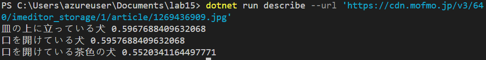
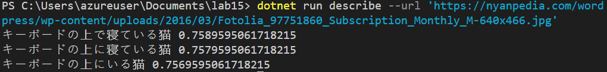

# ラボ15 コンピュータビジョン（画像の説明文の生成）

Cognitive ServicesのComputer Visionを使用して、画像の説明文を生成します。

画像は、インターネット上にあるものを使用します。

コンソールアプリの引数で、画像のURLを指定します。

実行例1:


実行例2:


## Cognitive Services リソースの作成

Azure portalで必要なリソースを作成。以下のいずれかを使用。

- Cognitive Services＞Vision＞Computer Vision
- Cognitive Services マルチサービスアカウント

リージョン、リソース名などは適当なものでOK。

エンドポイントとキー（キー1）をコピーしておく。

## .NET (C#) プロジェクトの作成

新しく「lab15」というプロジェクトを作成。必要なNugetパッケージの追加などを行う。

```
cd ~/Documents
mkdir lab15
cd lab15

dotnet new worker
rm Worker.cs
dotnet add package Azure.Extensions.AspNetCore.Configuration.Secrets
dotnet add package ConsoleAppFramework
dotnet add package Azure.Identity
dotnet add package Microsoft.Azure.CognitiveServices.Vision.ComputerVision
echo "root = true
[*.cs]
# supress 'Member ... does not access instance data and can be marked as static'
dotnet_diagnostic.CA1822.severity = none
" > .editorconfig
code .
```

## キーとエンドポイントの追加

作成済みのCognitive Servicesリソースの情報を、プロジェクトの「ユーザーシークレット」としてセット。

```sh
dotnet user-secrets set 'CognitiveServices:Endpoint' '...'
dotnet user-secrets set 'CognitiveServices:SubscriptionKey' '...'
```

## `Properties/launchSettings.json`の設定

https://stackoverflow.com/questions/65923063/purpose-of-dotnetrunmessages-in-launchsettings-json

```json
{
    ...
      "dotnetRunMessages": false,
    ...
}
```

## `Program.cs` のコーディング

```cs
using Microsoft.Azure.CognitiveServices.Vision.ComputerVision;

ConsoleApp
.CreateBuilder(args)
.ConfigureServices((context, services) =>
{
    var endpoint = context.Configuration["CognitiveServices:Endpoint"] ?? "";
    var key = context.Configuration["CognitiveServices:SubscriptionKey"] ?? "";
    var cred = new ApiKeyServiceClientCredentials(key);
    var client = new ComputerVisionClient(cred) { Endpoint = endpoint };
    services.AddSingleton(client);
})
.Build()
.AddCommands<Commands>()
.Run();

```

## `Commands.cs` のコーディング

`Commands.cs` を作成

以下のように変更して保存。

```cs
using Microsoft.Azure.CognitiveServices.Vision.ComputerVision;

class Commands : ConsoleAppBase
{
    public async Task Describe(ComputerVisionClient client, string url)
    {
        var description = await client.DescribeImageAsync(url, 3, "ja");
        description.Captions.ToList().ForEach(caption =>
            Console.WriteLine($"{caption.Text} {caption.Confidence}"));
    }
}
```

## 実行

```sh
dotnet run describe --url 'https://nyanpedia.com/wordpress/wp-content/uploads/2016/03/Fotolia_97751860_Subscription_Monthly_M-640x466.jpg'
```

実行結果例
```
キーボードの上で寝ている猫 0.7589595061718215
キーボードの上に寝ている猫 0.7579595061718215
キーボードの上にいる猫 0.7569595061718215
```

他にもいろいろな画像のURLを試してみましょう。
