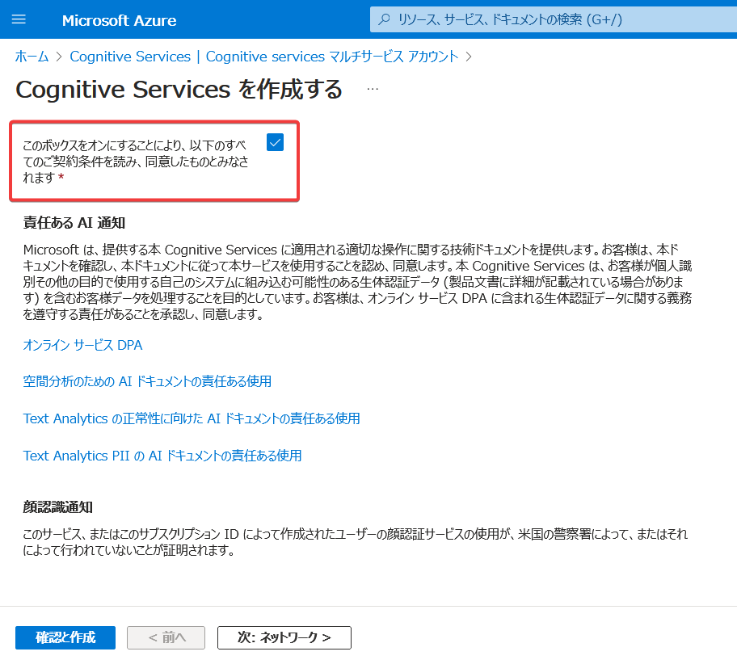

# ラーニングパス01 AI エンジニアリングへの準備


https://learn.microsoft.com/ja-jp/training/paths/prepare-for-ai-engineering/

■このラーニングパスで学ぶ内容

ラーニングパス1では以下の概要を学習します。

- 機械学習（マシンラーニング）
- 人工知能（AI）
- Azure Machine Learning
- Azure Cognitive Services
- Azure OpenAI Service
- Azure Bot Service
- Azure Cognitive Search
- 責任あるAI

<!--
また今後のラボを実施するための開発環境をAzure 仮想マシン（Windows）上に構築します。
-->


■機械学習（マシンラーニング）とは？

Microsoftの機械学習の解説ページ:
https://azure.microsoft.com/ja-jp/resources/cloud-computing-dictionary/what-is-machine-learning-platform

大量のデータをコンピューターに与えて学習させ、データの分類や判断、予測などを行えるようにすること。

たとえば、大量の「犬の画像」と「猫の画像」をコンピューターに学習させることで、犬と猫の画像を認識することができる「機械学習モデル」を構築する（トレーニング）。

構築した「機械学習モデル」に、新しい画像データを与えると、「犬」「猫」といったように画像の分類や認識ができるようになる。

```
ユーザー
↓画像データ↑判定結果
トレーニング済みの「機械学習モデル」
```

機械学習を活用できる範囲は多岐にわたる。

- 金融: 不正行為の検出
- 運輸: 配達ルートの最適化、自動運転
- 医療: 病気の診断
- 農業: 田畑の監視
- その他: 音声の文字起こし、画像の判定など

対応するAzureサービス: Azure Machine Learning

※本コース「AI-102」では、機械学習の詳細については学習範囲外となる。別のコース「[DP-100: Azure でのデータ サイエンス ソリューションの設計と実装](https://learn.microsoft.com/ja-jp/training/courses/dp-100t01)」で、機械学習の詳細について学ぶことができる。

■Azure Machine Learningとは？

公式サイト:
https://azure.microsoft.com/ja-jp/products/machine-learning

ドキュメント:
https://learn.microsoft.com/ja-jp/training/modules/prepare-to-develop-ai-solutions-azure/6-understand-capabilities-of-azure-machine-learning

「機械学習モデル」のトレーニング、デプロイ、管理、監視のためのクラウド プラットフォーム。

独自の「機械学習モデル」を構築したい場合に使用する。

■AI（人工知能）とは？

https://learn.microsoft.com/ja-jp/training/modules/get-started-ai-fundamentals/1-introduction

人間の行動と能力を模倣するソフトウェア。

人の持つ判断・認知・情報処理の一部をコンピューターで実現するもの。

音声の認識、画像の認識、テキストの認識、音声の聞き取り、翻訳などを行える。

AI（人工知能）は、機械学習モデルを利用して実装される（機械学習モデルは、AIの基盤となる）。

■機械学習とAI（人工知能）は何が違うのか？

https://azure.microsoft.com/ja-jp/resources/cloud-computing-dictionary/what-is-machine-learning-platform

機械学習はAI（人工知能）の一部とみなされる。

https://www.soumu.go.jp/johotsusintokei/whitepaper/ja/r01/html/nd113210.html

AI（人工知能）のうち、人間の「学習」に相当するしくみをコンピューター等で実現するもの。

https://business.ntt-east.co.jp/content/cloudsolution/column-159.html

AI（人工知能）をうまく機能させるための方法の1つが機械学習。

https://cloud.google.com/learn/artificial-intelligence-vs-machine-learning?hl=ja

- AI（人工知能）: 人間の知能を模倣するもの
- 機械学習: モデルを使用して、データから予測を行うもの

https://blogs.nvidia.co.jp/2016/08/09/whats-difference-artificial-intelligence-machine-learning-deep-learning-ai/

- AI（人工知能）: 1950年代に登場したアイデア
- 機械学習: 1980年代に登場した技法。AI（人工知能）に含まれる。

■Azure Cognitive Serviceとは？

公式サイト:
https://azure.microsoft.com/ja-jp/products/cognitive-services/#overview

ドキュメント:
https://learn.microsoft.com/ja-jp/azure/cognitive-services/what-are-cognitive-services

機械学習との違い:
https://learn.microsoft.com/ja-jp/azure/cognitive-services/cognitive-services-and-machine-learning#how-is-a-cognitive-service-different-from-machine-learning

あらかじめトレーニング済みの、すぐに使えるAIパーツをAPIとして提供するサービス。

言語・音声・視覚などのAPIを提供する。

たとえば「言語」のAPIを使用して、送信した自然言語がどの言語かを判定したり、翻訳をしたりできる。

```
ユーザー
↓「hello」↑判定結果（英語）
Cognitive Servicesアカウント
```

「音声」のAPIを使用して、テキストを音声に変換したり、音声をテキストに変換したりできる。

```
ユーザー
↓「hello」↑音声データ（～.wav）
Cognitive Servicesアカウント
```

「視覚」のAPIを使用して、画像の説明文を生成したりできる。

```
ユーザー
↓犬の画像データのURL ↑「窓のそばに座っている犬」
Cognitive Servicesアカウント
```

このサービスを利用するには、Azureサブスクリプション内に「Cognitive Serviceアカウント」というリソースを作成する。

※「Cognitive Serviceアカウント」は、MicrosoftアカウントやAzureのアカウントなどとは特に関係がない。リソースの種類の一つ。「ユーザー名＋パスワード」のようなものではない。Azureには「ストレージアカウント」や「Cosmos DBアカウント」といったように、「～アカウント」という名前のリソースの種類がいくつか存在する。

基本的には、AIの処理はこの「Cognitive Serviceアカウント」内で（Azure内で）実行される。データはいったんAzureに送信される。

```
ユーザー
↓リクエスト（データ） ↑レスポンス
Cognitive Serviceアカウント（データ処理を実行）
```

データを、Azure内ではなく、オンプレミスのサーバーなど、任意の環境で実行したい（データをAzureに送信したくない）場合は、以下のように、Dockerコンテナー内でAIの処理を実行することもできる。ただ、この場合も、課金情報は「Cognitive Serviceアカウント」側で管理されるので、「Cognitive Serviceアカウント」が必要。

```
ユーザー
↓リクエスト（データ） ↑レスポンス
Dockerコンテナー（データ処理を実行）
↓課金情報
Cognitive Serviceアカウント
```

■Azure OpenAI Service

→ 詳しくは後ほど [ラーニングパス12](lp12.md) で解説。

※本コース「AI-102」では、Azure OpenAI Serviceの概要のみ解説する。Azure OpenAI Serviceについては「AI-050」コースで解説。

■Azure Bot Serviceとは？

→ 詳しくは後ほど [ラーニングパス08](lp08.md) で解説。

https://learn.microsoft.com/ja-jp/training/modules/prepare-to-develop-ai-solutions-azure/8-understand-capabilities-of-azure-bot-service

対話型の「チャットボット」を構築・運用するためのサービス。

チャットボットの例:

- [ASKUL様の「アオイくん」](https://www.askul.co.jp/f/help/)
- [DAZN AIチャットボット](https://www.dazn.com/ja-JP/help/articles/how-do-i-contact-dazn)


チャットボットの開発には「Bot Framework SDK」（ライブラリ）、「Bot Framework Composer」（ツール）「Bot Framework Emulator」（ツール）なども使用される。

- C#などのコードを使用して、ボットを作成するには、「[Bot Framework SDK](https://github.com/microsoft/botframework-sdk)」を使用する。
- コードを書かずに、ボットを作成するには、「[Bot Framework Composer](https://github.com/microsoft/BotFramework-Composer)」を使用する。
- 作成したボットをテストするには、「[Bot Framework Emulator](https://github.com/microsoft/BotFramework-Emulator)」を使用する。
- 作成したボットをAzureで運用するには、「[Azure Bot Service](https://azure.microsoft.com/ja-jp/products/bot-services/)」を使用する。
- エンドユーザーは、Microsoft Teamsなどを通じて、「[Azure Bot Service](https://azure.microsoft.com/ja-jp/products/bot-services/)」で運用されているボットを利用できる。

```
ユーザー
↓↑
チャネル（Microsoft Teams等）
↓↑
Azure Bot Service
↓↑
チャットボット
(Bot Framework SDKまたはBot Framework Composerで開発)
(Bot Framework Emulator上でテスト)
```

「チャットボット」はAIとは異なるもの。「チャットボット」の実体は、リクエストとレスポンスを、ある形式に添って処理するWebアプリである。[.NET](https://dotnet.microsoft.com/ja-jp/)のWebアプリケーションフレームワーク「[ASP.NET Core](https://learn.microsoft.com/ja-jp/aspnet/core/introduction-to-aspnet-core?view=aspnetcore-7.0)」がベース技術として使用されている。

「チャットボット」に、AIなどを組み込むことで、よりインテリジェントな（便利な）チャットボットを作成できる。

```
ユーザー
↓↑
チャットボット
↓↑
Azure Cognitive Service
```


■Azure Cognitive Searchとは？

→ 詳しくは後ほど [ラーニングパス11](lp11.md) で解説。


公式サイト:
https://azure.microsoft.com/ja-jp/products/search

ドキュメント:
https://learn.microsoft.com/ja-jp/training/modules/prepare-to-develop-ai-solutions-azure/9-understand-capabilities-of-azure-cognitive-search

フル マネージドのクラウド検索サービス。たとえば、大量のPDFドキュメントを読み込ませて「インデックス」を作成し、それを使用してさまざまな検索を実行できる。

```
ユーザー
↓検索キーワード↑検索結果
Azure Cognitive Search
↓↑
インデックス
↑ Azure Cognitive Services
PDFなどのドキュメント
```

「インデックス」を作成する部分で、Azure Cognitive Servicesが組み合わせて使用される。たとえば、PDFに含まれる画像の説明文をAzure Cognitive Servicesで生成し、そこからインデックスを生成することで、画像に対するキーワード検索を実現している。

■責任あるAI (Responsible AI)

公式サイト:
https://www.microsoft.com/ja-jp/ai/responsible-ai

Microsoft では、「責任ある AI」という考え方を採用している。主なもの:

- AIシステムではすべての人を公平に扱う必要がある。
  - 性別、民族などで差別をしない。
- AIシステムが、安全かつ確実に実行されるようにする。
  - 自動運転などでは安全性が極めて重要である。
- AIシステムが、プライバシーを尊重する必要がある。
  - AIに入力されたデータのプライバシーを守る。

Microsoft のAIサービスを利用するユーザーにも、Microsoftの「責任ある AI」の考え方に同意し、条件に従ってAIサービスを利用することを求めている。たとえば、Azure Cognitive ServiceやAzure Open AI Serviceのリソースを作成する際に、条件への「同意」を行う必要がある。



<!--
■開発環境のセットアップ

[ラボ00（VMの準備）](lab00.md) を実施します。

今後、Azureの操作やコーディングなどの作業は、このVMの中で実施します。

■サブスクリプションの料金について

トレーニングで使用するサブスクリプションには100ドル分の「クレジット」が割り当てられています。サブスクリプションの利用料金は「クレジット」から引かれていきます。「クレジット」がなくなると、そのサブスクリプションは利用できなくなります。

現在のコスト発生状況（残りの「クレジット」）は、以下のサイトで確認できます。

https://www.microsoftazuresponsorships.com/

VMは起動している間料金が発生します（「クレジット」が減ります）ので、使っていない間は停止しておくことをおすすめします。以下のように運用してください。

- 各日のトレーニングの終了時（17:30）に、VMを停止します。
- 翌日のトレーニング（ハンズオン）開始時に、VMを起動します。


なお、その他のリソース（Cognitive Servicesなど）については、利用した回数に比例した料金がかかりますが、放置しても特に料金は発生しないので、それほど頻繁に削除を行わなくても大丈夫です。
-->

■まとめ

ラーニングパス1では以下の概要を学習しました。

- 機械学習（マシンラーニング）
- 人工知能（AI）
- Azure Machine Learning
- Azure Cognitive Services
- Azure OpenAI Service
- Azure Bot Service
- Azure Cognitive Search
- 責任あるAI

<!--
また今後のラボを実施するための開発環境をAzure 仮想マシン（Windows）上に構築しました。
-->
