# Cognitive Servicesの基本的な知識

■Cognitive Servicesでできること（主なもの）

https://learn.microsoft.com/ja-jp/azure/cognitive-services/what-are-cognitive-services

Cognitive Servicesは、「言語サービス（Language API）」「音声サービス（Speech API）」「視覚サービス（Vision API）」のような、いくつかのサービスで構成されている。

| サービス     | できること                             |
| ------------ | -------------------------------------- |
| 言語サービス | 言語の検出、翻訳、キーフレーズ抽出など |
| 音声サービス | 音声とテキストの相互変換など           |
| 視覚サービス | 画像の説明文を生成するなど             |

※「視覚サービス」は「Computer Vision」とも呼ばれる

■Cognitive Servicesの「リソース」とは？

https://learn.microsoft.com/ja-jp/azure/cognitive-services/cognitive-services-apis-create-account?tabs=multiservice%2Canomaly-detector%2Clanguage-service%2Ccomputer-vision%2Cwindows

「Cognitive Services」を使用するためのAzureリソース。サービスを使用する前に作成しておく。

Cognitive Servicesリソースの管理画面に移動:
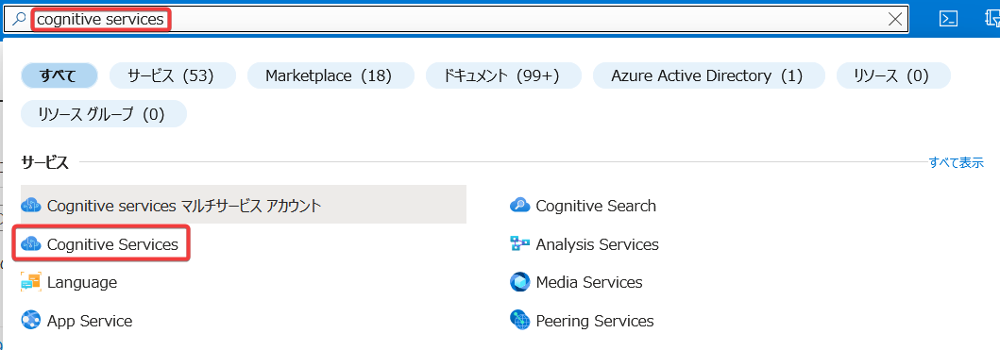

画面左のメニューから、リソースを作成する。

「言語サービス」を使用するためのCognitive Servicesリソース:
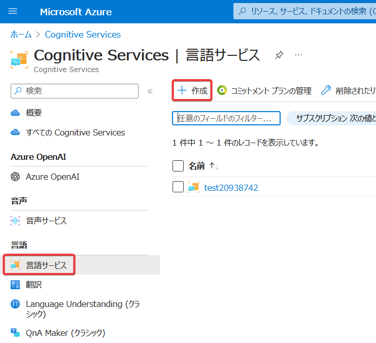

「音声サービス」を使用するためのCognitive Servicesリソース:
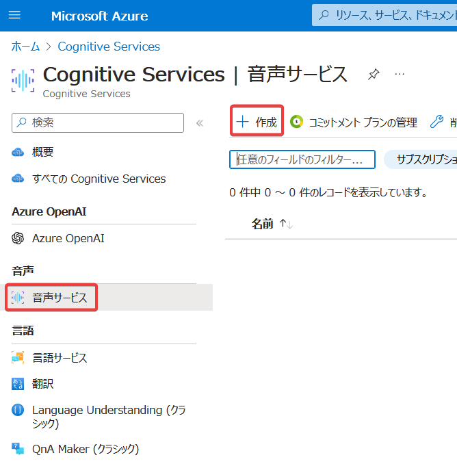

「視覚サービス（Computer Vision）」を使用するためのCognitive Servicesリソース:
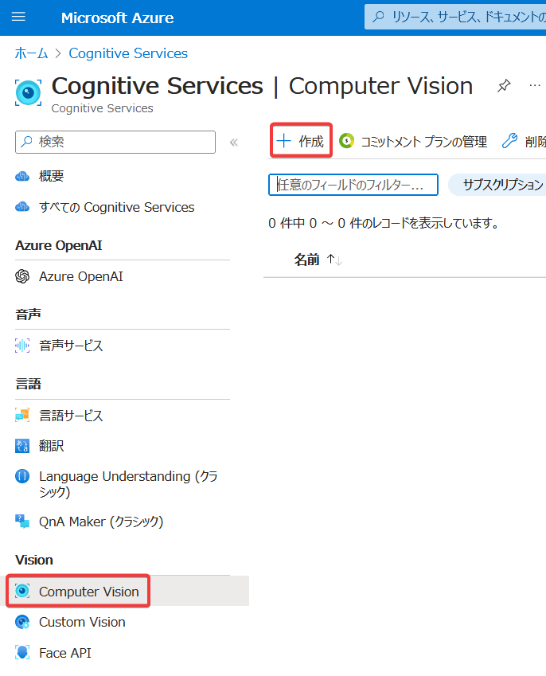

このように、Cognitive Servicesの「言語サービス」「音声サービス」「視覚サービス（Computer Vision）」に対応するリソースがある。

```
Cognitive Services
├「言語サービス」用のリソース
├「音声サービス」用のリソース
└「視覚サービス（Computer Vision）」用のリソース
```

たとえば「言語サービス」を使用する場合は、「言語サービス」用のリソースを作成する。このリソースでは、「言語サービス」に含まれるすべての機能を利用できる。

```
Cognitive Services「言語サービス」リソース
└「言語サービス」のすべての機能
```

■Cognitive Servicesマルチサービスアカウント

https://learn.microsoft.com/ja-jp/azure/cognitive-services/cognitive-services-apis-create-account?tabs=multiservice%2Canomaly-detector%2Clanguage-service%2Ccomputer-vision%2Cwindows#types-of-cognitive-services-resources

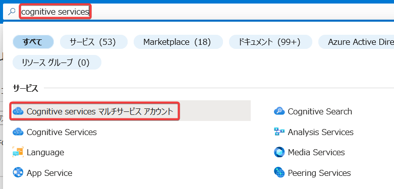

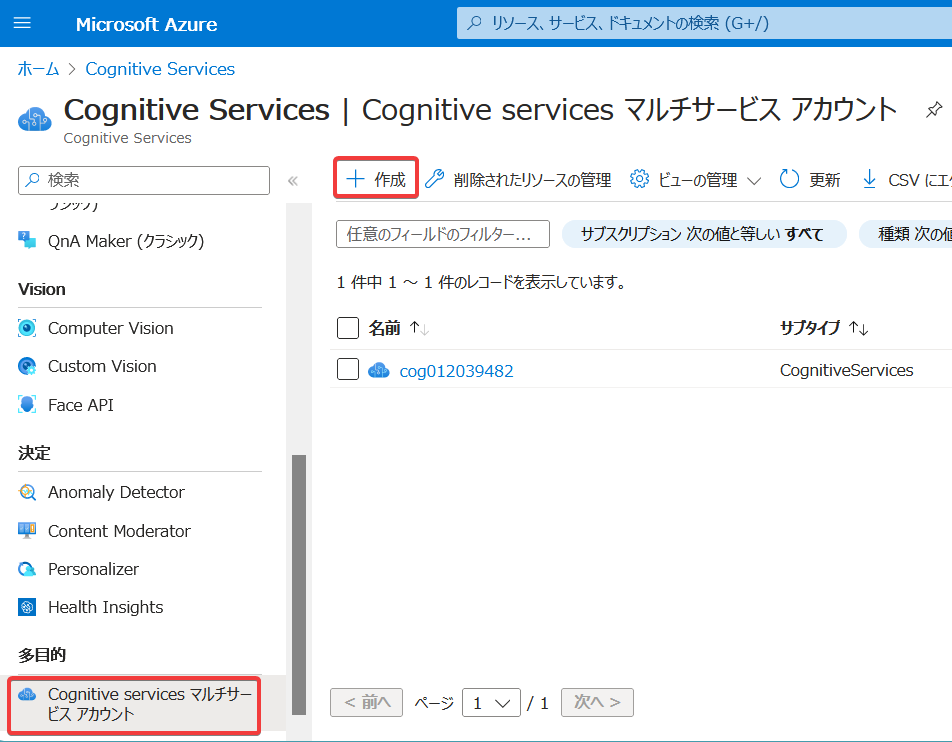

「Cognitive Servicesマルチサービスアカウント」というリソースもある。このリソースでは、1つのリソースで、「言語」「音声」「視覚」などのサービスの基本的な機能を利用できる。

```
「Cognitive Servicesマルチサービスアカウント」リソース
├「言語サービス」の基本的な機能
├「音声サービス」の基本的な機能
└「視覚サービス（Computer Vision）」の基本的な機能
```

■リソースの使い分け

| リソースの種類                       | 使える機能                              | 無料でも使える？ |
| ------------------------------------ | --------------------------------------- | ---------------- |
| 「言語サービス」リソース             | 「視覚サービス」の全機能                | Yes              |
| 「音声サービス」リソース             | 「視覚サービス」の全機能                | Yes              |
| 「視覚サービス」リソース             | 「視覚サービス」の全機能                | Yes              |
| 「マルチサービスアカウント」リソース | 「言語」「音声」 「視覚」の基本的な機能 | No               |

※「マルチサービスアカウント」ではないリソースは「単一サービス」のリソースとも呼ばれる。

■無料のリソースについて:

- リソース作成時に「Freeプラン」（Free F0）を選択。
- 無料で利用できるが、呼び出し回数に制限がある。
- 「マルチサービスアカウント」リソースには対応していない。
- サブスクリプションで複数個の無料リソースを作成することはできない。2個目のリソースを作成しようとすると、以下のようなメッセージが表示され、Free (F0)は選択できない。

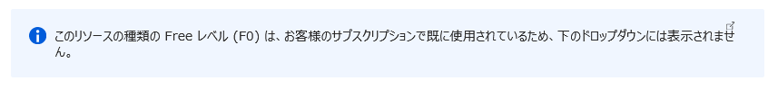

■ハンズオン: 「言語サービス」リソースの作成、エンドポイントとキーの確認

Azure portalにアクセス https://portal.azure.com

画面上部の検索ボックスで「cognitive services」を検索し、「Cognitive Services」の画面へ移動

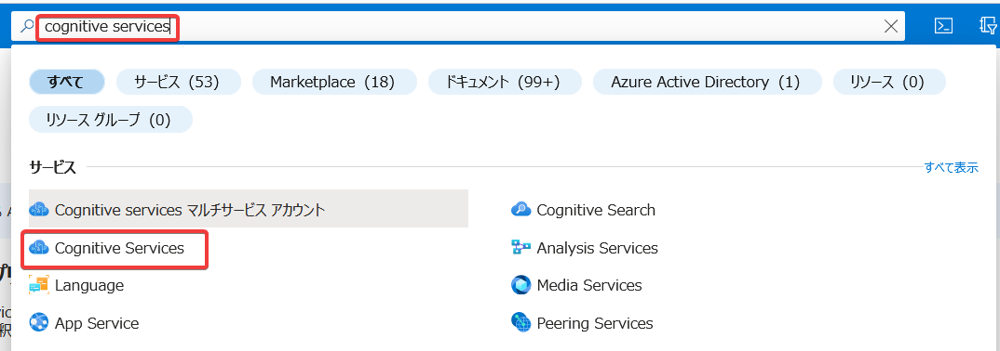

※「Cognitive Servicesマルチアカウント」や「Cognitive Search」ではなく「Cognitive Services」を選ぶこと。

画面左メニュー＞「言語サービス」、「＋作成」

「追加機能の選択」画面: 「リソースの作成を続行する」

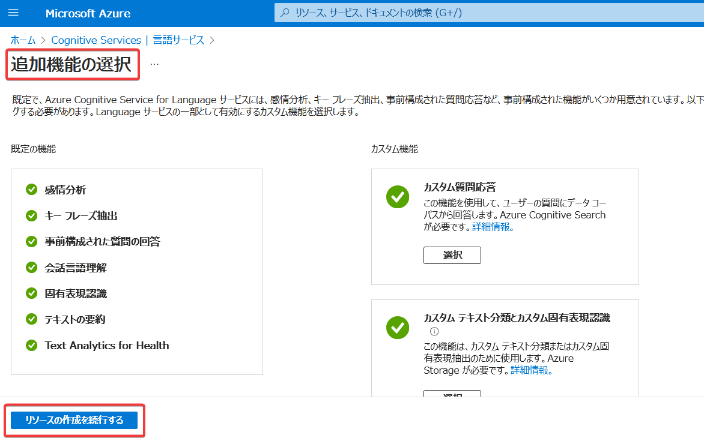

- リソースグループ: 新規作成、適当な名前を入力
- リージョン: 東日本
- 名前: lang(乱数) ※(乱数)は適当にキーボードから10桁程度数字を打ち込む
- 価格レベル: Free F0
  - Free のリソースは複数個作成できない場合がある。
  - それによるエラーが出た場合は「S」を指定。
- 「このボックスをオンにすることで・・」: チェック
- 「確認と作成」、「作成」

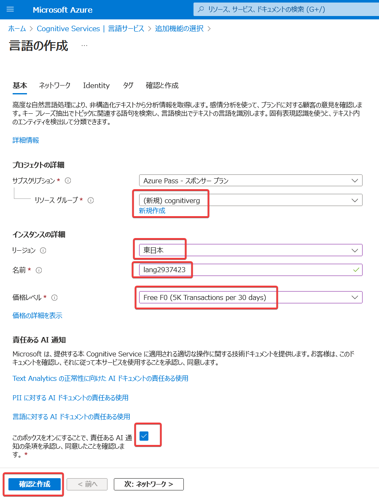

作成ができたら「リソースに移動」をクリック。

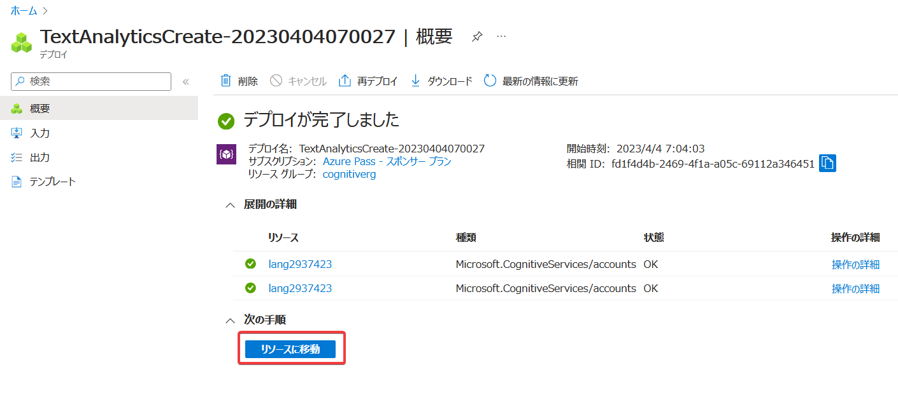


画面左のメニューで「キーとエンドポイント」を選択。

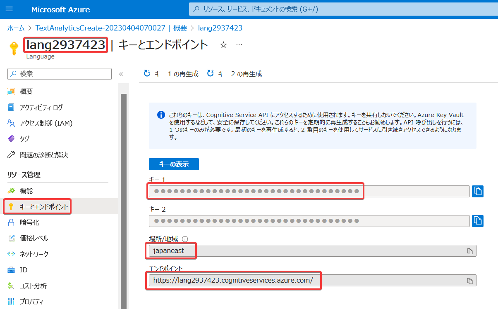

「キーの表示」をクリックすると、キー1・キー2の値が表示される。

画面左上のリソース名、キー（キー1）、リージョン（場所/地域）、エンドポイントの4つの情報をこの画面で取得できることを確認してください。

■リソース名

Cognitive Servicesリソースを作成する際に指定する。

エンドポイント（FQDN）の一部となるため、世界中の、すでに作成済みの他のCognitive Servicesリソースと重複してはいけない。

■リージョン（場所/地域）

Cognitive Servicesリソースを作成する際に指定する。

ここで指定したリージョンでリソースが稼働し、AIの処理が実行される。

コンプライアンス要件などがある場合はそれを満たすようにリージョンを選択する。（例えば日本国内でデータを処理する必要がある場合は「東日本リージョン」または「西日本リージョン」のいずれかを選択する、など）

■エンドポイント

`https://lang2937423.cognitiveservices.azure.com/`のようなアドレス。

Cognitive Serviceの「言語サービス」などを使用するためのAPIを呼び出すために使用するアドレスとなる。

```
アプリ
↓リクエスト↑レスポンス
エンドポイント
↓↑
言語サービスのリソース
```

■キー

Cognitive Serviceの「言語サービス」などを使用するために必要となる認証情報。パスワードのようなもの。

アプリは、言語サービスにリクエストを送信する際に、キーを一緒に送信する。

言語サービスのリソースは、正しいキーが送られてきた場合に、リクエストを受け付ける。

```
アプリ
↓リクエスト（＋キー）↑レスポンス
エンドポイント
↓↑
言語サービスのリソース
```

■キーの取り扱い

キーは機密情報であるため、アプリのコードの中に直接書き込んだりしてはいけない。GitHubなどのパブリックな場所に送信してはいけない。

キーは、[環境変数に設定](https://learn.microsoft.com/ja-jp/azure/cognitive-services/cognitive-services-environment-variables?tabs=command-line%2Ccsharp)し、アプリは実行時に環境変数からキーを取得するようにする。

```
環境変数
└キー
  ↓
アプリ
↓リクエスト（＋キー）↑レスポンス
エンドポイント
↓↑
言語サービスのリソース
```

開発環境でアプリを開発している間は、「[ユーザーシークレット](https://learn.microsoft.com/ja-jp/aspnet/core/security/app-secrets?view=aspnetcore-7.0&tabs=windows)」にキーを設定し、アプリは実行時に「ユーザーシークレット」からキーを取得するようにすることもできる。

```
ユーザーシークレット
└キー
  ↓
アプリ
↓リクエスト（＋キー）↑レスポンス
エンドポイント
↓↑
言語サービスのリソース
```

アプリを本番環境（Azure上や、オンプレミスサーバー等）で実行する場合は、[Azure Key Vaultの「シークレット」](https://learn.microsoft.com/ja-jp/azure/key-vault/secrets/about-secrets)にキーを設定し、アプリは実行時に「シークレット」からキーを取得するようにする。

```
Azure Key Vault
└シークレット
 └キー
  ↓
アプリ
↓リクエスト（＋キー）↑レスポンス
エンドポイント
↓↑
言語サービスのリソース
```

■ハンズオン: 言語サービスを利用してみる

Language Studio（ https://language.cognitive.azure.com/ ）を使用すると、作成済みの「言語サービス」リソースを使った操作を簡単に試すことができる。

Language Studioにアクセスする。サインインが求められた場合は、本トレーニング受講用に作成したMicrosoftアカウントでサインインする。（または、画面右上のSign inをクリック）

はじめに「言語サービス」のリソースを選択する（この画面が出てこない場合や、リソースを切り替えたい場合は、画面右上をクリックし、「現在のリソース」の「選択」をクリック）

Resource Type: 「Language」を選択。

Resource Name: 作成済みの「言語サービス」の名前を選択。

「完了（Done）」をクリック。


画面上部の歯車アイコンをクリックして、General の中で「Japanese」をクリックすると、Language Studioを日本語化できる。

「テキストの分類」、「言語の検出」 の「使用の開始」をクリック

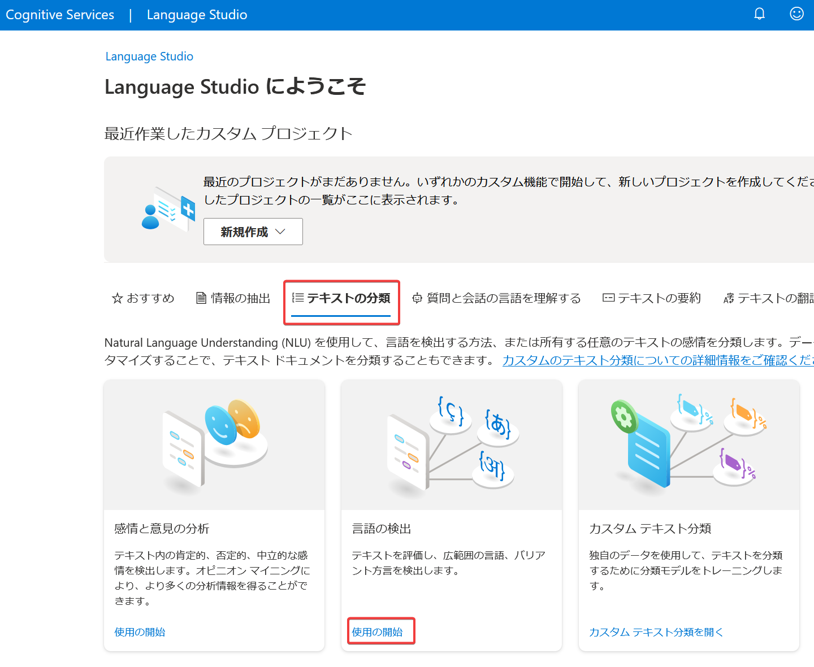

大きなテキストボックスに「こんにちは」などの日本語を適当に入力。

「このデモを実行することで・・・」にチェック、実行。

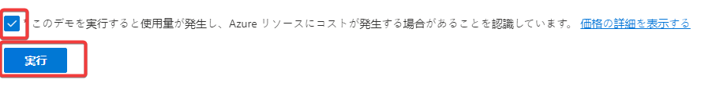

「結果」に、「日本語」といったように、検出された言語が表示される。

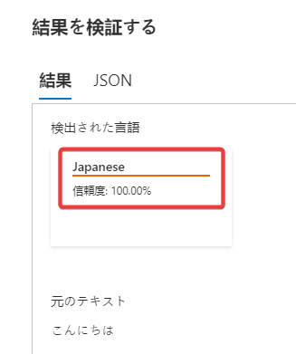

他にもいくつかの言語で試してみよう:

- 中国語で「ありがとう」: 谢谢
- フランス語で「今何時？」: Quelle heure est-il


■ ラボの概要

.NET (C#)のコンソールアプリから、Cognitive Servicesを使用する。

- [ラボ01 Cognitive Servicesを使用する(言語の検出)](lab01.md)

■まとめ

- Cognitive Servicesのリソースの種類
  - 「言語サービス」リソース
  - 「音声サービス」リソース
  - 「視覚サービス」リソース
  - 「マルチサービスアカウント」リソース
- エンドポイント
- キー
- Cognitive Servicesの「言語サービス」リソースを作る
- 「Language Studio」から「言語サービス」を利用する(言語の特定)
- Cognitive Servicesの「マルチサービスアカウント」リソースを作る
- C#プログラムから「マルチサービスアカウント」リソースを利用する(言語の特定)
