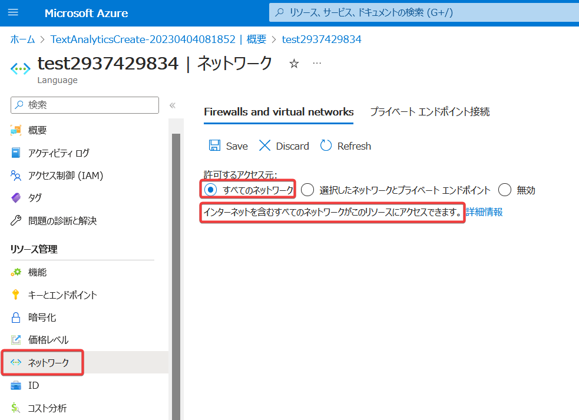

# モジュール2 Cognitive Servicesの保護

- 認証
  - キー認証
    - キーの再生成
  - Azure Active Directory認証
- ネットワーク アクセスの制限
  - サービスエンドポイント
  - プライベートエンドポイント
- [ラボ02 Key Vaultの利用](lab02.md)

■認証

https://learn.microsoft.com/ja-jp/azure/cognitive-services/authentication

アプリがCognitive Servicesを利用する（APIを呼び出す）には、認証が必要。

つまり、Cognitive Servicesを呼び出すアプリが、自らを「本物のアプリである」（「にせのアプリではない」）ということを証明する必要がある。このプロセスを「認証」という。

認証には、以下の3方式が利用できる。

- キー認証
- トークン認証
- Azure Active Directory認証

最も安全なのはAzure Active Directory認証である。

PDF資料: [Azureの認証と承認](../SC/pdf/Azureの認証と承認.pdf)

■キー認証

https://learn.microsoft.com/ja-jp/azure/cognitive-services/authentication?tabs=powershell#authenticate-with-a-single-service-subscription-key


※キーは「サブスクリプションキー」とも呼ばれる。

リソースの「キー」を使用した認証。

```
Cognitive Service
↑キーで認証
アプリ
└キー
```

アプリが安全な環境（アプリ運用者の管理下にあるサーバーなど）で稼働している場合に使用する。

キーは、「再生成」ができる。漏洩する可能性を想定し、定期的に「再生性」を行うことが推奨されている。

キーは（次に再生成をするまで）有効。

■トークン認証

https://learn.microsoft.com/ja-jp/azure/cognitive-services/authentication?tabs=powershell#authenticate-with-an-access-token

※トークンは「アクセストークン」とも呼ばれる。

キーから「トークン」を取得し、「トークン」で認証する方式。

```
Cognitive Service
↑トークンで認証
アプリ
↑アプリにトークンを渡す
バックエンドサービス(キー)
```

アプリが安全とはみなされない環境（エンドユーザーの端末など）で稼働している場合に使用。

トークンは10分間だけ有効。万が一漏洩しても、すぐに使えなくなってしまうので、キーよりも安全である。

※Text Translation APIや、Speech Services APIなど、一部のサービスでしか利用できない。

■Azure Active Directory認証

https://learn.microsoft.com/ja-jp/azure/cognitive-services/authentication?tabs=powershell#authenticate-with-azure-active-directory

認証に「Azure AD認証」、承認に「Azure RBACロール」を使う方法。

■ネットワークアクセスの制御

Azure VM（仮想マシン）を使用して、Azure環境でWindows ServerやLinuxを稼働させることができる。

VMは「仮想ネットワーク(VNet)」内に配置する必要がある。

Cognitive Serviceのリソースは、「仮想ネットワーク(VNet)」の外に配置される。

```
VNet
└サブネット
 └VM
  ↓
Cognitive Servicesのエンドポイント
  ↑
インターネット
```

Cognitive Servicesのリソースのデフォルトのネットワーク設定では、Cognitive Servicesのエンドポイントは、どこからでもアクセスが可能となっている。VNetからも、インターネットからも、アクセスができる。

ただし、ネットワーク的にアクセスができること（リクエストがリソースに到達すること）と、リクエストがCognitive Servicesで実行されることは別の話。ネットワーク的にアクセスができるからといってリクエストが無条件に実行されるわけではない。リクエストがCognitive Servicesで実行されるには、ネットワーク的にアクセスができることに加えて、上記で説明した「認証」も必要。



「サービスエンドポイント」や「プライベートエンドポイント」を使用して、指定したサブネットからのみ、Cognitive Servicesのエンドポイントにアクセスできるように、設定できる。

インターネットからのアクセスが不要な場合は、「サービスエンドポイント」や「プライベートエンドポイント」を使用して、エンドポイントにアクセスできるネットワークを限定することで、よりセキュリティを向上させることができる。

PDF資料: [サービスエンドポイントとプライベートエンドポイント](../AZ-104/pdf/mod06/%E3%82%B5%E3%83%BC%E3%83%93%E3%82%B9%E3%82%A8%E3%83%B3%E3%83%89%E3%83%9D%E3%82%A4%E3%83%B3%E3%83%88vs%E3%83%97%E3%83%A9%E3%82%A4%E3%83%99%E3%83%BC%E3%83%88%E3%82%A8%E3%83%B3%E3%83%89%E3%83%9D%E3%82%A4%E3%83%B3%E3%83%88.pdf)

※上記資料では「ストレージアカウント」におけるサービスエンドポイントとプライベートエンドポイントについて説明していますが、「ストレージアカウント」を「Cognitive Services」に置き換えても同じ。

