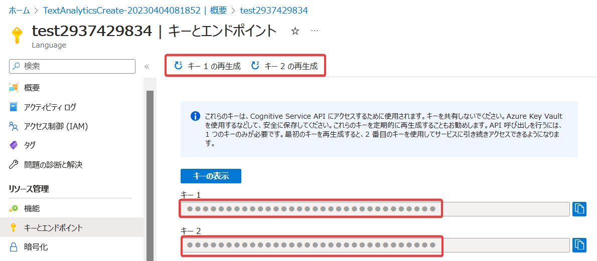

# モジュール2 Azure AI Servicesの保護


- 認証
  - キー認証
  - トークン認証
  - Entra ID認証
  - [ラボ02 Azure AI Service + Key Vault](lab02cs.md)
- ネットワーク アクセスの制限
  - サービスエンドポイント
  - プライベートエンドポイント

## 認証

https://learn.microsoft.com/ja-jp/azure/cognitive-services/authentication

アプリがAzure AI Servicesを利用する（APIを呼び出す）には、認証が必要。

つまり、Azure AI Servicesを呼び出すアプリが、自らを「本物のアプリである」（「にせのアプリではない」）ということを証明する必要がある。このプロセスを「認証」という。

認証には、以下の3方式が利用できる。

- キー認証
- トークン認証
- Entra ID認証

最も安全なのはEntra ID認証である。

PDF資料: [Azureの認証と承認](../SC/pdf/Azureの認証と承認.pdf)

## キー認証

https://learn.microsoft.com/ja-jp/azure/cognitive-services/authentication?tabs=powershell#authenticate-with-a-single-service-subscription-key



※キーは「サブスクリプションキー」とも呼ばれる。

リソースの「キー」を使用した認証。

```
Azure AI Service
↑キーで認証
アプリ
└キー
```

アプリが安全な環境（アプリ運用者の管理下にあるサーバーなど）で稼働している場合に使用する。

キーは、「再生成」(regenerate)ができる。漏洩する可能性を想定し、定期的に「再生成」を行うことが推奨されている。

キーは（次に再生成をするまで）有効。

キーは、アプリやAzureリソース（VM）に格納せず、Azure Key Vaultに一元管理するとよい。Azure Key Vaultを利用することには、以下のようなメリットがある。

- 多数のリソース（VM、App Service、コンテナーなど）、場所（Azure、オンプレミス、他社クラウドなど）から、Key Vaultのキーを参照（共有）できる
- 不要な場所・不要な人物にキーを晒す必要が少なくなる
  - 漏洩の可能性が減る
- キーの再生成の運用がしやすくなる
  - 新しいキーをKey Vaultに格納するだけで済む
- 誰が・どのアプリがキーへのアクセスできるかを、Key Vaultのアクセス制御で制御できる。
  - [アクセスポリシー](https://learn.microsoft.com/ja-jp/azure/key-vault/general/assign-access-policy?tabs=azure-portal) または
  - [Azure RBAC（ロール）](https://learn.microsoft.com/ja-jp/azure/key-vault/general/rbac-guide?tabs=azure-cli)

## トークン認証

https://learn.microsoft.com/ja-jp/azure/cognitive-services/authentication?tabs=powershell#authenticate-with-an-access-token

※トークンは「アクセストークン」とも呼ばれる。

キーから「トークン」を取得し、「トークン」で認証する方式。

キーを持っているユーザーやアプリは、キー（永続的）を使用して、トークン（一時的）を取得できる。

アプリが、安全とはみなされない環境（エンドユーザーのモバイル端末上など）で稼働している場合に使用される場合がある。

```
Azure AI Service
↑トークンで認証
モバイルアプリ
↑トークンを取得し、アプリにトークンを渡す
バックエンドサービス(キー)
```

トークンは10分間だけ有効。万が一漏洩しても、すぐに使えなくなってしまう。また、キーそのものをネットワークで送信しない。これらの点で、キーよりも安全である。

※Text Translation APIや、Speech Services APIなど、一部のサービスでしか利用できない。

[サブスクリプション キーをアクセス トークンと交換する](https://learn.microsoft.com/ja-jp/azure/cognitive-services/authentication?tabs=powershell#sample-requests-1)には、
`https://YOUR-REGION.api.cognitive.microsoft.com/sts/v1.0/issueToken` という URL を使用する。

※URLに含まれる sts は、security token service の略（と思われる）。Azureやその他のクラウドで、STSと呼ばれる仕組みがよく使用される。[参考1 Microsoft ID Platform](https://learn.microsoft.com/ja-jp/azure/active-directory/develop/access-tokens#payload-claims) [参考2 トークンサービス](https://learn.microsoft.com/ja-jp/azure/remote-rendering/how-tos/tokens#token-service-rest-api) [参考3: ストレージアカウントのsas](https://learn.microsoft.com/ja-jp/azure/storage/common/storage-sas-overview)

## Entra ID認証

https://learn.microsoft.com/ja-jp/azure/cognitive-services/authentication?tabs=powershell#authenticate-with-azure-active-directory

認証に「Azure AD認証」、承認に「Azure RBACロール」を使う方法。

Azure AI Servicesの一部のサービスで対応している。

※今後、（Azure全体的に）Entra ID認証への対応が進んでいくと思われる。

## ラボ

[ラボ02 Azure AI Service + Key Vault](lab02cs.md)

## ネットワークアクセスの制御

Azure VM（仮想マシン）を使用して、Azure環境でWindows ServerやLinuxを稼働させることができる。

VMは「仮想ネットワーク(VNet)」内に配置する必要がある。

Azure AI Serviceのリソースは、「仮想ネットワーク(VNet)」の外に配置される。

```
VNet
└サブネット
 └VM
  ↓
Azure AI Servicesのエンドポイント
  ↑
インターネット
```

Azure AI Servicesのリソースのデフォルトのネットワーク設定では、Azure AI Servicesのエンドポイントは、どこからでもアクセスが可能となっている。VNetからも、インターネットからも、アクセスができる。

ただし、ネットワーク的にアクセスができること（リクエストがリソースに到達すること）と、リクエストがAzure AI Servicesで実行されることは別の話。ネットワーク的にアクセスができるからといってリクエストが無条件に実行されるわけではない。リクエストがAzure AI Servicesで実行されるには、ネットワーク的にアクセスができることに加えて、上記で説明した「認証」も必要。


「サービスエンドポイント」や「プライベートエンドポイント」を使用して、指定したサブネットからのみ、Azure AI Servicesのエンドポイントにアクセスできるように、設定できる。

インターネットからのアクセスが不要な場合は、「サービスエンドポイント」や「プライベートエンドポイント」を使用して、エンドポイントにアクセスできるネットワークを限定することで、よりセキュリティを向上させることができる。

PDF資料: [サービスエンドポイントとプライベートエンドポイント](../AZ-104/pdf/mod06/%E3%82%B5%E3%83%BC%E3%83%93%E3%82%B9%E3%82%A8%E3%83%B3%E3%83%89%E3%83%9D%E3%82%A4%E3%83%B3%E3%83%88vs%E3%83%97%E3%83%A9%E3%82%A4%E3%83%99%E3%83%BC%E3%83%88%E3%82%A8%E3%83%B3%E3%83%89%E3%83%9D%E3%82%A4%E3%83%B3%E3%83%88.pdf)

※上記資料では「ストレージアカウント」におけるサービスエンドポイントとプライベートエンドポイントについて説明しているが、「ストレージアカウント」を「Azure AI Services」に置き換えても同じ。
