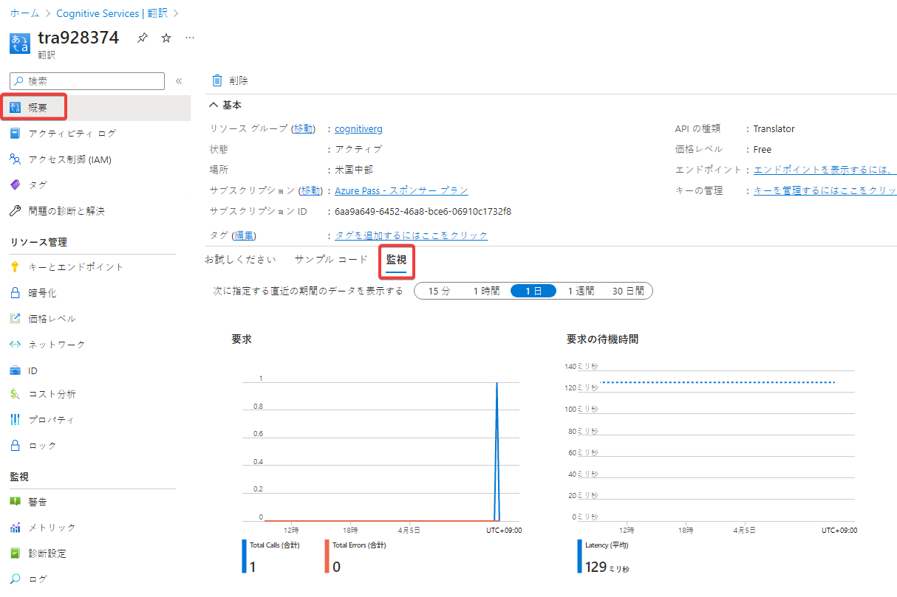

## モジュール3 Cognitive Servicesの監視

- コスト監視
  - Azureの標準的なコスト管理・監視の仕組みである [Microsoft Cost Management and Billing](https://learn.microsoft.com/ja-jp/azure/cost-management-billing/cost-management-billing-overview) (コストの分析)を使用する
  - [解説資料](../AZ-304/mod12-01-cost-management.md)
- [メトリック](https://learn.microsoft.com/ja-jp/azure/search/monitor-azure-cognitive-search#monitor-metrics)
  - Cognitive Servicesの呼び出し回数などのメトリック（数値データ）を取得できる
    - 「概要」や「メトリックエクスプローラー」で確認できる

- アラート作成
  - 「メトリックが特定のしきい値を超えた」といった条件を設定し、アラートを設定できる
  - アラートがトリガーされた際、アクショングループが実行される
- [リソースログ（診断ログ）](https://learn.microsoft.com/ja-jp/azure/cognitive-services/diagnostic-logging)
  - 問題の識別やデバッグに使用されるリソースの操作に関する豊富で頻繁なデータが提供される
    - Cognitive ServicesのAPI呼び出しなどが記録できる
  - [以前は「診断ログ」と呼ばれていたが現在は「リソースログ」と呼ぶようになってきている](https://learn.microsoft.com/ja-jp/azure/azure-monitor/essentials/resource-logs-schema)
  - 「診断設定」を作成し、リソースログが Log Analytics などに蓄積されるように設定する。
  - 「診断設定」を作成しないと生成・蓄積されない
  - 解説資料: [Log Analytics](../log-analytics/log-analytics.md)
  - [参考サイト](https://blog.johtani.info/blog/2020/05/26/logging-azure-search-request/) ※このページは Cognitive Search についての解説だが、Cognitive Services と読み替えても良い
    - 利用状況を監視する方法はいろいろあるが、「診断設定」が一番手軽で便利。アプリに手を入れたりログを収集する仕組みを作り込む必要がない。

[ラボ03 Cognitive Services を監視する](lab03cs.md)
