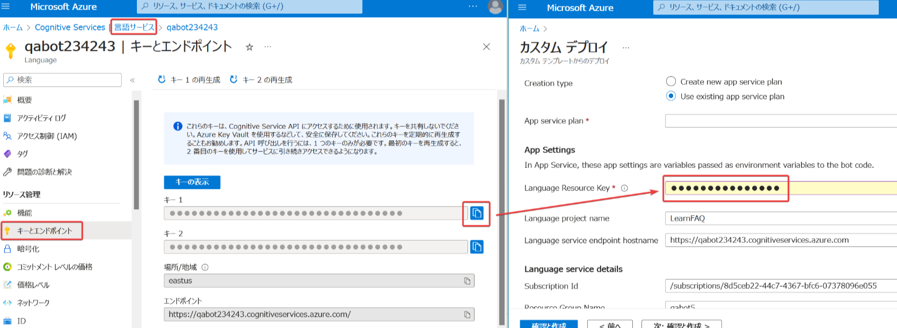

# ラーニングパス06 質問応答ソリューションを構築する

https://learn.microsoft.com/ja-jp/training/paths/build-qna-solution/

- モジュール1 質問応答ソリューションを構築する

■「質問応答」 question answering とは？

https://learn.microsoft.com/ja-jp/azure/cognitive-services/language-service/question-answering/overview

ユーザーの質問に回答する仕組み。

たとえば、「質問応答」では、[Microsoft Learn のトレーニングについての「よく寄せられる質問」ページ](https://learn.microsoft.com/ja-jp/training/support/faq) を使用して「ナレッジベース」を構築し、ユーザーからの「ラーニング パスとは何ですか？」といった質問に、ナレッジベースを活用して回答することができる。

質問応答は、たとえば「チャットボット」と組み合わせて利用できる。

```
ユーザー
↓質問 ↑応答（回答）
Webアプリ / Teams / Slack / Line など
↓ ↑
チャットボット
↓ ↑
Cognitive Services「言語サービス」
└ 質問応答
  └ナレッジベース
```

■「ChatGPT」と「質問応答」は何が違うのか？

「ChatGPT」は、OpenAIが開発したAIチャットボット。インターネットの情報などを使用してトレーニングが行われている。自然な回答を「生成する」ことができる。Azure OpenAI Serviceを通じて利用することもできる。

「質問応答」は、Cognitive Servicesの「言語サービス」に含まれる機能の一つ。あらかじめ開発者が指定したWebページなどを使用して「ナレッジベース」を構築し、そこから、ユーザーの質問に対応する回答を探して回答する。ナレッジベースにない回答を「生成する」ことはしない（できない）。

|                     | 回答を「生成」する？ | ナレッジベースの構築機能 |
| ------------------- | -------------------- | ------------------------ |
| ChatGPT(2022/11～)  | Yes                  | なし                     |
| 質問応答(2020/6～※) | No                   | あり                      |

※[質問応答の前身である「QnA Maker」が2020/6より一般提供開始された。](https://ascii.jp/elem/000/004/015/4015444/2/)


「ChatGPT」と「質問応答」は、ユーザーの質問に回答するもの、という意味では、近いといえるが、「ChatGPT」のほうがはるかに膨大なトレーニングを行っているため、より知的な回答を行うことができる。

■「会話言語理解」（Conversational Language Understanding、CLU）と「質問応答」は何が違うのか？

「CLU」では、ユーザーの入力（発話）から「意図」を決定することはできるが、質問に回答する能力は持たない。（質問に回答する能力を持たせたい場合は、別途そのような仕組みを実装する）

「質問応答」では、ユーザーの入力（質問）を受け、「ナレッジベース」から、対応する回答を探し、回答することができる。

|          | 質問に回答できる？                     | 質問から「意図」と「エンティティ」を抽出できる？ |
| -------- | -------------------------------------- | ------------------------------------------------ |
| CLU      | No  （モデル自体は回答能力を持たない） | Yes                                              |
| 質問応答 | Yes  （ナレッジベースから回答を検索）  | No                                               |

「会話言語理解」は会話文を分析するという基礎的な機能を提供するもの、「質問応答」はユーザーの質問を解決する手段を提供するもの、ともいえる。

■「質問応答」はどのCognitive Servicesリソースを使用するのか？

Cognitive Servicesの「言語サービス」リソースに、「質問応答」が含まれているので、「言語サービス」リソースを使用する。

■「質問応答」はどの言語に対応している？

以下に「サポートされている言語」の一覧がある。日本語にも対応。

https://learn.microsoft.com/ja-jp/azure/cognitive-services/language-service/question-answering/language-support#languages-supported

■「ナレッジ ベース」とは？

質問と応答のペアの集まり。

FAQ（よくある質問とその回答集）、製品マニュアル、Webページなどをインポートして作成する。

また、質問と応答を手動で追加することもできる。


■「チャットボット」とは？

ユーザーの会話や質問に答えることができるプログラム。「ボット」とも。

チャットボットの例: [ASKUL様の「アオイくん」](https://www.askul.co.jp/f/help/)


■「チャットボット」はどうやって作る？

チャットボットの開発には「Bot Framework SDK」（ライブラリ）、「Bot Framework Composer」（ツール）「Bot Framework Emulator」（ツール）などを使用する。

- C#などのコードを使用して、ボットを作成するには、「[Bot Framework SDK](https://github.com/microsoft/botframework-sdk)」を使用する。
- コードを書かずに、ボットを作成するには、「[Bot Framework Composer](https://github.com/microsoft/BotFramework-Composer)」を使用する。
- 作成したボットをテストするには、「[Bot Framework Emulator](https://github.com/microsoft/BotFramework-Emulator)」を使用する。

■「チャットボット」はどうやって運用する？

- 作成したボットをAzureで運用するには、「[Azure Bot Service](https://azure.microsoft.com/ja-jp/products/bot-services/)」を使用する。
- エンドユーザーは、Microsoft Teamsなどを通じて、「[Azure Bot Service](https://azure.microsoft.com/ja-jp/products/bot-services/)」で運用されているボットを利用できる。

```
ユーザー
↓↑
チャネル（Microsoft Teams等）
↓↑
Azure Bot Service
↓↑
チャットボット
(Bot Framework SDKまたはBot Framework Composerで開発)
(Bot Framework Emulator上でテスト)
```

■チャットボットの「チットチャット」 chit-chat とは？

https://learn.microsoft.com/ja-jp/azure/cognitive-services/language-service/question-answering/how-to/chit-chat

チットチャット＝お喋り、世間話。

チャットボットに、（ナレッジベースからの回答以外の）簡単な会話機能を追加するしくみ。

たとえば、ユーザーが、チャットボットに対して「誕生日はいつですか？」と聞いた場合に、「私はボットですから年齢はありません」といった回答を行うことができる。

ユーザーにとって、ボットがより親しみやすくなる。

■ ラボ12

英語版の手順書（最新。ブラウザの翻訳機能で日本語化して閲覧できます）
https://github.com/MicrosoftLearning/AI-102-AIEngineer/blob/master/Instructions/12-qna-maker.md

日本語翻訳版の手順書（若干古い可能性があります）
https://github.com/MicrosoftLearning/AI-102-AIEngineer.ja-jp/blob/main/Instructions/12-qna-maker.md

※どちらの手順書を使用しでも、英語のナレッジベースが構築される。質問と回答の文章は、英語となる。

■補足:

```
Azure Cognitive Services
└言語サービス
  └カスタム質問応答 (以前の QnA Maker): Language Studioで開発
      │ ├チットチャット
      │ └ナレッジベース <--- 外部のFAQページ等
      │
      ↓ デプロイ
Azure Bot Service
└チャットボット ───── Webチャット
```

