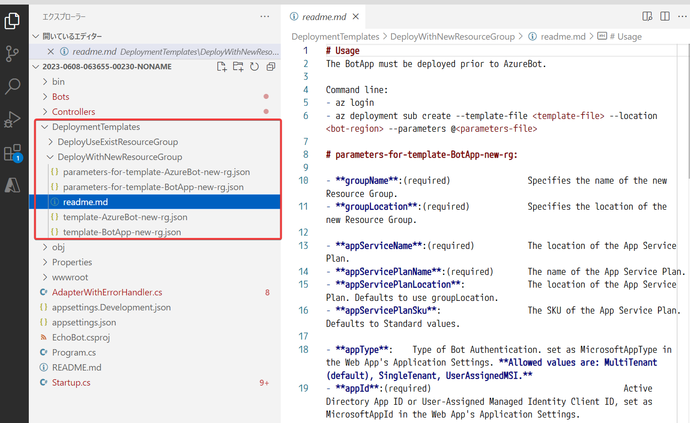

# ラーニングパス08 会話 AI ソリューションを作成する

https://learn.microsoft.com/ja-jp/training/paths/create-conversational-ai-solutions/

- モジュール1 Bot Framework SDK を使用してボットを作成する
  - ラボ13 ボット(TimeBot)の作成
- モジュール2 Bot Framework Composer を使用してボットを作成する
  - ラボ14 ボット(WeatherBot)の作成

## ボットの開発について

ラーニングパス6 では、「質問応答」のプロジェクト（ナレッジベース）内から、簡易的なチャットボットを生成した。

C#などのコードなどを使用して、より複雑な動作をするボットを開発するには、「Bot Framework SDK」を使用する。

コードを書かずに、ボットを開発するには、「Bot Framework Composer」というGUIツールを使用する。

## C#などのコードを使用したボットの開発

■Bot Framework SDK

https://github.com/microsoft/botframework-sdk

C#などのコードを使用して、ボットを作成するためのSDK(Software Development Kit)。

具体的には`dotnet new echobot` といったコマンドで、.NETのボットのプロジェクトを作成する。すると、そのプロジェクトにBot Framework SDKのライブラリが追加される。

■Bot Framework SDKの対応言語: C#とJavaScript

https://learn.microsoft.com/ja-jp/azure/bot-service/what-is-new

＞Python SDK と Java SDK は、2023 年 11 月に終了する最終的な長期サポートで廃止されます。 このリポジトリ内の重要なセキュリティとバグの修正のみが行われます。

■Bot Framework Emulator

https://github.com/microsoft/BotFramework-Emulator

作成したボットを開発環境でテストするためのツール。

<!--
■ ラボ13

- [ラボ13 チャットボット(TimeBot)の作成](lab13cs.md)
  - Bot Framework SDKを使用。
  - C#でコードを記述。
-->

■ ボットをAzureにデプロイするには？

`dotnet new echobot`などのコマンドを使用して作成したボットのプロジェクトには、`DeploymentTemplates`というフォルダが含まれている。

このフォルダ内に、AzureにデプロイするためのARMテンプレートや、デプロイの手順書（READMEファイル）が含まれている。

これらを使用して、Azureに必要なリソースを作成し、デプロイできる。

Azureのドキュメントも用意されている:
https://learn.microsoft.com/ja-jp/azure/bot-service/provision-and-publish-a-bot?view=azure-bot-service-4.0&tabs=userassigned%2Ccsharp

## Bot Framework Composer

■Bot Framework Composerとは？

https://github.com/microsoft/BotFramework-Composer

ボットを開発するためのGUIツール。Windows/Mac/Linuxに対応。

デザイナー画面上でフローチャートを入力して、ボットを作成できる。C#などのコードを記述する必要がない。

作成したボットをローカルで実行して動作を確認したり（Bot Framework Emulatorを背後で起動）、Azureにパブリッシュ（発行、公開）する機能なども持つ。

■日本語化

日本語化が可能。ただしすべてのUIが日本語化されるわけではない。

左下歯車アイコン＞Composer Settings＞composer lanuage＞日本語

Configure＞Localization で、ボットの会話を日本語化（ローカライゼーション）したり、メッセージを直接日本語化することで、ボットが日本語を出力するようにすることも可能。

■簡単な使い方

- Bot Framework Composerを起動
- 左メニュー＞ホーム＞作成＞Empty Bot
- 画面右上の「Start bot」でボットを起動、「Webチャットを開始」をクリック
- 画面右側にチャットのような画面が出てくる。画面右下でMessageをタイプすると、ボットが回答する。

ただし、Empty Botは「Welcome to your bot」というあいさつをする他は、どんなメッセージにも「Sorry, I didn't get that」
（わかりません）としか答えない。

画面右上の「会話を再開します」をクリックすると、ここまでの会話をリセットできる。

リセットすると、初期状態（あいさつ）からボットとの会話が始まる。

■開発の例

[天気を調べるボット（WeatherBot）の開発例](lab14.md)

<!--
■ ラボ 14

- [ラボ14 チャットボット(WeatherBot)の作成](lab14.md)
  - Bot Framework Composerを使用。
  - コードを記述せず、GUIツールでボットを設計。
  - Azureにデプロイ。

-->
