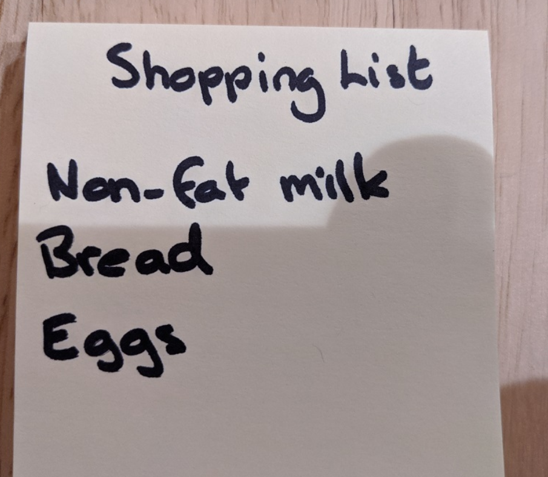

# ラーニングパス10 画像およびドキュメントからテキストを抽出する

https://learn.microsoft.com/ja-jp/training/paths/extract-text-from-images-documents/

- モジュール1 Computer Vision サービスを使用して画像やドキュメント内のテキストを読み取る
- モジュール2 Form Recognizer を使用してフォームからデータを抽出する

■光学式文字認識 (OCR Optical Character Recognition)

https://learn.microsoft.com/ja-jp/azure/cognitive-services/computer-vision/overview-ocr

Computer Visionに含まれる機能の一つ。

テキスト認識またはテキスト抽出とも呼ばれる。

画像の中の、手書きまたは印刷のテキスト（文字）を読み取る。

例: このような手書き画像を読み取って「Shopping List」「Non-fat milk」「Bread」「Eggs」というテキストを返す。

■Form Recognizer

https://learn.microsoft.com/ja-jp/azure/applied-ai-services/form-recognizer/overview?view=form-recog-3.0.0

光学式文字認識 (OCR) を使用して、請求書・領収書・名刺などの「フォーム」を効率よく読みとる。

ファイル形式は画像やPDFなどに対応。
<!--
■ラボ

- [ラボ20 画像内のテキストの読み取り](lab20cs.md)
- [ラボ21 フォームからのデータの抽出](lab21cs.md)
-->
