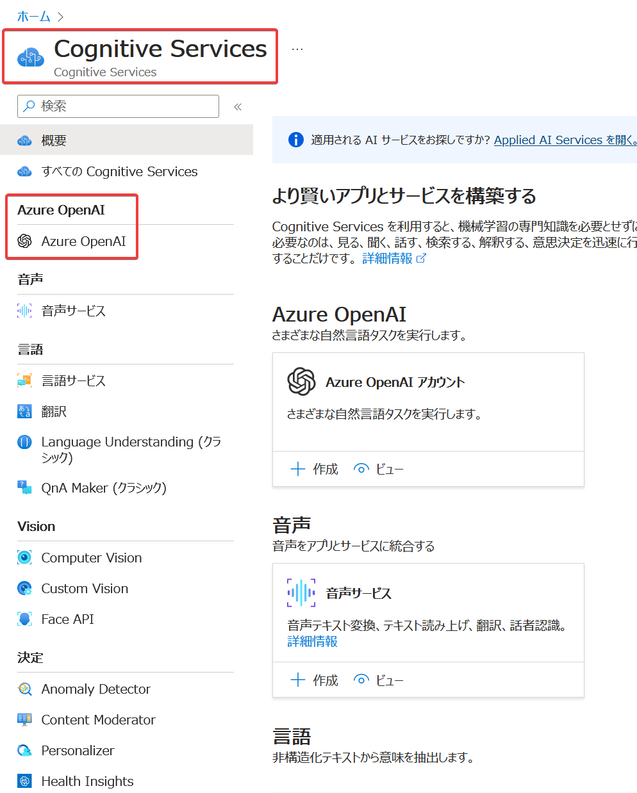
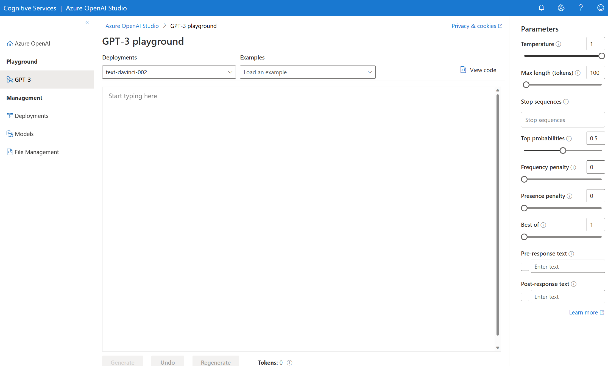

# ラーニングパス12 Azure OpenAI を使用して AI ソリューションを開発する

■このラーニングパスで学ぶ内容

このラーニングパスでは以下の概要を学習します。

- Azure OpenAI Serviceとは？
- 「OpenAI」とは？
- Azure OpenAI Serviceの「生成AIモデル」
- 申請
- 価格
- プロンプト
- Azure OpenAI Serviceリソースの作成
- Azure OpenAI Serviceの操作

■Azure OpenAI Serviceとは？



公式サイト:
https://azure.microsoft.com/ja-jp/products/cognitive-services/openai-service

ドキュメント:
https://learn.microsoft.com/ja-jp/azure/cognitive-services/openai/overview

2023/1/23 一般提供開始のアナウンス(Blog記事):
https://news.microsoft.com/ja-jp/2023/01/23/230123-general-availability-of-azure-openai-service-expands-access-to-large-advanced-ai-models-with-added-enterprise-benefits/

Azure OpenAI Serviceは、「[OpenAI](https://openai.com/)」が開発している「GPT-4」「ChatGPT」「DALL-E2」「Codex」などのAPIを使用できるAzureのサービス。2023/1/16に一般提供が開始された。

■参考: 「OpenAI」について

https://openai.com/

「OpenAI」は、サンフランシスコのAI研究所。

Microsoftの一部ではない。

[Microsoftは、OpenAI との長期的なパートナーシップを結び、OpenAI に数十億ドル規模の投資を行っている。](https://news.microsoft.com/ja-jp/2023/01/25/230125-microsoftandopenaiextendpartnership/)

「OpenAI」が開発・ホストするAIモデルは、「OpenAI」のAPIから利用できる。

※2023/6/13 「OpenAI」が日本オフィス設立のため、[米Twitter日本法人の元代表、James Kondo氏](https://ja.wikipedia.org/wiki/%E8%BF%91%E8%97%A4%E6%AD%A3%E6%99%83%E3%82%B8%E3%82%A7%E3%83%BC%E3%83%A0%E3%82%B9)を採用
https://bocek.co.jp/media/news/4953/

※2023/5/26より、「OpenAI」公式のiPhone向け「ChatGPT」アプリが日本でも利用できるようになった
https://forest.watch.impress.co.jp/docs/news/1503579.html

■参考: 「OpenAI」のデータプライバシー

https://openai.com/policies/privacy-policy

ユーザーが入力した情報は、「OpenAI」により収集され、モデルをトレーニングするために利用される場合がある。

2023/4/25 ChatGPTに、チャット履歴を保存しない機能が追加された。
https://www.itmedia.co.jp/news/articles/2304/26/news075.html

■「Azure OpenAI Service」と「OpenAI」の関係について

「Azure OpenAI Service」は、Azureが提供するAIサービス。

「OpenAI」が開発したAIモデルを、Azure上でホストし、利用者に提供している。

「Azure OpenAI Service」がホストするAIモデルは、「Azure OpenAI Service」のAPIから利用できる。

■参考: 「Azure OpenAI Service」vs「OpenAI」

https://twitter.com/ichi_eng/status/1659143283761889280

■Azure OpenAI Serviceのデータプライバシー

https://learn.microsoft.com/ja-jp/legal/cognitive-services/openai/data-privacy

Azure OpenAI Serviceに入力されるデータは、以下のように扱われる。

- 他のAzure利用者には提供されない
- OpenAI では利用されない
- OpenAI モデルを改善するためには使用されない
- Microsoft またはサードパーティの製品やサービスを改善するために使用されることはない
- リソースで使用するために Azure OpenAI モデルを自動的に改善するためには使用されない
- ユーザー向けに微調整された Azure OpenAI モデルは、そのユーザー専用に提供される
- Azure OpenAI Serviceは Microsoft によって完全に管理されている。
- Microsoft は Microsoft の Azure 環境で OpenAI モデルをホストしている。
- 本サービスは OpenAI社 によって運営されるサービス (ChatGPT や OpenAI API など) と通信しない。

■Azure OpenAI Serviceで利用可能な「生成AIモデル」

- [GPT-4](https://openai.com/product/gpt-4): [大規模言語モデル](https://atmarkit.itmedia.co.jp/ait/articles/2303/13/news013.html)の一種。ChatGPT、DALL-E2、Codexなどのベースとなる。
- [ChatGPT](https://openai.com/blog/chatgpt): AIチャットボット
- [DALL-E2](https://openai.com/product/dall-e-2): 画像生成
- [Codex](https://openai.com/blog/openai-codex): コード生成、コーディング支援

■Azure OpenAI Serviceを使用するための申請

現時点では、このサービスへのアクセスは申請によってのみ許可される（申請をして、許可がされないと、サービスを使用することはできない）。

アクセスを申請するには、https://aka.ms/oai/access のフォームを利用する。

参考: [Microsoftクラウドソリューションアーキテクトによる記事「Azure OpenAI Service を使い始める」](https://zenn.dev/microsoft/articles/1a15305021cd01)

参考: [Azure OpenAI 関連の申請について(Azureサポートチームによるブログ)](https://jpaiblog.github.io/blog/2023/04/21/RequestAccess-to-AzureOpenAIService/)

■Azure OpenAI Serviceの料金

価格はOpenAIが提供するAPIの料金と同様。参考: 「[GPT-4がMicrosoft Azureで利用可能に　まずはプレビュー版](https://www.itmedia.co.jp/news/articles/2303/22/news111.html)」

■プロンプト

基本的にユーザーは「プロンプト」を使用して、AIに対して自然言語で指示を行う。

```
ユーザー
↓↑
プロンプト
↓↑
ChatGPT
```

※Azure OpenAI Studioの「プレイグラウンド」のプロンプト入力画面


プレイグラウンドの解説: https://learn.microsoft.com/ja-jp/training/modules/get-started-openai/7-use-azure-openai-playground

■Azure OpenAI Serviceリソースの作成

- Azure portal、Azure CLI、PowerShell、ARM テンプレートなどを使用してAzure OpenAI Serviceリソースを作成
  - サブスクリプション: アクセスを申請して許可されたサブスクリプションを選択
  - リソースグループ
  - 名前
  - リージョン:
    - 米国東部、米国中南部、西ヨーロッパ、フランス中部などが選択可能。
    - [使用できるモデルはリージョンにより異なる。](https://learn.microsoft.com/ja-jp/azure/cognitive-services/openai/concepts/models#model-summary-table-and-region-availability)
    - 東日本・西日本リージョンは現在（2023/5/19）選択できない
    - リージョンあたり2個までリソースを作成できる
  - 価格レベル: Standard S0（のみ）
- モデルをデプロイする
  - Azure OpenAI Studio (https://oai.azure.com/) にアクセス
  - `text-davinci-003` などのモデルを選択してデプロイ


■Azure OpenAI Serviceの操作

操作は以下の方法で実行できる。[クイックスタートのページ](https://learn.microsoft.com/ja-jp/azure/cognitive-services/openai/quickstart?tabs=command-line&pivots=programming-language-studio)に、これらの開始方法が説明されている。

- Azure OpenAI Studio
  - https://oai.azure.com/
  - 「プレイグラウンド」を使用して、コードを書かずにプロンプトを試せる
- C# SDK
  - [Azure OpenAI client library for .NET](https://github.com/Azure/azure-sdk-for-net/tree/main/sdk/openai/Azure.AI.OpenAI)を使用
- Python SDK
  - [OpenAI Python Library](https://github.com/openai/openai-python)を使用
- Java SDK
  - [Azure OpenAI client library for Java](https://learn.microsoft.com/en-us/java/api/overview/azure/ai-openai-readme)
- JavaScript SDK
  - [Azure OpenAI SDK for JavaScript](https://learn.microsoft.com/ja-jp/javascript/api/overview/azure/openai)
- REST API
  - Azure OpenAI Serviceのエンドポイントに直接通信

■認証

https://learn.microsoft.com/ja-jp/azure/cognitive-services/openai/reference#authentication

https://learn.microsoft.com/ja-jp/azure/cognitive-services/openai/how-to/managed-identity

- APIキー認証
  - Azure OpenAI ServiceのAPI呼び出しの際に、api-key HTTP ヘッダーに、API キーを指定
- Azure AD認証
  - Azure ADのID（マネージドID等）に「Cognitive Services User」ロールを割り当てる
  - Azure ADで認証を行い、アクセストークンを取得
  - Azure OpenAI ServiceのAPI呼び出しの際に、Authorization ヘッダーに、アクセストークンを指定

OpenAIと同様のAPIキー認証に加え、Azure AD認証も使用できるのがAzure OpenAI Serviceの特徴。APIキー漏洩のリスクを削減できる。またトークンを取得できるID（Azure OpenAI ServiceのAPIを呼び出せるID）をロールでコントロールできる。


■Azure OpenAI on your data

2023/6/19 パブリックプレビュー開始。
https://techcommunity.microsoft.com/t5/ai-cognitive-services-blog/introducing-azure-openai-service-on-your-data-in-public-preview/ba-p/3847000

ドキュメント:
https://learn.microsoft.com/en-us/azure/cognitive-services/openai/concepts/use-your-data

コーディングなしで、ChatGPT や GPT-4 などの OpenAI モデルに、ユーザー（企業）のドキュメントを取り込んで、そのドキュメントに基づいた回答を利用できるようになった。いわゆるエンタープライズサーチのAI対応版。

これにより、社内の手続きやルールの確認、問い合わせなど行うAIの開発が簡単に実現できるようになった。

Blob, Cognitive Searchインデックス、ローカルファイル（txt、md、html、Wordファイル、PowerPoint、PDFなど）に対応。

参考:
- https://zenn.dev/microsoft/articles/azure-openai-add-your-data
- https://codezine.jp/article/detail/17931
- https://www.qes.co.jp/media/open-ai/a297
- https://www.itmedia.co.jp/news/articles/2306/20/news196.html

■このラーニングパスで学んだこと

このラーニングパスでは以下の概要を学習しました。

- Azure OpenAI Serviceとは？
- Azure OpenAI Serviceの「生成AIモデル」
- 申請
- 価格
- プロンプト
- Azure OpenAI Serviceリソースの作成
- Azure OpenAI Serviceの操作


■さらなる学習リソース

- 動画
  - [自然言語処理が得意な OpenAI API で遊んでみよう！クラウドデベロッパーちゃんねる(2022/12)](https://www.youtube.com/watch?v=dmhMC-r0GjI)
  - [Azure OpenAI Developers セミナー(2023/4)](https://www.youtube.com/watch?v=tFgqdHKsOME)
  - [Azure AI 最新技術解説(2023/3)](https://www.youtube.com/watch?v=yfd7RVsfa5s)
  - [AI Show](https://learn.microsoft.com/ja-jp/shows/ai-show/)
- 参考サイト
  - [Azure OpenAI Service 概要とサンプルアプリ等のご紹介](https://www.docswell.com/s/shosuz/5M1XQL-2023-04-22-170836)
  - [Azure OpenAI Service を検証目的で使い始めるまでにやったことまとめ](https://dev.classmethod.jp/articles/usage-rules-for-azure-openai-service/)
  - [システムサポート、Azure OpenAI Serviceの導入をトータルに支援する新サービス](https://cloud.watch.impress.co.jp/docs/news/1499774.html)
  - [GPT搭載の「Azure OpenAI Service」セキュリティから見る](https://blog.cloudnative.co.jp/16682/)
- FAQ(よく寄せられる質問)
  - [Azure OpenAI Service に関してよく寄せられる質問](https://learn.microsoft.com/ja-jp/azure/cognitive-services/openai/faq)
  - [Azure OpenAI Serviceのデータ、プライバシー、セキュリティ](https://learn.microsoft.com/ja-jp/legal/cognitive-services/openai/data-privacy?context=%2Fazure%2Fcognitive-services%2Fopenai%2Fcontext%2Fcontext)
  - [Azure OpenAI サービスに関するFAQと記事](https://cptechweb.teldevice.co.jp/hc/ja/articles/17904132558105-Azure-OpenAI-%E3%82%B5%E3%83%BC%E3%83%93%E3%82%B9%E3%81%AB%E9%96%A2%E3%81%99%E3%82%8BFAQ%E3%81%A8%E8%A8%98%E4%BA%8B)
- 応用
  - [k8sgpt](https://github.com/k8sgpt-ai/k8sgpt)
    - Kubernetesクラスターをスキャンしアナライザーで診断
    - クラスターの問題を発見、解決策を提示
    - [Azure OpenAI Serviceでも使用できる](https://techblog.ap-com.co.jp/entry/2023/05/15/163114)