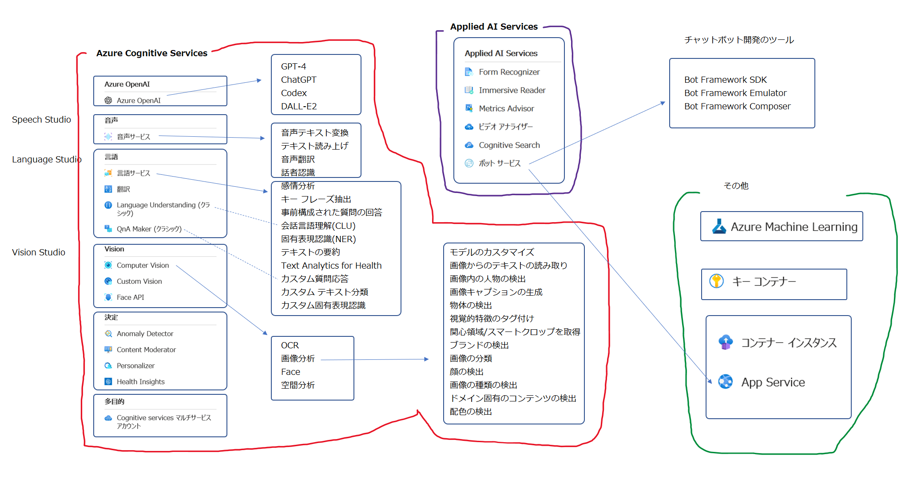

# このコースで学習したサービス・機能のまとめ

■AzureのAIのサービス

- Azure Cognitive Services
- 「責任あるAI」の原則

■機械学習のサービス (AI-102 範囲外)

- Azure Machine Learning

■高度なAI機能を提供するサービス (AI-102 範囲外)

- Azure OpenAI Service
  - GPT-4 (モデル)
  - ChatGPT (モデル)
  - Codex (モデル)
  - DALL-E2 (モデル)

■Azureの基礎

- 認証・承認
  - キー認証
  - トークン認証
  - Azure Active Directory認証＋Azure RBACロールによる承認
    - ユーザー
    - グループ
    - サービスプリンシパル
    - マネージドID
- 機密情報の一元管理
  - Azure Key Vault
    - シークレット（Cognitive Servicesでいう「キー」） / キー / 証明書
- ネットワーク
  - サービスエンドポイント
  - プライベートエンドポイント
- コンテナーでの

■.NET / C#

- .NETの構成
  - ユーザーシークレット
  - 環境変数
  - コンソールアプリ起動時の引数
  - 設定ファイル appsettings.json
- NuGetパッケージ

■基礎的なAI機能を提供するサービス

- Azure Cognitive Services
  - 言語 (カテゴリー) ← Language Studio
    - 言語サービス (リソース)
      - 言語の検出
      - 感情分析
      - キーフレーズ抽出
      - 会話言語理解(CLU) ... 以前の LUIS
      - 固有表現認識(NER)
      - カスタム質問応答 ... 以前の QnA Maker
        - ナレッジベース
    - 翻訳 (リソース)
  - 音声 (カテゴリー) ← Speech Studio
    - 音声サービス (リソース)
      - 音声テキスト変換
      - テキスト読み上げ
  - 視覚 (カテゴリー) ← Vision Studio
    - Computer Vision (リソース)
      - 画像分析
        - 画像の説明
        - 物体の検出
        - ブランドの検出
        - 顔の検出
      - OCR
      - Form Recognizer

※正確にはForm Recognizerは「Applied AI Services」の一部。

■チャットボットの開発と運用

```
Azure Cognitive Services
└言語サービス
  └カスタム質問応答 (以前の QnA Maker): Language Studioで開発
      │ ├チットチャット
      │ └ナレッジベース <--- 外部のFAQページ等
      │
Azure Bot Service
└チャットボット ───── Webチャット
      │
Azure App Serviceアプリ
└チャットボット（実体）: Bot Framework Composerで開発
```

- Bot Framework SDK (チャットボット開発用のライブラリ)
- Bot Framework Emulator (チャットボットのテスト用ツール)

■ドキュメントの検索

- Azure Cognitive Search

■各社クラウドのサービスの比較・全体像

https://atmarkit.itmedia.co.jp/ait/articles/2006/22/news020.html

<!--
■俯瞰図


-->
