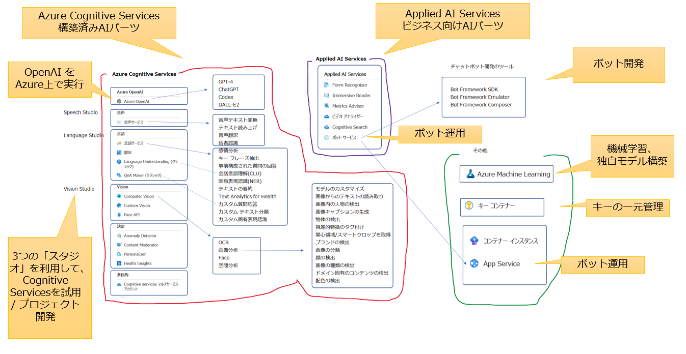

# このコースで学習したサービス・機能のまとめ



■AzureのAIのサービス

- [Azure Cognitive Services](https://learn.microsoft.com/ja-jp/azure/cognitive-services/what-are-cognitive-services)
- [「責任あるAI」の原則](https://learn.microsoft.com/ja-jp/training/modules/responsible-ai-principles/)

■機械学習のサービス (AI-102 範囲外)

- [Azure Machine Learning](https://learn.microsoft.com/ja-jp/azure/machine-learning/overview-what-is-azure-machine-learning?view=azureml-api-2)

■高度なAI機能を提供するサービス (AI-102 範囲外)

- [Azure OpenAI Service](https://learn.microsoft.com/ja-jp/azure/cognitive-services/openai/overview)
  - [GPT-4](https://learn.microsoft.com/ja-jp/azure/cognitive-services/openai/concepts/models#gpt-4-models) (モデル)
  - [ChatGPT](https://learn.microsoft.com/ja-jp/azure/cognitive-services/openai/chatgpt-quickstart?tabs=command-line&pivots=rest-api) (モデル)
  - [Codex](https://learn.microsoft.com/ja-jp/azure/cognitive-services/openai/concepts/models#codex-models) (モデル)
  - [DALL-E2](https://zenn.dev/microsoft/articles/1a15305021cd01#dall-e-2) (モデル)

■Azureの基礎

- Cognitive Servicesでの認証・承認
  - [キー認証](https://learn.microsoft.com/ja-jp/azure/cognitive-services/authentication?tabs=powershell#authenticate-with-a-single-service-subscription-key)
  - [トークン認証](https://learn.microsoft.com/ja-jp/azure/cognitive-services/authentication?tabs=powershell#authenticate-with-an-access-token)
  - [Azure Active Directory認証＋Azure RBACロールによる承認](https://learn.microsoft.com/ja-jp/azure/cognitive-services/authentication?tabs=powershell#authenticate-with-azure-active-directory)
    - [ユーザー](https://learn.microsoft.com/ja-jp/azure/active-directory/fundamentals/how-to-create-delete-users)
    - [グループ](https://learn.microsoft.com/ja-jp/azure/active-directory/fundamentals/concept-learn-about-groups)
    - [サービスプリンシパル](https://learn.microsoft.com/ja-jp/azure/active-directory/develop/howto-create-service-principal-portal)
    - [マネージドID](https://learn.microsoft.com/ja-jp/azure/active-directory/managed-identities-azure-resources/overview)
- 機密情報の一元管理
  - [Azure Key Vault](https://learn.microsoft.com/ja-jp/azure/key-vault/general/basic-concepts)
    - [シークレット](https://learn.microsoft.com/ja-jp/azure/key-vault/secrets/about-secrets)（Cognitive Servicesでいう「キー」） / [キー](https://learn.microsoft.com/ja-jp/azure/key-vault/keys/about-keys) / [証明書](https://learn.microsoft.com/ja-jp/azure/key-vault/certificates/about-certificates)
- 仮想ネットワークからのアクセスに限定する
  - [サービスエンドポイント](https://learn.microsoft.com/ja-jp/azure/virtual-network/virtual-network-service-endpoints-overview)
  - [プライベートエンドポイント](https://learn.microsoft.com/ja-jp/azure/private-link/create-private-endpoint-portal?tabs=dynamic-ip)
- [コンテナーでの運用](https://learn.microsoft.com/ja-jp/azure/cognitive-services/cognitive-services-container-support)
  - [Azure Container Instance](https://learn.microsoft.com/ja-jp/azure/container-instances/container-instances-overview)

<!--
■.NET / C#

- [.NET](https://learn.microsoft.com/ja-jp/dotnet/azure/intro)
- [.NETの構成](https://learn.microsoft.com/ja-jp/dotnet/core/extensions/configuration)
  - [ユーザーシークレット](https://learn.microsoft.com/ja-jp/aspnet/core/security/app-secrets?view=aspnetcore-7.0&tabs=windows#enable-secret-storage)
  - [環境変数](https://learn.microsoft.com/ja-jp/dotnet/core/extensions/configuration-providers#environment-variable-configuration-provider)
  - [コンソールアプリ起動時の引数](https://learn.microsoft.com/ja-jp/dotnet/core/extensions/configuration-providers#command-line-configuration-provider)
  - [設定ファイル appsettings.json](https://learn.microsoft.com/ja-jp/dotnet/core/extensions/configuration-providers#file-configuration-provider)
- [NuGetパッケージ](https://learn.microsoft.com/ja-jp/nuget/what-is-nuget)

-->

■Azure の AI サービス

- [Azure Cognitive Services](https://learn.microsoft.com/ja-jp/azure/cognitive-services/what-are-cognitive-services)
  - 言語 (カテゴリー) ← [Language Studio](https://language.cognitive.azure.com/)
    - 言語サービス (リソース)
      - [言語の検出](https://learn.microsoft.com/ja-jp/azure/cognitive-services/language-service/language-detection/overview)
      - [感情分析](https://learn.microsoft.com/ja-jp/azure/cognitive-services/language-service/sentiment-opinion-mining/overview)
      - [キーフレーズ抽出](https://learn.microsoft.com/ja-jp/azure/cognitive-services/language-service/key-phrase-extraction/overview)
      - [会話言語理解(CLU)](https://learn.microsoft.com/ja-jp/azure/cognitive-services/language-service/conversational-language-understanding/overview) ... 以前の [LUIS](https://learn.microsoft.com/ja-jp/azure/cognitive-services/luis/what-is-luis)
      - [固有表現認識(NER)](https://learn.microsoft.com/ja-jp/azure/cognitive-services/language-service/named-entity-recognition/overview)
      - [質問応答](https://learn.microsoft.com/ja-jp/azure/cognitive-services/language-service/question-answering/overview) ... 以前の [QnA Maker](https://learn.microsoft.com/ja-jp/azure/cognitive-services/qnamaker/overview/overview)
        - ナレッジベース
    - [翻訳](https://learn.microsoft.com/ja-jp/azure/cognitive-services/translator/translator-overview) (リソース)
  - 音声 (カテゴリー) ← [Speech Studio](https://speech.microsoft.com/)
    - 音声サービス (リソース)
      - [音声テキスト変換](https://learn.microsoft.com/ja-jp/azure/cognitive-services/speech-service/speech-to-text)
      - [テキスト読み上げ](https://learn.microsoft.com/ja-jp/azure/cognitive-services/speech-service/index-text-to-speech)
  - 視覚 (カテゴリー) ← [Vision Studio](https://portal.vision.cognitive.azure.com/)
    - Computer Vision (リソース)
      - [画像分析](https://learn.microsoft.com/ja-jp/azure/cognitive-services/computer-vision/overview-image-analysis?tabs=4-0)
        - [画像の説明](https://learn.microsoft.com/ja-jp/azure/cognitive-services/computer-vision/concept-describing-images)
        - [物体の検出](https://learn.microsoft.com/ja-jp/azure/cognitive-services/computer-vision/concept-object-detection)
        - [ブランドの検出](https://learn.microsoft.com/ja-jp/azure/cognitive-services/computer-vision/concept-brand-detection)
        - [顔の検出](https://learn.microsoft.com/ja-jp/azure/cognitive-services/computer-vision/concept-detecting-faces)
      - [OCR](https://learn.microsoft.com/ja-jp/azure/cognitive-services/computer-vision/overview-ocr)
      - [Form Recognizer](https://learn.microsoft.com/ja-jp/azure/applied-ai-services/form-recognizer/overview?view=form-recog-3.0.0) ← [Form Recognizer Studio](https://formrecognizer.appliedai.azure.com/)

※正確にはForm Recognizerは「[Applied AI Services](https://learn.microsoft.com/ja-jp/azure/applied-ai-services/what-are-applied-ai-services)」の一部。

■チャットボットの開発と運用

```
Azure Cognitive Services
└言語サービス
  └カスタム質問応答 (以前の QnA Maker): Language Studioで開発
      │ ├チットチャット
      │ └ナレッジベース <--- 外部のFAQページ等
      │
Azure Bot Service
└チャットボット ───── Webチャット
      │
Azure App Serviceアプリ
└チャットボット（実体）: Bot Framework Composerで開発
```

- [Azure Bot Service](https://learn.microsoft.com/ja-jp/azure/bot-service/)
- [Bot Framework SDK](https://learn.microsoft.com/ja-jp/azure/bot-service/bot-service-overview?view=azure-bot-service-4.0) (チャットボット開発用のライブラリ)
- [Bot Framework Emulator](https://learn.microsoft.com/ja-jp/azure/bot-service/bot-service-debug-emulator?view=azure-bot-service-4.0&tabs=csharp) (チャットボットのテスト用ツール)
- [Bot Framework Composer](https://learn.microsoft.com/ja-jp/power-virtual-agents/advanced-bot-framework-composer)

■ドキュメントの検索

- [Azure Cognitive Search](https://learn.microsoft.com/ja-jp/azure/search/search-what-is-azure-search)

■その他

- [料金計算ツール](https://azure.microsoft.com/ja-jp/pricing/calculator/)
- [イマーシブリーダー](https://www.onenote.com/learningtools)

■おまけ: 各社クラウドのAIサービスの比較・全体像

https://atmarkit.itmedia.co.jp/ait/articles/2006/22/news020.html

<!--
■俯瞰図


-->
