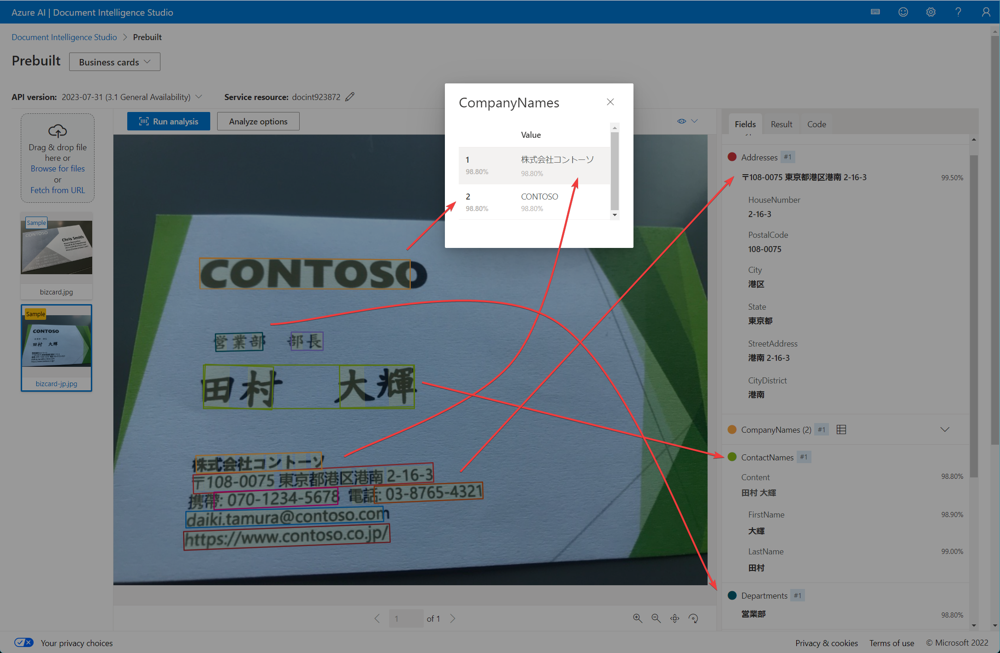

# Azure AI Document Intelligence ソリューションを計画する

※旧名称 「Form Recognizer」。2023年7月、名前が「Azure AI Document Intelligence」に変わった。

## Azure AI Document Intelligenceとは？

Azure AI Document Intelligence を使用することで、特定のドキュメントに含まれる情報をすばやく正確に抽出できる。

たとえばスキャナから読み込んだ領収書の画像などをAzure AI Document Intelligenceで分析することで、領収書に書かれた内容を抽出できる。

手書き・印刷の文字どちらにも対応できる。

文書のデジタル化に役立つ。

## Azure AI Document Intelligence では、どのようなドキュメントから情報を抽出できるのか？

領収書、請求書、納税申告書、パスポート、クレジットカード、契約書、手紙、レポートなどから、情報を抽出できる。

※「カスタムモデル」を利用すると、独自の種類のドキュメントから情報を抽出することもできる。たとえばある企業で使用している独自のフォーマットのアンケート用紙、伝票など。

## Azure AI Document Intelligenceによるドキュメントの読み取り例

以下を参照:
https://learn.microsoft.com/ja-jp/azure/ai-services/document-intelligence/overview?view=doc-intel-4.0.0#models-and-development-options

## Azure AI VisionのOCRとの違い(1)

Azureには多数のAIサービスがあり、その中の一つに「Azure AI Vision」がある。これは画像の分析を行うサービスである。

[Azure AI VisionのOCR（Optical Character Reader）](https://learn.microsoft.com/ja-jp/azure/ai-services/computer-vision/overview-ocr)を使用して、画像から文字情報を読み取ることもできる。

Azure Vision のOCRでは、与えた画像に含まれる文字列が抽出されるが、表などは認識できない。

Azure AI Document Intelligenceでは、ドキュメントに含まれる表などを認識できる。

## Azure AI VisionのOCRとの違い(2)

Azure AI Vision のOCRは「画像に含まれる文字の読み取りを行う」だけ。

Azure AI Document Intelligenceは「画像（ドキュメント）に含まれるデータ構造を認識した高度なデータ抽出を行う」。

たとえば、ある名刺の読み取りを行った場合、「Azure AI VisionのOCR機能」と「Azure AI Document Intelligence」では以下のような結果となる。

- Azure AI VisionのOCR機能:
  - 「○✕株式会社」 ... 文字列
  - 「営業部」 ... 文字列
  - 「山田太郎」 ... 文字列
  - 「090-xxxx-xxxx」 ... 文字列
- Azure AI Document Intelligence: 
  - 会社名:「○✕株式会社」 ... キー(`CompanyNames`)・値のペア`
  - 部署: 「営業部」 ... キー(`Departments`)・値のペア
  - 氏名:「山田太郎」 ... キー(`ContactNames`)・値のペア
  - 電話番号:「090-xxxx-xxxx」 ... キー(`MobilePhones`)・値のペア

Azure AI VisionのOCR機能の場合は、画像の中に含まれる文字を読み取って、0個～複数個の文字列を返す。それぞれの文字列がどのようなデータ項目（会社名、氏名、電話番号など）なのかまでは認識できない。

それに対し、Azure AI Document Intelligenceの場合は、それぞれの文字列がどのようなデータ項目（会社名、氏名、電話番号など）なのかを認識し、キー・値のペアとして情報を返す。したがって、その後のデータ処理（たとえばデータベースへのデータの登録など）がしやすくなる。

## Azure AI VisionのOCRとの違い(3)

https://learn.microsoft.com/en-us/answers/questions/1512283/vision-studio-vs-document-intelligence-studio-ocr

Document Intelligence は、Azure AI Vision よりも高い解像度で読み取りを行うため、より高い精度で文字情報を抽出できる。

## Azure AI VisionのOCRとの違い(4)

Azure AI Vision のOCRでは、モデルのトレーニングはできない。

Azure AI Document Intelligenceでは、モデルのトレーニングを行って、カスタムモデルを構築することで、独自の形式のドキュメント（自社のみで使用している独自の書類・伝票など）に対応することができる。

## Azure AI VisionのOCRとの違い(5)

Azure AI Vision のOCRでは、アドオン（追加機能）は利用できない。

Azure AI Document Intelligenceでは、アドオン（追加機能）を追加することで、数式、バーコード、QRコードなどを抽出することもできる。

## Azure AI VisionのOCRとの違い(6)

[Azure AI Vision のOCRは、 JPEG、PNG、GIF、BMP、WEBP、ICO、TIFF、MPO 形式に対応している。](https://learn.microsoft.com/ja-jp/azure/ai-services/computer-vision/overview-image-analysis?tabs=4-0#input-requirements)

[Azure AI Document Intelligenceは、PDF、JPG、GIF、PNG、BMP、TIFF、HEIF、Word(.docx)、Excel(.xlsx)、PowerPoint(.pptx)、HTMLに対応している。PDFやTIFFの場合、最大2000ページを処理できる](https://learn.microsoft.com/ja-jp/azure/ai-services/document-intelligence/concept-layout?view=doc-intel-4.0.0&tabs=sample-code#input-requirements)

※[HEIF(High Efficiency Image File Format, ヒーフ)](https://ja.wikipedia.org/wiki/High_Efficiency_Image_File_Format)

## 参考: Azure アーキテクチャセンター（ドキュメント）

https://learn.microsoft.com/ja-jp/azure/architecture/data-guide/cognitive-services/vision-api?view=azureml-api-2

Azure AI Vision や Azure AI Document Intelligence を選ぶためのフローチャートが利用できる。

## Azure AI Document Intelligence では、どのような画像データ形式に対応しているのか？

https://learn.microsoft.com/ja-jp/azure/ai-services/document-intelligence/concept-model-overview?view=doc-intel-4.0.0#input-requirements

- PDF
- JPEG
- PNG
- BMP
- TIFF
- [HEIF(High Efficiency Image File Format, ヒーフ)](https://ja.wikipedia.org/wiki/High_Efficiency_Image_File_Format): JPEGに比べ圧縮効率が高い。
- Word (DOCX)
- Excel (XLSX)
- PowerPoint (PPTX)
- HTML

## Azure AI Document Intelligenceを使用するためのAzureリソースは？

Azure AI Document Intelligenceを使用するには、まずAzureサブスクリプション内に「Azure AI Document Intelligence」のリソースを作成する。

東日本リージョン・西日本リージョンを含む、世界60以上のリージョンでリソースを作成できる。

## Azure AI Document Intelligenceの料金は？

リソースを作成する際に「価格レベル」を選択する。それにより、読み取り可能なページ数や料金が異なる。

価格レベル:
- Free F0: 無料
  - 「1ヶ月に500ページまで」といった制限がある。
  - 複数のページから構成されるドキュメントを読み取った際、最初の2ページ分しか処理されない。
  - あとでStandard S0にアップグレードが可能
- Standard S0: 有料
  - 1000ページごとに $1.5 など。
  - ページ数制限なし

詳しくは以下を参照:

- 料金表 https://azure.microsoft.com/ja-jp/pricing/details/ai-document-intelligence/
- Free F0とStandard S0の違い: https://learn.microsoft.com/ja-jp/azure/ai-services/document-intelligence/service-limits?view=doc-intel-4.0.0

## Azure AI Document Intelligenceの「モデル」とは？

一般的に、機械学習の「モデル」とは、分析・分類などを行うための数学的な表現のこと。世の中にはさまざまな「機械学習モデル」が存在する。

Azure AI Document Intelligenceでも、機械学習モデルを使用して、画像から文字情報を読み取る。

Azure AI Document Intelligenceでは、以下の3種類の機械学習モデルが使用される。

- 事前構築済みモデル
- カスタム モデル
- 構成済みモデル

## Azure AI Document Intelligenceの「事前構築済みモデル」とは？

https://learn.microsoft.com/ja-jp/azure/ai-services/document-intelligence/overview?view=doc-intel-4.0.0#prebuilt-models

請求書や領収書、名刺など、一般的な種類のドキュメントを処理するために、事前構築済みモデルのセットが提供されている。

これらのモデルはあらかじめマイクロソフトによってトレーニングが済ませてあるため、ユーザーがトレーニングを実施する必要がない。

## Azure AI Document Intelligenceの「カスタム モデル」とは？

https://learn.microsoft.com/ja-jp/azure/ai-services/document-intelligence/overview?view=doc-intel-4.0.0#custom-models

自社のみで使用している独自の書類・伝票など、事前構築済みモデルでは対応できないドキュメントを読み取るには、カスタム モデルを作成し、それをトレーニングして使用する。

## Azure AI Document Intelligenceの「構成済みモデル」とは？

複数のカスタム モデルで構成されるもの。

ユーザーが構成済みモデルにフォームを送信すると、Document Intelligence はそれを自動的に分類し、その分析においてどのカスタム モデルを使用するべきかを決定する。ドキュメントの種類が事前にわからない場合や、ドキュメントに複数のバリエージョンがある場合に利用する。

1 つの構成済みモデルに、最大で 100 個のカスタム モデルを追加できる。

## APIとは？

一般的にAPI(Application Programming Interface)とは、あるサービスの機能にアクセスするためのしくみ。AzureのサービスのほとんどはAPI経由で利用する。

Azure AI Document IntelligenceのAPIリファレンス:
https://learn.microsoft.com/en-us/rest/api/aiservices/document-models

## SDKとは？

https://learn.microsoft.com/ja-jp/azure/ai-services/document-intelligence/sdk-overview-v4-0

C#などのプログラミング言語からAPIを呼び出すための公式ライブラリ。SDKは内部的にAPIを呼び出して必要な処理を行う。

通常、APIを直接呼び出す（HTTPリクエストを送りHTTPレスポンスを受信する）よりも、SDKを使用したほうが、プログラムコードが簡潔でわかりやすくなり、開発効率が上がり、メンテナンス性も向上するので、実際の開発ではSDKを使用する場合がほとんどである。

Azure AI Document Intelligenceでは以下の言語に対応するSDKが利用できる。

- .NET (C#/F#/Visual Basic)
- Java
- JavaScript
- Python

## SDKの使い方は？

Azure AI Document Intelligenceの「クイックスタート」ページに、各言語のSDKの開始方法が説明されている。
https://learn.microsoft.com/ja-jp/azure/ai-services/document-intelligence/quickstarts/get-started-sdks-rest-api?view=doc-intel-4.0.0&pivots=programming-language-csharp

## Document Intelligence Studioとは？

https://learn.microsoft.com/ja-jp/azure/ai-services/document-intelligence/studio-overview?view=doc-intel-4.0.0

Azure AI Document Intelligence の機能を視覚的に探索、理解するためのオンライン ツール。コードを書かずに、Azure AI Document Intelligenceの一通りの機能を試すことができる。

以下のURLからアクセスできる。
https://documentintelligence.ai.azure.com/studio/
