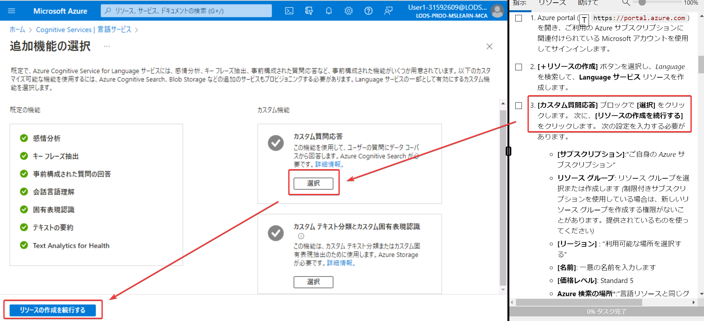

# モジュール2 Azure AI Language を使用して質問応答ソリューションを作成する

```
Azure AI services
├ Azure AI Language
│ ├ Text analysys / テキスト分析 ... M1 (モジュール1)
│ ├ ★ Question Answering / 質問応答 ... M2
│ ├ Conversational Language Understanding (CLU) / 会話言語理解 ... M3
│ ├ Custom text classification / カスタムテキスト分類 ... M4
| └ Custom Named Entity Recognition (NER) / カスタムNER ... M5
├ Azure AI Translator / 翻訳 ... M6
└ Azure AI Speech
  ├ Text-to-speech, Speech-to-Text / 音声認識・テキスト読み上げ ... M7
  └ Speech translation / 音声翻訳 ... M8
```

## 「質問応答」 question answering とは？

https://learn.microsoft.com/ja-jp/azure/cognitive-services/language-service/question-answering/overview

ユーザーからの自然言語による質問を受け付けて、ナレッジ ベース (KB) の情報から最も適切な回答を見つけるサービス。

たとえば、「質問応答」で、「よく寄せられる質問」(Frequently Asked Question, FAQ)を読み取って「ナレッジベース」を構築し、ユーザーからの「ラーニング パスとは何ですか？」といった質問に、ナレッジベースを活用して回答することができる。

## 対応する言語

以下に「サポートされている言語」の一覧がある。日本語にも対応。

https://learn.microsoft.com/ja-jp/azure/ai-services/language-service/question-answering/language-support#languages-supported

## FAQ (Frequently Asked Question)とは？

よく寄せられる質問とその回答。

例: [Microsoft Learn のトレーニングについての「よく寄せられる質問」ページ](https://learn.microsoft.com/ja-jp/training/support/faq)

「質問応答」 question answering では、Webページ上のFAQドキュメント等を読み込んで、自動的にナレッジベースを構築できる。

## 「ナレッジ ベース」とは？

質問と応答のペアの集まり。

FAQ（よくある質問とその回答集）、製品マニュアル、Webページなどをインポートして作成する。

また、質問と応答を手動で追加することもできる。


## 質問応答の利用例

質問応答は、たとえば「チャットボット」と組み合わせて利用できる。

```
ユーザー
↓質問 ↑応答（回答）
Webアプリ / Teams / Slack / Line など
↓ ↑
チャットボット
↓ ↑
AI Services「言語サービス」
└ 質問応答
  └ナレッジベース
```

## 必要なリソース

AI Servicesの「言語サービス」を選び、画面右側の「カスタム質問応答」を「選択」して、リソースを作る。（言語サービスのリソースの一種）


