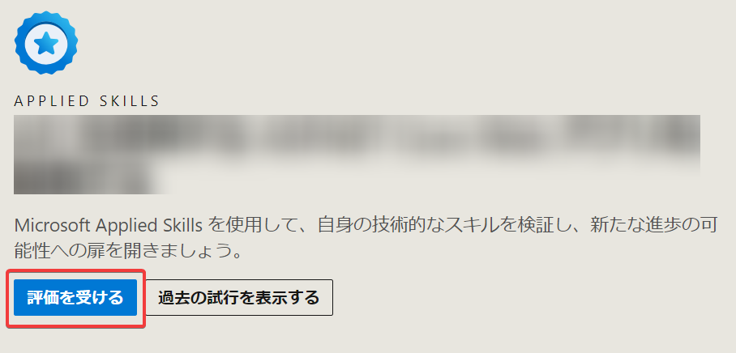
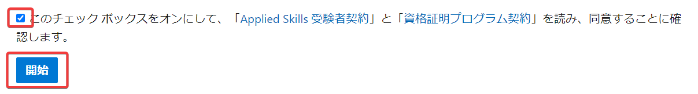
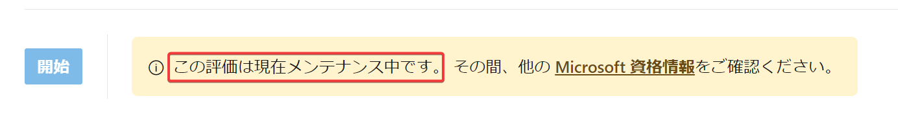

# Microsoft Applied Skills

本コース(AI-3004)は「[Microsoft Applied Skills](https://learn.microsoft.com/ja-jp/credentials/support/appliedskills-process-overview)」の一部です。

## アセスメント（評価）

Microsoft Applied Skillsのコースの内容に対応する、無料のオンライン試験「アセスメント（評価）」に合格することで、「資格証明」を取得し、スキルを証明できます。

「アセスメント（評価）」では、画面内に表示される案内に従い、Azure操作やコードの作成を行います。

以下のページの「評価を受ける」からアセスメント（評価）を受験できます。

https://learn.microsoft.com/ja-jp/credentials/applied-skills/build-azure-ai-vision-solution

## アセスメント（評価）のメンテナンス

アセスメント（評価）はメンテナンスのため開始できない場合があります。再開までしばらくお待ち下さい。

## 「資格証明」の活用方法

「アセスメント（評価）」に合格したら、デジタル証明書やPDFを使用して、資格証明を活用（アピール）できます。

たとえば、LinkedIn で資格証明を共有したり、電子メール署名に資格証明のリンクを追加したりできます。

詳しくは以下のページをご確認ください。

https://learn.microsoft.com/ja-jp/credentials/certifications/cred-share-validate
