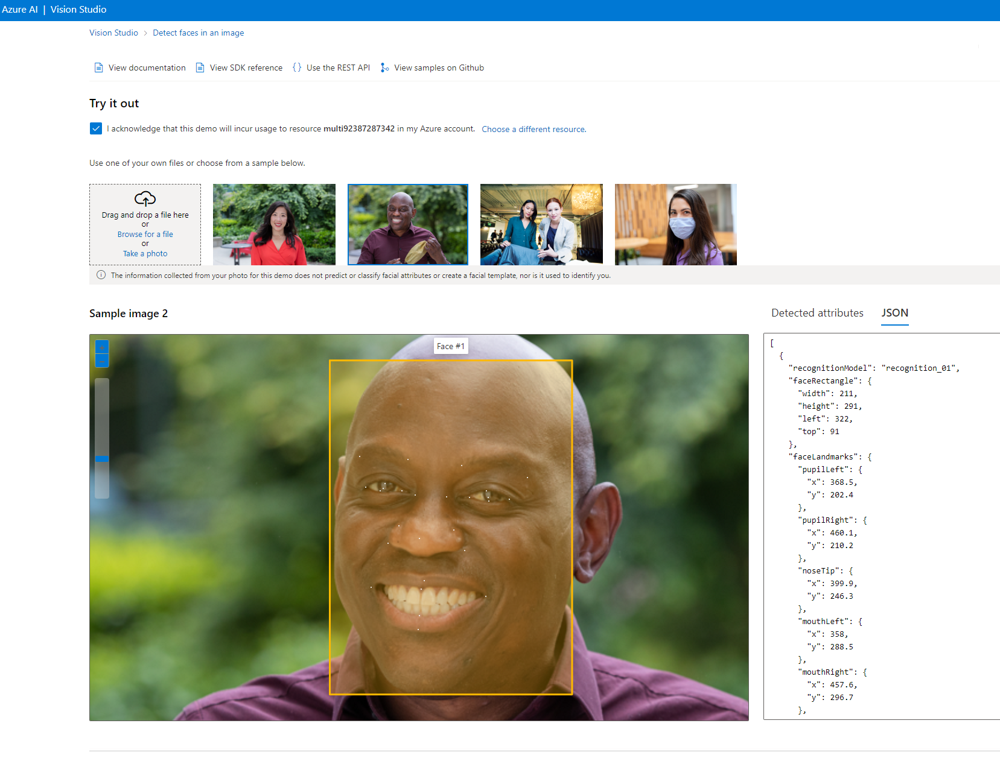
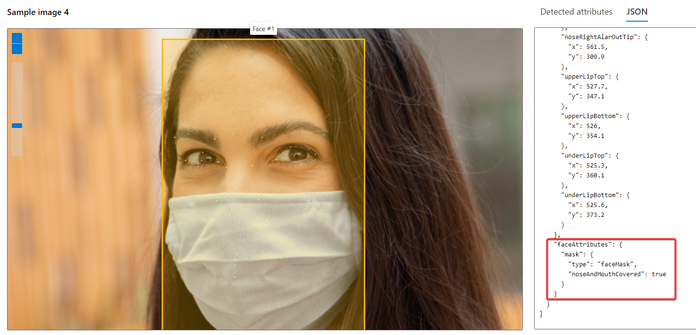

# 顔の検出・分析・認識 - Azure AI Face service

[公式ドキュメント](https://learn.microsoft.com/ja-jp/azure/ai-services/computer-vision/overview-identity)

```
Azure AI services
 └ Azure AI Vision (Computer Vision)
   └ Face service (画像に含まれる人の顔の検出)
      ├ Face detection and analysis （顔検出と分析）
      ├ Liveness detection （ライブネス検出）
      ├ Face recognition （顔認識）
      └ Find similar faces （似た顔の検索）
```

## Face serviceとは？

https://learn.microsoft.com/ja-jp/training/modules/detect-analyze-faces/1-introduction

画像から顔を検出し、顔について分析する（顔や位置を特定したり、特定の人物であるかを判定したりする）サービス。

例1: デバイスのロックを顔認証で解除する。

例2: スマホで撮影された多数の画像を人物別にアルバム化する。

## Face serviceの利用申請

Face serviceは、Microsoft が管理する顧客とパートナーのみが利用できる。

Face serviceを使用するには「利用申請」を行う必要がある。詳しくは「[公式ドキュメント](https://learn.microsoft.com/ja-jp/azure/ai-services/computer-vision/overview-identity)」内で説明されている。

Azureサポートチームによる解説:
https://jpaiblog.github.io/blog/2023/03/14/Register-for-LimitedAccessfeatures-of-FaceAPI/

## 廃止された機能について

以前は、顔の感情、性別、年齢などを検出できた。現在は、これらの属性の検出の機能が廃止された。

https://azure.microsoft.com/ja-jp/updates/facelimitedaccess/

https://azure.microsoft.com/en-us/blog/responsible-ai-investments-and-safeguards-for-facial-recognition/

＞当社は Face API で、感情状態、性別、年齢、笑顔、ひげ、髪、メイクを推測することを目的とする汎用システムをサポートしないことを選択しました。これらの属性の検出は、2022 年 6 月 21 日以降、新規のお客様にはご利用いただけなくなります。また、既存のお客様は、これらの属性が廃止される前に、2023 年 6 月 30 日までに使用を中止する必要があります。

## Face serviceでできること

- 顔検出と分析
- ライブネス検出
- 顔認識
- 似た顔の検索

### 顔検出と分析 - Face detection and analysis

https://learn.microsoft.com/ja-jp/azure/ai-services/computer-vision/concept-face-detection

検出された顔の位置とサイズを取得。目・鼻・口の位置情報も返される。マスクをしているかどうかも判定できる。





### ライブネス検出 - Liveness detection

https://learn.microsoft.com/ja-jp/azure/ai-services/computer-vision/tutorials/liveness

入力ビデオ ストリーム内の顔が実際の (ライブ) か偽の (スプーフィング) かを判断できる。

これは、写真、ビデオ、マスク、またはその他の手段を使用してシステムにアクセスしようとする詐欺師からスプーフィング（なりすまし）攻撃を防ぐために利用できる。

### 顔認識 - Face recognition

https://learn.microsoft.com/ja-jp/azure/ai-services/computer-vision/concept-face-recognition

あらかじめ、顔と名前のデータ（例: Aさん、Bさん、Cさん・・・）を準備し、モデルをトレーニングする。

トレーニングしたモデルに新しい顔の画像を与えると、顔から人物を特定できる。

### 似た顔の検索 - Find similar faces

https://learn.microsoft.com/ja-jp/azure/ai-services/computer-vision/how-to/find-similar-faces?tabs=csharp

ターゲットの顔と、候補となる一連の顔との間で顔照合を行い、ターゲットの顔によく似ている顔を見つける。


※「顔認識」＝「この顔は誰か？」を返す。

※「似た顔の検索」＝「指定した顔に似た顔画像はどれか？」を返す。結果は「似た顔」の画像であって、同一人物の画像とは限らない。また、それが誰なのかはわからない。
