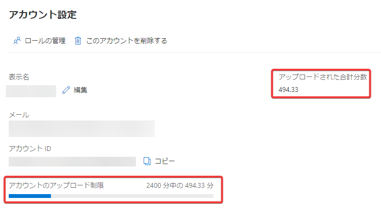
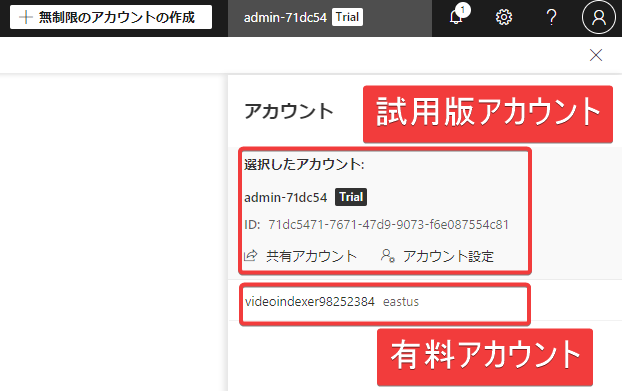
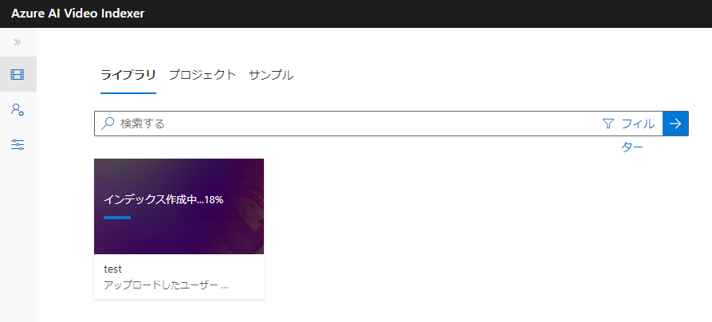
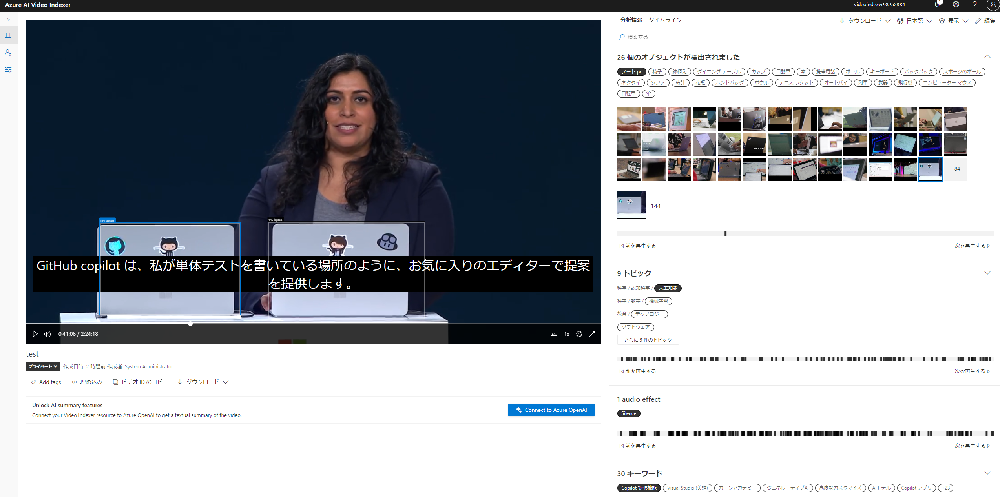
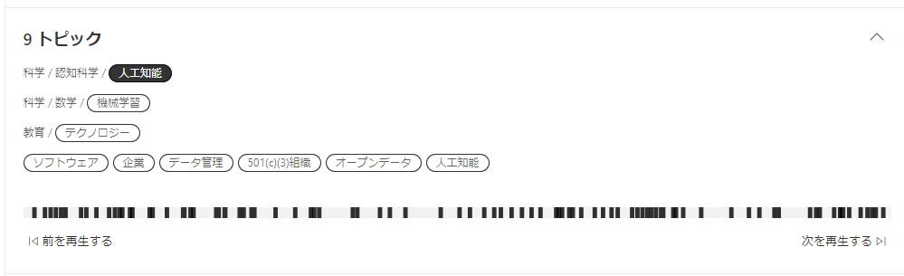
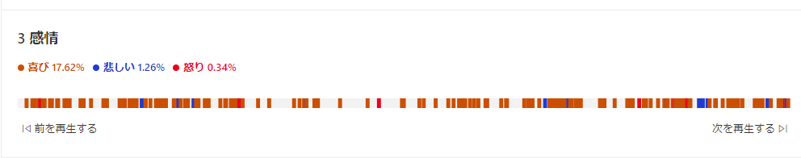
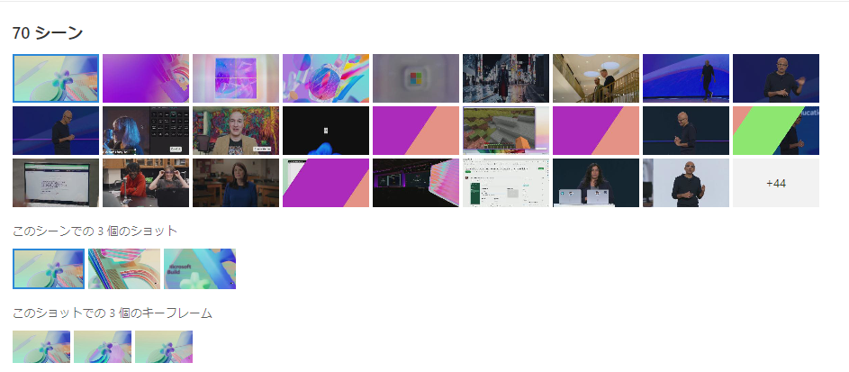
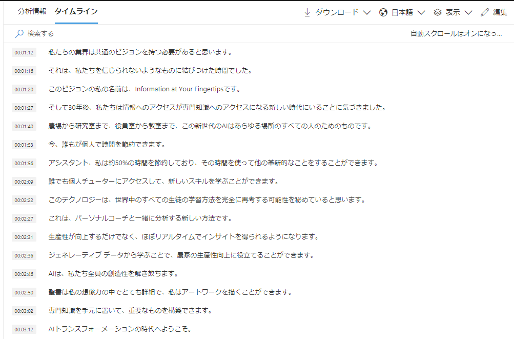

# ビデオ分析 - Azure AI Video Indexer

[公式サイト](https://azure.microsoft.com/ja-jp/products/ai-video-indexer)

[公式ドキュメント](https://learn.microsoft.com/ja-jp/azure/azure-video-indexer/video-indexer-overview)

```
Azure AI services
 └ Azure AI Video Indexer
```
## Azure AI Video Indexerとは？

Azure AI サービスを使用して、ビデオから分析情報を抽出するサービス。

30 個以上の AI モデルを実行することでビデオおよびオーディオ コンテンツを分析する。

## Azure AI Video Indexerの機能

- "顔認識" - 画像内の個人の存在の検出。ビデオに表示される顔を検出し、グループ化。著名人（世界中のリーダー、俳優、アーティスト、アスリート、研究者、ビジネス リーダー、技術リーダーなど。Wikipediaに顔が掲載されているような人物）に関しては名前も検出が可能。
- "光学式文字認識" - ビデオ内のテキストの読み取り。写真、道路標識、商品などの画像からテキストを抽出し、分析情報を作成。
- "音声の文字起こし" - ビデオ内の会話の音声テキストの作成。VTT、TML、SRT という 3 つの形式で字幕を作成できる。複数の言語への翻訳も可能
- "トピック" - ビデオ内で話されている主要なトピックの識別。たとえば"証券取引"、"ウォール街" というキーワードから "経済" というトピックが生成される。
- "センチメント" - ビデオ内のセグメントがどれだけ肯定的か否定的かの分析。「ポジティブ」「ネガティブ」「ニュートラル」の3通りに分析。
- "ラベル" - ビデオ内の主要なオブジェクトやテーマを識別するラベル タグ。
- "シーンのセグメント化" - ビデオの「シーン」（意味的に関連する一連の連続したショット）への分解。たとえば「タクシーに乗るまでのシーン」「タクシー車内のシーン」「タクシーから降りたあとのシーン」など。
- "コンテンツ モデレーション" - ビデオ内の成人向けまたは暴力的なテーマの検出。

## ビデオのサイズ/長さの制限

- ファイル サイズの制限
  - デバイスからファイルをアップロードする場合 2 GB
  - ビデオが URL からアップロードされる場合 30 GB
- ファイルの長さ制限:
  - 4 時間
- サポートされているコーデック
  - [こちらのページを参照](https://learn.microsoft.com/ja-jp/azure/azure-video-indexer/avi-support-matrix#supported-input-video-codecs)

## Azure AI Video Indexerアカウント

https://learn.microsoft.com/ja-jp/azure/azure-video-indexer/create-account?tabs=portal

Azure AI Video Indexer の使用を開始するには、Azure AI Video Indexer アカウントを使用する。3種類のアカウントがある。

「クラシックアカウント」は以前使われていた種類のアカウントで、現在は作成不可となった。

「試用版アカウント」は、リソースを作成する必要がなく、無料で利用できるが、制限がある。

「試用版アカウント」を使い終わったら「有料アカウント」を使用する。

アカウントの種類:

- クラシックアカウント
  - 現在、新規作成は不可
  - 2024/6/30 廃止
- 試用版（無料試用版）アカウント
  - インデックス作成: 最大で2400分
  - Azureサブスクリプション不要
  - 12ヶ月間、使用されていない試用版アカウントは、削除される可能性がある
- 有料アカウント
  - インデックス作成: 無制限
  - Azureサブスクリプションが必要
  - 「Azure AI Video Indexerアカウント」と「ストレージアカウント」を作る

「試用版アカウント」のアップロード制限: 「Azure AI Video Indexer portal」画面の「アカウント設定」で確認できる。



アカウントの切り替え: 「Azure AI Video Indexer portal」画面の右上のユーザー名をクリックして切り替える。



## Azure AI Video Indexerの利用方法

いくつかの利用方法がある。

- Azure AI Video Indexer portal
  - 専用サイト「Azure AI Video Indexer portal」（ https://www.videoindexer.ai/ ）を使用して、動画のアップロード、分析情報の取得などを実行できる。
- API呼び出し（独自アプリからの利用）
  - Azure AI Video Indexerへの動画のアップロード、分析情報の取得などを行うAPIが提供されている。
  - このAPIを呼び出す、独自のアプリを開発できる。
  - つまり、独自のアプリに、ビデオ分析機能を追加できる。
  - C#/Java/Pythonなどのサンプルコードが提供されている。
- Azure Logic Appsからの利用
  - Azure Logic Appsで「Azure AI Video Indexerコネクター」を使用することで、Logic Apps内から動画のアップロード、分析情報の取得などを実行できる。


## Azure AI Video Indexer portalでビデオをアップロードする



ローカルの動画ファイルをアップロードするか、オンラインのURLを指定することで、ビデオをAzure AI Video Indexerにアップロードできる。

アップロードが終わると分析（インデックス作成）が進行する。

2時間のビデオのアップロードに約5分、分析に約30分ほどかかった。

## Azure AI Video Indexer portalでビデオを分析する



ここでは、ビデオに「ノートPC」「椅子」「時計」など26種類のオブジェクトが出現していることが確認できる。また、具体的に「ノートPC」などのオブジェクトが映り込んでいる場所を再生したり、オブジェクトに枠をつけて場所を確認することができる。



トピックとして「人工知能」「機械学習」「テクノロジー」などが検出されている。



感情として「喜び」「悲しみ」「怒り」などが検出されている。



「スピーチのシーン」「ビデオの再生シーン」などのシーンが検出されている。



「タイムライン」では、動画の中の音声の文字起こしを確認できる。この動画の元の音声は英語だが、文字起こしを日本語などに翻訳して表示することもできる。

## 参考: Azure AI Video IndexerのAPI

以下のページからAPIを確認できる。

https://api-portal.videoindexer.ai/

たとえば「Explore APIs」、「Indexing」、「Get Video Index」とたどると、ビデオの分析情報（インデックス）の取得APIの詳細を確認できる。

## 参考: Azure AI Video IndexerのAPIの利用例（サンプルコード）

C#, Java, Python の各言語のサンプルコード（API呼び出しを行うコードの例）が以下から入手できる。

https://github.com/Azure-Samples/azure-video-indexer-samples/tree/master

## 参考: Azure Logic Appsコネクター

https://learn.microsoft.com/ja-jp/azure/azure-video-indexer/logic-apps-connector-arm-accounts

## 参考: テキスト要約 text summarization

https://techcommunity.microsoft.com/t5/ai-azure-ai-services-blog/build-2024-azure-ai-video-indexer-integration-with-language/ba-p/4146320

https://learn.microsoft.com/ja-jp/azure/azure-video-indexer/text-summarization-overview

https://learn.microsoft.com/ja-jp/azure/azure-video-indexer/text-summarization-task?tabs=web

Azure AI Video Indexerと、Azure OpenAI Service（GPT-3.5 / GPT-4）を組み合わせることで、動画のテキストの要約を得ることができるようになった。


<!--

## クイックスタート

Azure AI Video Indexerを使用するための手順は「クイックスタート」のドキュメントで解説されている。

https://learn.microsoft.com/ja-jp/azure/azure-video-indexer/video-indexer-get-started


## 参考: Azure AI Visionの「Video Analysis」

[公式ドキュメント](https://learn.microsoft.com/ja-jp/azure/ai-services/computer-vision/intro-to-spatial-analysis-public-preview?tabs=sa)

```
Azure AI services
 └ Azure AI Vision (Computer Vision)
   └ Video Analysis
```
## Video Analysisでできること

### 空間分析

### ビデオ検索

-->
