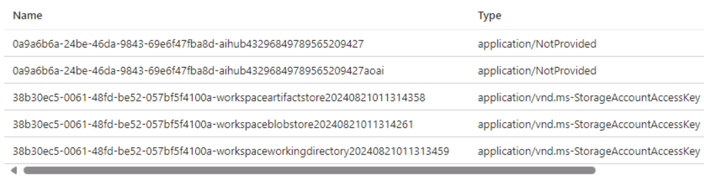

# Azure AI Studio関連リソース

```
Hub
├Project
├ストレージアカウント
└Key Vault
```

## Hub

ハブのリソースのType: `Microsoft.MachineLearningServices/workspaces`, Kind: `Hub` である。

https://learn.microsoft.com/ja-jp/azure/machine-learning/concept-hub-workspace?view=azureml-api-2

## Project

ハブのリソースのType: `Microsoft.MachineLearningServices/workspaces`, Kind: `Project` である。

Azure Machine Learning的には「（プロジェクト）ワークスペース」である。

https://learn.microsoft.com/ja-jp/azure/machine-learning/concept-workspace?view=azureml-api-2

## HubとProject

どちらにもシステム割り当てマネージドIDが割り当てられる。Azure portalのリソースのJSON表示で、マネージドIDの存在が確認できる。

## ストレージアカウント

## Azure Key Vault

ロールベースアクセス制御ではなくVault access policyが使用されている。

HubとProjectに割り当てられたシステム割り当てマネージドIDに対し、キー・シークレット・証明書に対するほぼすべての操作権限が与えられている。

キー・証明書は使用されていない。

シークレットが5個格納されている。


上2つは、Azure AI Servicesリソースのキーが入っている。

下3つは、ストレージアカウントのBlobコンテナーのSASやキーが入っている。

- workspaceartifactstore: BlobコンテナーのSAS
- workspaceblobstore: BlobコンテナーのSAS
- workspaceworkingdirectory: キー1

