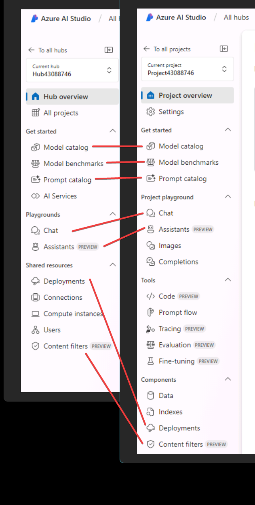

# Azure AI Studio の概要

https://learn.microsoft.com/ja-jp/training/modules/introduction-to-azure-ai-studio/

## Azure AI Studioとは？

- Azure Machine Learning、Azure OpenAI Service、その他の Azure AI サービスの機能を 1 つにまとめたワークスペース(Web ポータル)を提供するサービス
- AI ソリューションを構築できる
- AIソフトウェア開発者向け
- 開発者がデータサイエンティストなどと共同作業がしやすい
- Microsoft Fabric データストア レイクハウス内のデータにシームレスにアクセスできる。
- ChatGPT 以外のモデルも利用できる。

## 料金

Azure AI Studio の利用自体には料金はかからない。

ただし、Azure AI Studioの中で使用されるAzureリソースについては、それぞれ料金がかかる。

## ハブ

AI Studio の主要な最上位レベルの Azure リソース。

セキュリティ設定がハブで共有される。

データコネクションなどの「アーティファクト」が共有される。

- ストレージアカウント
- Azure Key Vault

運用方法

- IT 部門は、チーム用に事前構成された再利用可能な環境 (ハブ) を 1 回で設定できます。 
- その後、チームはそのハブを使用して、AI アプリケーションのプロトタイプ作成、構築、運用のための独自のプロジェクトを作成できます。

## プロジェクト

プロジェクトは、カスタマイズされた AI アプリの構築中に作業を整理し、状態を保存するために使用されます。

## メニューの対比

