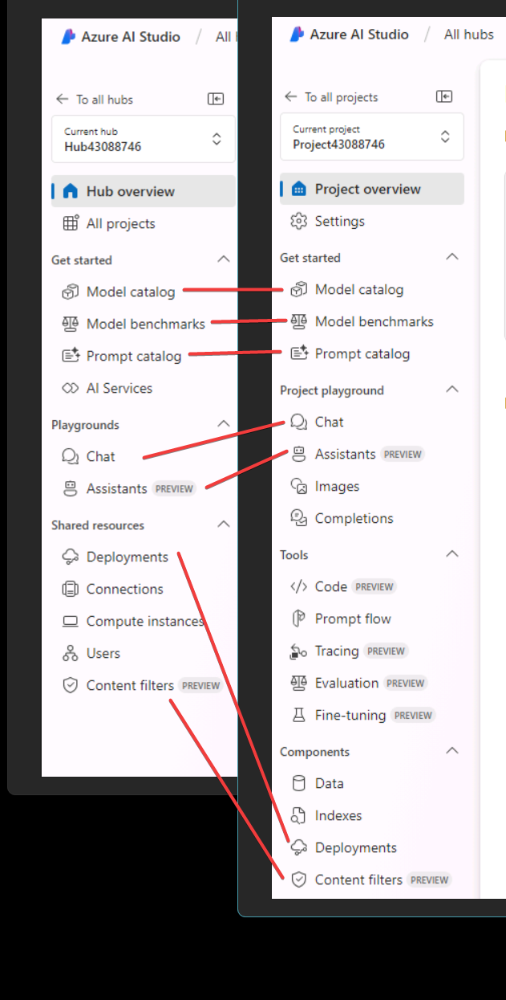

# Azure AI Studio の概要

## ハブ

AI Studio の主要な最上位レベルの Azure リソース。

セキュリティ設定がハブで共有される。

データコネクションなどの「アーティファクト」が共有される。

運用方法

- IT 部門は、チーム用に事前構成された再利用可能な環境 (ハブ) を 1 回で設定できます。 
- その後、チームはそのハブを使用して、AI アプリケーションのプロトタイプ作成、構築、運用のための独自のプロジェクトを作成できます。

## プロジェクト

プロジェクトは、カスタマイズされた AI アプリの構築中に作業を整理し、状態を保存するために使用されます。

## メニューの対比

