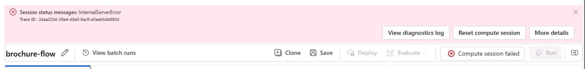
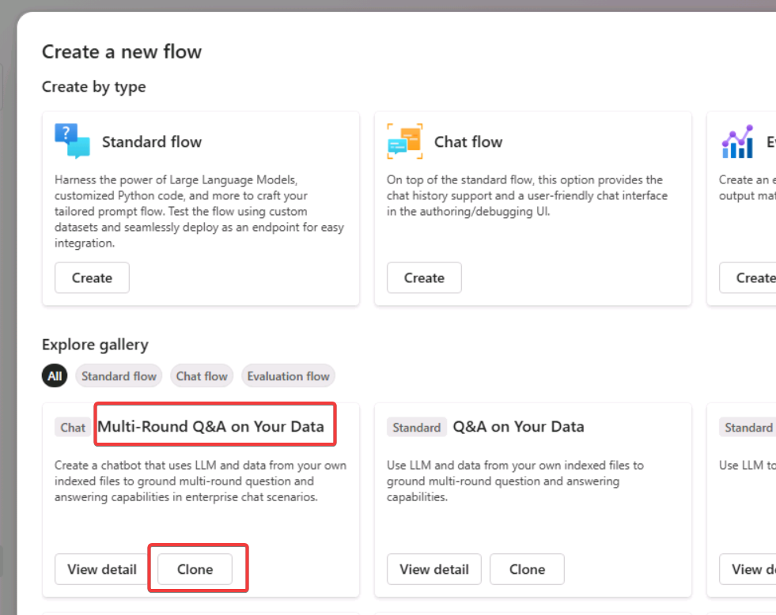
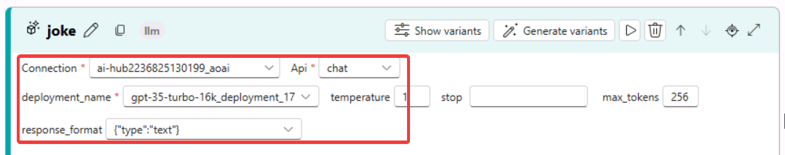
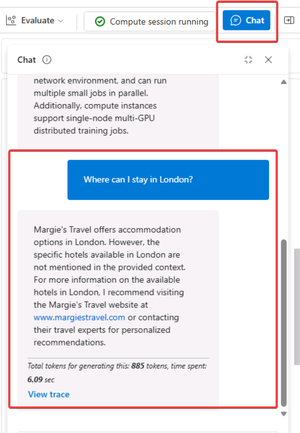

# lab 03: AI Studio

1.5H

## Microsoft Learn

https://learn.microsoft.com/ja-jp/training/modules/build-copilot-ai-studio/5-exercise

## 手順書

https://microsoftlearning.github.io/mslearn-ai-studio/Instructions/04-Use-own-data.html

## 注意

2024/8/11 リソースを `eastus` で作成すると、Prompt flowの Compute sessionの開始に失敗する（InternalServerError）。 `eastus2` ならば問題ない。



`eastus2` では `gpt-35-turbo-16k` のデプロイを作る。`gpt-4o` や `gpt-4o-mini` は使えない。

## 概要 (前半: セットアップ)

- Azure AI Studioで新しい「プロジェクト」を作る
   - Azure AI Searchは新規作成するよう設定
   - ハブ, プロジェクトが作られる
   - プロジェクトに以下のリソースが作成・接続される
     - Azure AI Services
     - Azure AI Search
     - ストレージアカウント
     - Azure Key Vault
- 「プロジェクト」概要画面が表示される
- 「モデルカタログ」からモデルをデプロイする
  - `text-embeddings-ada-002`
  - `gpt-35-turbo-16k`
- データを追加する
    - ブローシャ（パンフレット）をダウンロード: [ZIPファイル](https://github.com/MicrosoftLearning/mslearn-ai-studio/raw/main/data/brochures.zip)
    - Indexes画面からデータをアップロード
    - インデックス作成完了まで待つ（10分ほどかかる）
- Chatプレイグラウンドで検証する
  - Add your dataの設定なし: ニューヨークの宿泊先について具体的な宿泊先情報が返されない
  - Add your dataの設定あり（インデックスを使用）: ニューヨークの宿泊先について具体的な宿泊先情報が返される

## 概要 (後半: Prompt flowの利用)

- Prompt flowを新規作成。Create a new flow画面から「Multi-Round Q&A on Your Data」を選ぶ。
- フローの中（2箇所）にて、Connection, deployment_name, response_format を指定する。
- `Save`で保存する
- 右上の「Chat」ボタンをクリックして、New York、London等への宿泊について聞く。インデックスを使用して、適切な結果が返される。
- デプロイを行う。（Azure Machine Learningのonline deploymentsが作成される。）
- 画面右上のベルマークでデプロイ状況を確認できる。
- 画面左 Components / Deployments の Model deployments でも、デプロイ状況を確認できる
- Components / Deployments で、デプロイされたエンドポイントを選択し、画面上部の「Test」をクリック。ここでデプロイされたPlompt flowをテストできる。


```
The sample prompt flow you are using implements the prompt logic for a chat application in which the user can iteratively submit text input to chat interface. The conversational history is retained and included in the context for each iteration. The prompt flow orchestrate a sequence of tools to:

Append the history to the chat input to define a prompt in the form of a contextualized form of a question.
Retrieve the context using your index and a query type of your own choice based on the question.
Generate prompt context by using the retrieved data from the index to augment the question.
Create prompt variants by adding a system message and structuring the chat history.
Submit the prompt to a language model to generate a natural language response.

使用しているサンプル プロンプト フローは、ユーザーがテキスト入力をチャット インターフェイスに繰り返し送信できるチャット アプリケーションのプロンプト ロジックを実装します。会話履歴は保持され、各反復のコンテキストに含まれます。プロンプト フローは、一連のツールを調整して次の操作を行います。

履歴をチャット入力に追加して、コンテキスト化された質問の形式でプロンプトを定義します。

質問に基づいて、インデックスと独自のクエリ タイプを使用してコンテキストを取得します。

インデックスから取得したデータを使用して質問を拡張し、プロンプト コンテキストを生成します。

システム メッセージを追加してチャット履歴を構造化することで、プロンプトのバリエーションを作成します。

プロンプトを言語モデルに送信して、自然言語応答を生成します。
```