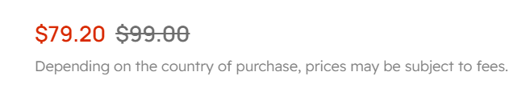
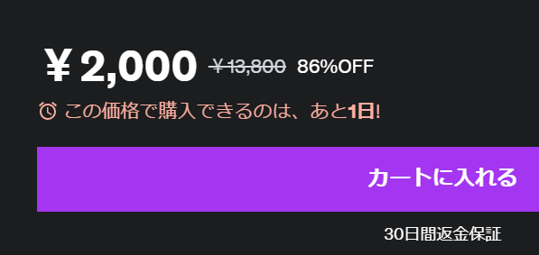

# AZ-104 試験対策

AZ-104の試験・資格と学習方法をご紹介。

■認定試験のメリットは？ 合格すると何が嬉しいの？

参考: [Microsoft認定試験のメリット](https://www.trainocate.co.jp/upload/flyer/flyer_108.pdf)) / [認定プロセスの概要](https://learn.microsoft.com/ja-jp/certifications/certification-process-overview)

- エンジニアとしての信頼感が向上
- 査定・評価が向上
- 転職にも有利
- 自信が持てる

■「認定試験」と「認定資格」

「認定試験」に合格すると「認定資格」が得られる。

```
認定試験: Azure Administrator Associate (AZ-104)

↓合格

認定資格: Microsoft Certified: Azure Administrator Associate
```

■「トレーニングジャーニー」を確認しよう！（無料、公式、英語）

「クラウドITプロフェッショナル向け」「データ&AIプロフェッショナル向け」「開発者向け」などの「トレーニングジャーニー」（学習の道のり）を確認できる。

「何をどの順で学べばよいか」「どんな資格・試験・トレーニングがあるのか」を把握できる。

https://aka.ms/AzureTrainingJourney

[その他の「トレーニングジャーニー（学習の道のり）」のまとめ](../general/training-journey.md)

■他の合格者の体験談を調べよう（無料）

Googleで[「AZ-104 合格」](https://www.google.com/search?q=az-104+%E5%90%88%E6%A0%BC)といったキーワードで検索すると、AZ-104合格者の体験談などがたくさん出てくる。

■Microsoft Learn ラーニングパス内の「知識チェック」を活用しよう！（公式、無料）

試験の詳細ページ（ https://learn.microsoft.com/ja-jp/certifications/exams/AZ-104 ）の下部に、「ラーニングパス」へのリンクがある。

各ラーニングパスには1つ～複数の「モジュール」が含まれている。

ほとんどのモジュールには「知識チェック」が含まれている。これを使用して、各モジュールで学んだ知識を確認できる。

```
ラーニングパス
└モジュール
  ├ユニット1
  ├ユニット2
  ├ユニット3
  ├...
  ├知識チェック
  └まとめ
```

正解・解説表示あり。

例:
https://learn.microsoft.com/ja-jp/training/modules/configure-azure-resources-tools/8-knowledge-check

■「試験準備」動画を活用して学習しよう！（公式、無料、英語）

以下のリンクから「試験準備」動画を視聴できる。

https://learn.microsoft.com/en-us/shows/exam-readiness-zone/preparing-for-az-104-manage-azure-identities-and-governance-1-of-5

全部で5本。試験で問われる重要ポイントの整理、模擬問題の解説など。英語音声だが、日本語字幕を付けて視聴できる。

■「プラクティス評価」を活用して学習しよう！（公式、無料）

https://learn.microsoft.com/ja-jp/certifications/practice-assessments-for-microsoft-certifications

主なAzure認定試験の模擬問題にチャレンジできる。正解・解説表示あり。英語だが、Webブラウザーの翻訳機能を使用して日本語化が可能。

[AZ-104の「プラクティス評価」](https://learn.microsoft.com/ja-jp/certifications/exams/az-104/practice/assessment?assessment-type=practice&assessmentId=21)

■「模擬試験」を活用して学習しよう！（非公式、有料）

**MeasureUp 社が提供する模擬試験の問題は、本番の問題にかなり近い。模擬試験を徹底的に学習または暗記することで、まず間違いなく合格ラインに到達できる。**

https://www.measureup.com/microsoft-practice-test-az-104-microsoft-azure-administrator.html

たまにセールを実施している場合がある。


■Udemyのeラーニング教材を活用しよう（非公式、有料）

いろいろな団体や講師がAZ-104の教材を作成している。

https://www.udemy.com/topic/microsoft-az-104/

品質・価格はさまざま。利用者数、評価、内容のボリュームなどをよく確認して購入。

たまにセールを実施している場合がある。13,800円 → 2,000円 (86% OFF) など、かなり大幅な割引が行われる場合もある。



■「試験サンドボックス」で本番の画面構成に慣れておこう！（公式、無料）

https://aka.ms/examdemo

Microsoftの本番の認定試験の画面構成、画面遷移、出題パターン（多岐選択・穴埋め・並び替えなど）を事前に確認できる。

特に、マイクロソフトの認定試験をまだ受けたことがない場合はおすすめ。

■本番の試験に申し込もう！（有料、割引あり）

https://learn.microsoft.com/ja-jp/certifications/exams/az-104

上記ページの「試験のスケジュール設定」から申し込む。

割引の利用方法: https://aka.ms/lxp-userguide

新宿・銀座・秋葉原などの試験会場に出向いて受験する方法と、自宅などで場所を確保し、ノートPCを使用して受験する方法が選べる。

- 試験会場での受験:
  - メリット:
    - 機材や場所について準備する必要がない
      - 必要なものはすべて会場で準備される
    - 試験時間中、試験に集中できる
  - デメリット:
    - 試験会場への移動が必要（時間と交通費がもったいない）
    - 時期によっては予約が取りにくい場合がある
- 自宅での受験:
  - メリット:
    - 試験会場への移動が必要ない
      - 試験開始ギリギリまで学習できる
    - 予約が取りやすい
  - デメリット:
    - 機材（ノートPC）の準備が必要
    - 受験する部屋の確保が必要
      - 試験中は他人が立ち入らないようにする必要がある

■合格したらアピールしよう！

- 履歴書・名刺などに記載
- LinkedInに「デジタルバッジ」を公開
  - やり方は合格時に送られてくるメールに記載
- ご所属の組織に報告
  - 組織の資格所有者数の増加に貢献

■認定資格を維持しよう！（無料）

https://learn.microsoft.com/ja-jp/certifications/renew-your-microsoft-certification

取得した「認定資格」には有効期限が設定されている。

有効期限が切れる6ヶ月前に、期限を「更新」を行うためのリンクが送られてくるので、忘れずに更新しよう。

更新の際は簡単なWeb試験に合格する必要があるが、もし不合格でも何度もチャレンジできる。

