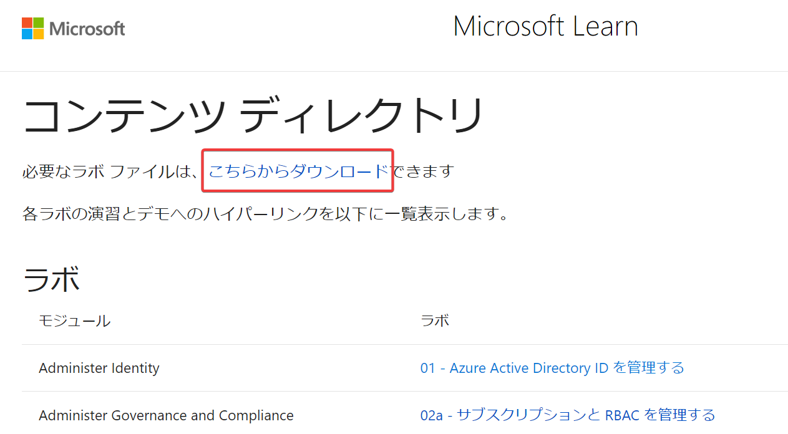
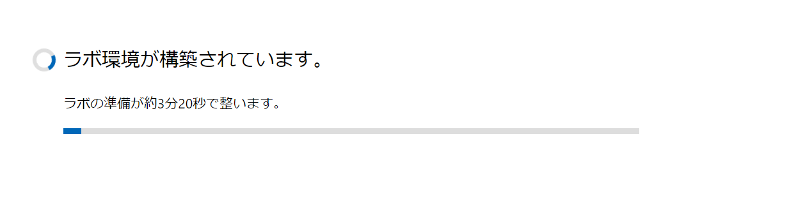
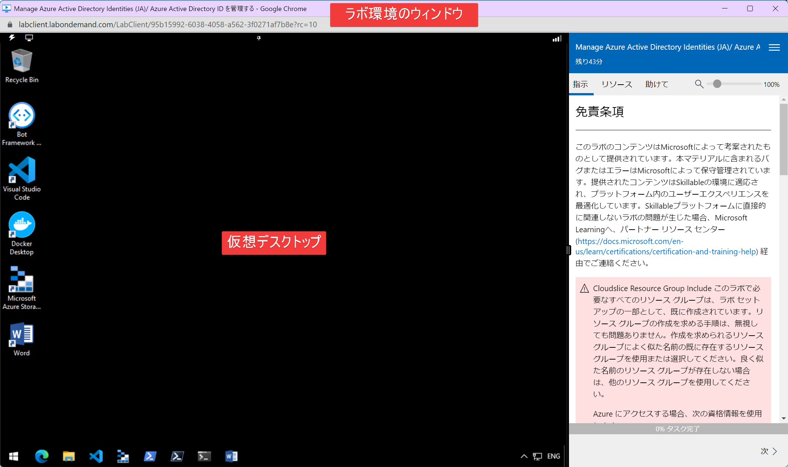
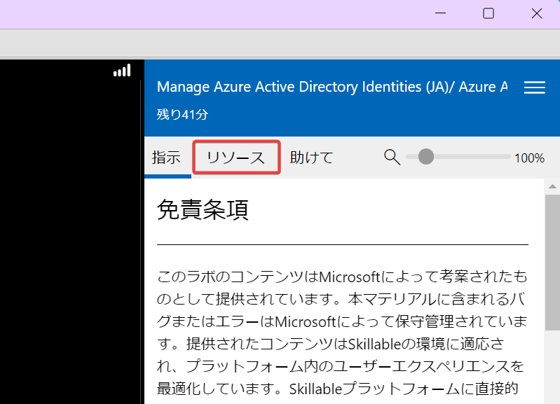
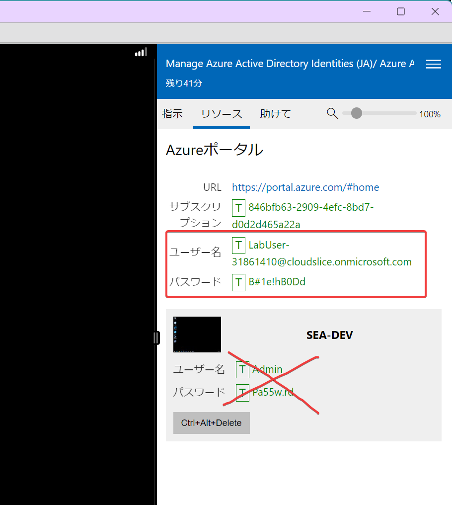
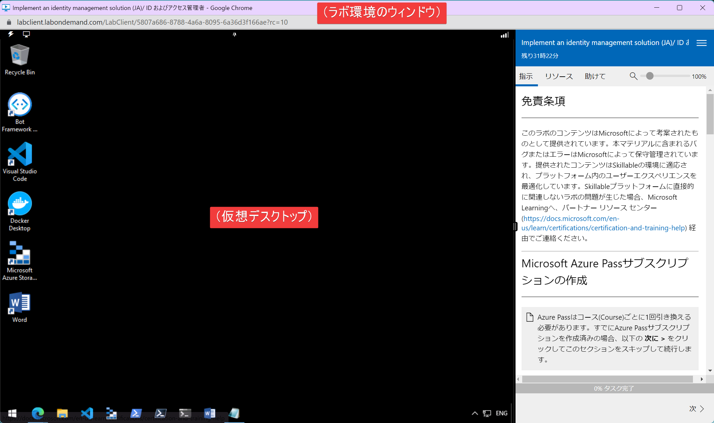
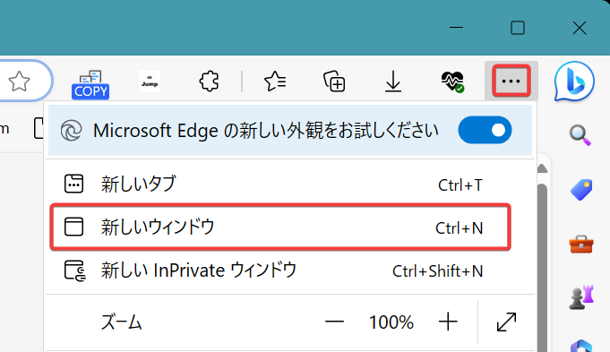
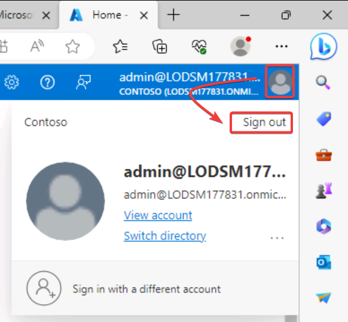
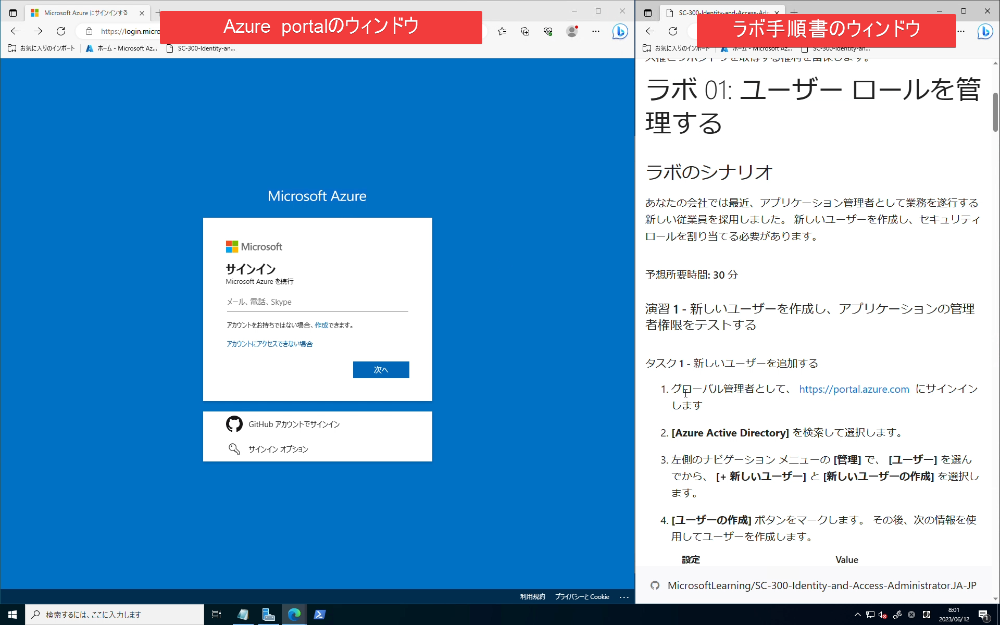

# ラボ環境の利用方法

## ラボの手順書

以下の目次ページから、各ラボの手順書を表示できます。

https://microsoftlearning.github.io/AZ-104-MicrosoftAzureAdministrator.ja-jp/

## ラボで使用するファイル

ラボによっては追加のファイルを使用します。ファイルの利用方法は、ラボの手順書に記載されていますので、その指示に従ってください。

手順書の目次ページの上部のリンク、または https://github.com/MicrosoftLearning/AZ-104-MicrosoftAzureAdministrator/archive/master.zip から、ZIPファイルをダウンロードします。

ダウンロードしたZIPファイルをダウンロードし、展開します。ラボの手順書で指示されるファイルは`AllFiles`フォルダー内にあります。

## ラボ環境の起動

お手元のWebブラウザーで、ラボ環境を開きます。

https://esi.learnondemand.net/

サインイン（Sign In）をクリックします。

Microsoft Account をクリックします。

トレーニング開始時に作成したMicrosoftアカウントを使用してサインインします。

トレーニングの開始時（初日の朝）に、すでに「トレーニングキー」の入力は済んでいますので、AZ-104のクラスが表示されるはずです。まだ「トレーニングキー」の入力をしていない方は、講師までお問い合わせください。

AZ-104のクラスをクリックします。

少し下にスクロールして、ラボを起動（Launchをクリック）します。

実施するラボの番号を確認し、対応するラボ環境を起動してください。

- ラボ1 (ラボ環境1) Manage Azure Active Directory Identities (JA)/ Azure Active Directory ID を管理する
- ラボ2a (ラボ環境2) Manage Subscriptions and RBAC (JA)/ サブスクリプションと RBAC を管理する
- ラボ2b (ラボ環境3) Manage Governance via Azure Policy (JA)/ Azure Policy を介してガバナンスを管理する
- ラボ3a (ラボ環境4) Manage Azure resources by Using the Azure Portal (JA)/ Azure portal を使用して Azure リソースを管理する
- ラボ3b (ラボ環境5) Manage Azure resources by Using ARM Templates (JA)/ ARM テンプレートを使用して Azure リソースを管理する
- ラボ3c (ラボ環境6) Manage Azure resources by Using Azure PowerShell (JA)/ Azure PowerShell を使用して Azure リソースを管理する
- ラボ3d (ラボ環境7) Manage Azure resources by Using Azure CLI (JA)/ Azure CLI を使用して Azure リソースを管理する
- ラボ4 (ラボ環境8) Implement Virtual Networking (JA) バーチャル ネットワークを実装する
- ラボ5 (ラボ環境9) Implement Intersite Connectivity (JA)/ サイト間の接続性 を実装する
- ラボ6 (ラボ環境10) Implement Traffic Management (JA)/ トラフィック管理を実装する
- ラボ7 (ラボ環境11) Manage Azure Storage (JA)/ Azure Storage の管理
- ラボ8 (ラボ環境12) Manage Virtual Machines (JA)/ 仮想マシンの管理
- ラボ9a (ラボ環境13) Implement Web Apps (JA)/ Web Apps の実装
- ラボ9b (ラボ環境14) Implement Azure Container Instances (JA)/ Azure Container Instancesの実装
- ラボ9c (ラボ環境15) Implement Azure Kubernetes Service (JA)/ Azure Kubernetes Service を実装する
- ラボ10 (ラボ環境16) Backup virtual machines (JA)/ データ保護を実装する
- ラボ11 (ラボ環境17) Implement Monitoring (JA)/ モニタリングを実装する

ラボ環境が起動するまで3分ほど待ちます。

3分ほどすると、ラボ環境のウィンドウが表示されます。

ウィンドウの左側は「仮想デスクトップ」になっています。ネットワークなどの状態によって、「仮想デスクトップ」部分がうまく表示されず、「接続の問題」といったエラーメッセージが表示される場合がありますが、それは無視してください。

ラボ環境ウィンドウの右側の「リソース」をクリックします。

ユーザーIDとパスワードの情報（LabUser～）をコピーして、お手元のメモ帳などに記録してください。

ラボの実施中は、このウィンドウは閉じずに、そのままにしておいてください。

## ラボ環境のご注意

ラボ環境は以下のように、ウィンドウの左側に仮想デスクトップ、右側に手順書が表示される構成となっています。

現在、このAZ-104のラボ環境（仮想デスクトップ）では、以下のような問題が発生する場合があります。

- 仮想デスクトップが表示されない
- コピー・ペーストができない
- タイプした文字が二重に打ち込まれる場合がある
  - 例 `azure` → `aazzuurree`
- 日本語が入力できない
- 記号が正しく入力できない
  - 例 `@` → `[`
- 「指示」にラボ手順書が表示されない

そこで、ラボ環境（仮想デスクトップ）ではなく、お手元のPCのWebブラウザーを使用してラボを実施してください。

## ラボの実施

- お手元のPCで、Webブラウザーのウィンドウを2つ開きます。
  - （2つのタブではなく、2つのウィンドウを開きます）

- ウィンドウを左右に並べます。
- 1つのウィンドウ（左）では、Azure portalを開きます。
  - https://portal.azure.com/
  - サインイン画面が表示されます。もし、別のアカウントでサインイン済みになってしまう場合は、画面右上のアイコンをクリックして「サインアウト」を選び、サインアウトして、サインイン画面を表示します。

- もう一つのウィンドウ（右）では、ラボ手順書を開きます。
  - https://microsoftlearning.github.io/AZ-104-Identity-and-Access-Administrator.JA-JP/

- Azure portalのウィンドウにて、さきほどラボ環境からコピーしておいたユーザーIDとパスワードを使用して、Azure portalにサインインします。
- 以降は、画面右側のラボ手順書に従ってラボ（演習）を進めます。
