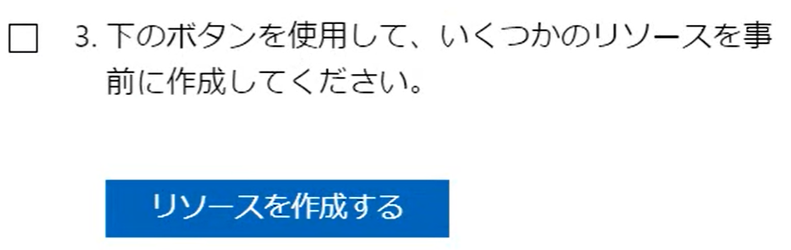

# ラボ 03d - Azure CLI を使用して Azure リソースを管理する

## 動画

ラボの実施手順を記録した動画です。音声はありません。

AZ-104 ラボ03d Azure CLI を使用して Azure リソースを管理する(CloudSlice)
https://youtu.be/hgjwhHOE0q0

## 起動するラボの番号

ラボ7番を起動します。**3番ではありませんのでお気をつけください。**

## ヒント

ラボの開始時、「リソースを作成する」ボタンをクリックしてください。

## 手順書

日本語版:
https://microsoftlearning.github.io/AZ-104-MicrosoftAzureAdministrator.ja-jp/Instructions/Labs/LAB_03d-Manage_Azure_Resources_by_Using_Azure_CLI.html

英語版:
https://microsoftlearning.github.io/AZ-104-MicrosoftAzureAdministrator/Instructions/Labs/LAB_03d-Manage_Azure_Resources_by_Using_Azure_CLI.html