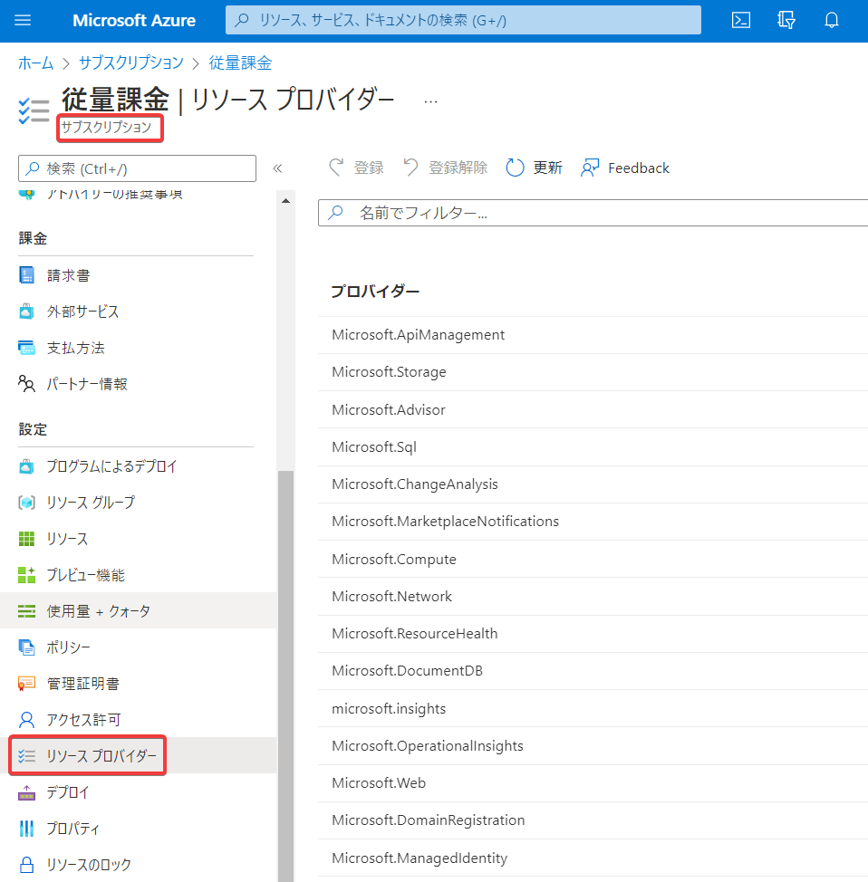
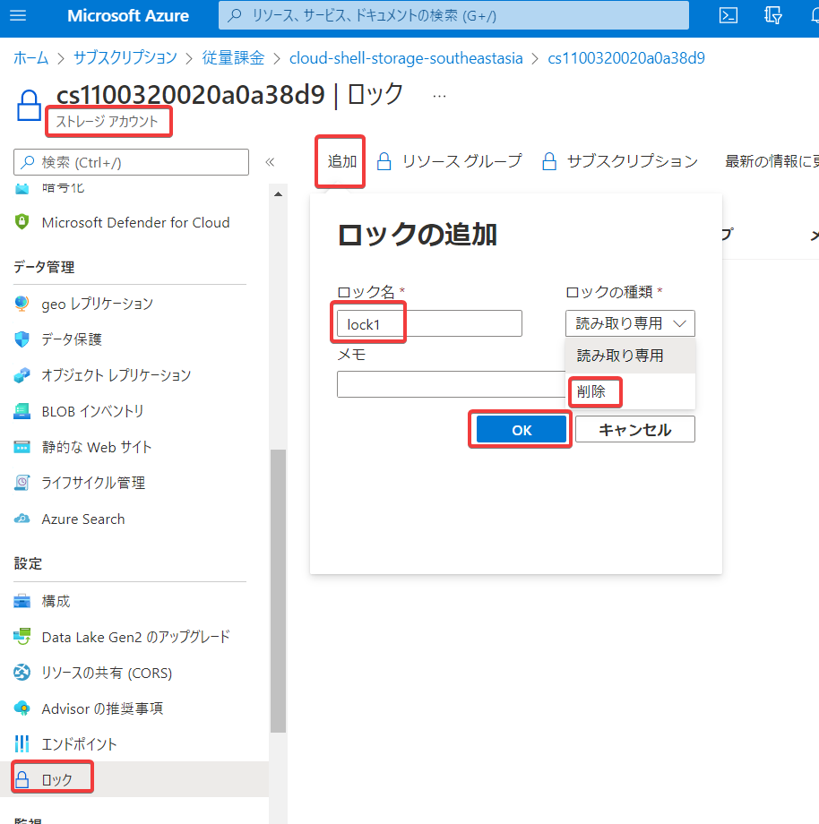
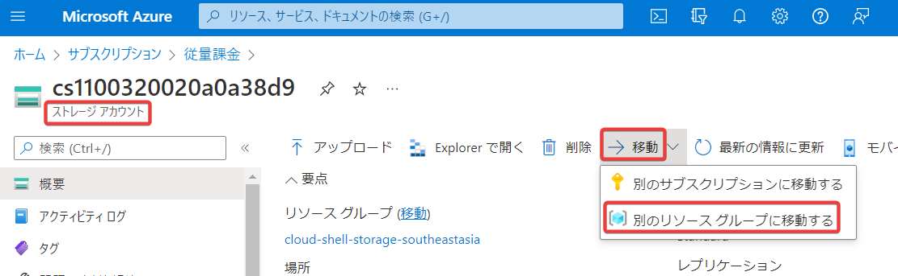
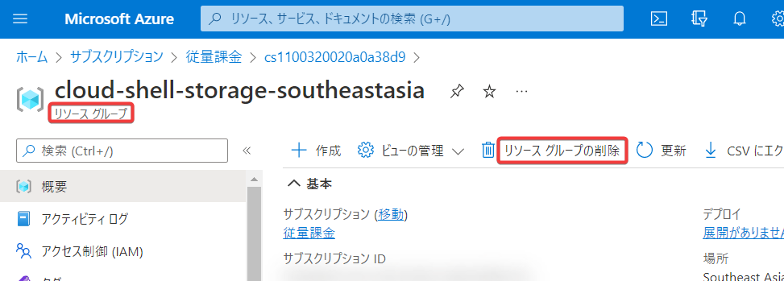
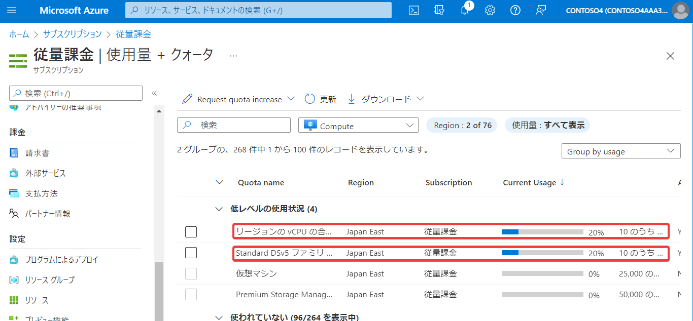
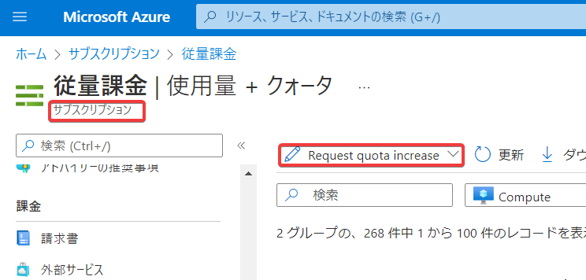

# Azure Resource Manager

Azure Resource Manager(ARM) は、Azureに組み込まれた、リソース管理の仕組みです。

ソリューションのすべてのリソースのデプロイ、更新、または削除を 1 回の連携した操作で行えます。

Azure PowerShell、Azure CLI、Azure portal、REST API、およびクライアント SDK など、どのようなツールを使用しても、Azure Resource Managerがリクエストを処理します。

ARM上のリソースは、ARMテンプレートにエクスポートすることができます。また、テンプレートを使用して、リソースを繰り返しデプロイしたりすることができます。

```
ARMテンプレート
↓デプロイ  ↑エクスポート
リソース（1個～複数個）
```

# リソース プロバイダー

リソースプロバイダーは、リソースとそのオペレーションを管理します。



Azure サブスクリプションにリソース プロバイダーを登録する必要があります。 この手順により、サブスクリプションがリソース プロバイダーと連携するように構成されます。

既定では、多数のリソース プロバイダーが自動的に登録されますので、基本的には手動による操作は不要です。

:blub: たとえば、サブスクリプションから「Microsoft.Compute」の登録を解除し（NotRegistered）、VMをデプロイすると、「Microsoft.Compute」が登録された状態（Registered）となります。

ただし、**一部のリソース プロバイダーについては、手動で登録する必要がある場合があります**。

例：AZ-104のラボ11では、Microsoft.Insights と Microsoft.AlertsManagement の2つのリソース プロバイダーを明示的に登録しています。

:blub: Azure Portalで、サブスクリプションのリソース プロバイダーを確認・登録・解除するには、サブスクリプション＞設定＞リソース プロバイダー を選択します。

参考: [よく使う Resource Provider を Azure サブスクリプションに一括登録するスクリプト](https://blog.shibayan.jp/entry/20210107/1609948542)

# リソース グループ

リソースは、リソース グループ内にデプロイします。

リソース グループには、複数のリソースを含めることができます。

リソース グループのリージョンと、リソース グループに含めるリソースのリージョンは、一致している必要はありません。

```
リソースグループ: 東日本リージョン
└ リソース: 西日本リージョン
```

※リソースそのものは、リソースを作成する際に指定したリージョンに作成されますが、そのリソースの名前などの情報（メタデータ）は、リソースグループに格納されます。

# ロック

リソースグループまたはリソースに対してロックを設定できます。



- 読み取り専用ロック：変更を防ぎます。
- 削除ロック：削除を防ぎます。

たとえば、重要なデータを保管しているストレージアカウントに対して「削除ロック」を設定することで、誤った削除を防ぐことができます。

# リソースの移動

サブスクリプション間で、あるいはリソースグループ間で、リソースを移動することができます。



# リソース と リソース グループの削除

リソースは個別に削除できます。リソースグループを削除すると、リソース グループの中のリソースがすべて削除されます。



# リソースの制限

サブスクリプション単位で、作成できるリソースの数に制限が設けられています。



制限を増やす必要がある場合は、Azure サポートに問い合わせを行います。

