# Azure Portal

URL: http://portal.azure.com/

[ドキュメント](https://docs.microsoft.com/ja-jp/azure/azure-portal/)

Azureの管理画面です。Webブラウザーからアクセスできます。

## メニューを表示

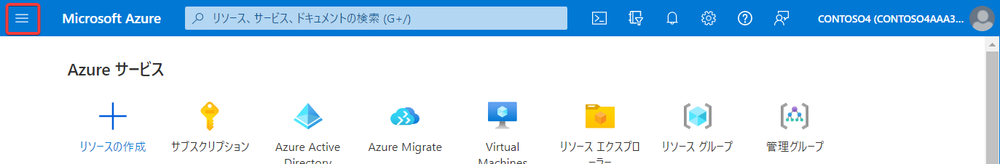

クリックするとメニューが表示されます。

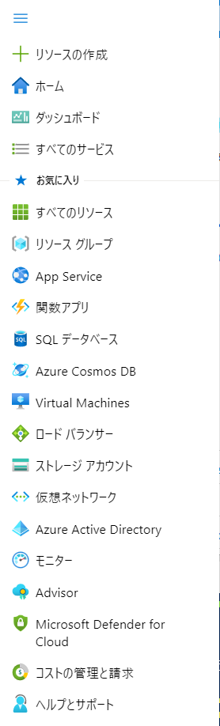

## トップページに戻る

クリックするとAzure portalのトップページに戻ります。

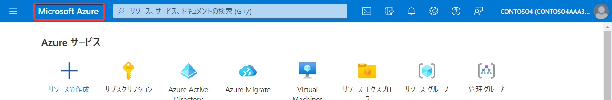

## 検索

ここにテキストを入力して対応する機能やリソースを検索できます。例: 「virtual machines」「ストレージ アカウント」

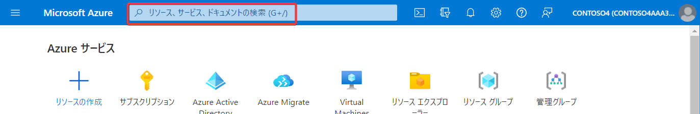

## Cloud Shellを開く

[ドキュメント](https://docs.microsoft.com/ja-jp/azure/cloud-shell/overview)

Azure portalの中でCloud Shellが使用できます。Cloud Shellでは、コマンドを使用した操作が可能です。

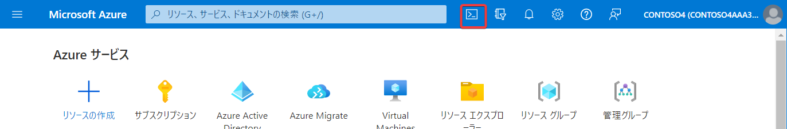

クリックするとCloud Shellが起動します。初回の起動では、「ストレージがマウントされていません」という表示が出ます。「ストレージの作成」をクリックしてください。

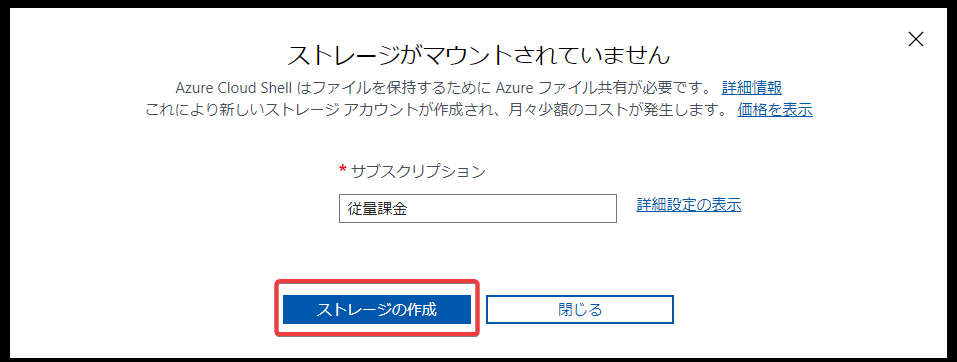

しばらくすると「Bash」または「PowerShell」が起動します。

```
Azure portal
└ Cloud Shell
   ├ PowerShell
   └ Bash
```

## BashからPowerShellへの切り替え

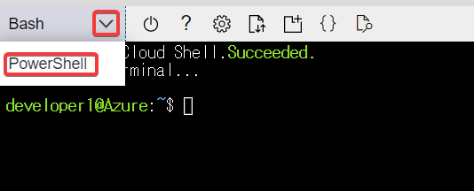

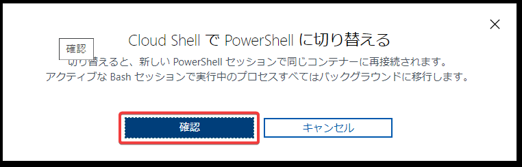

## PowerShellからBashへの切り替え

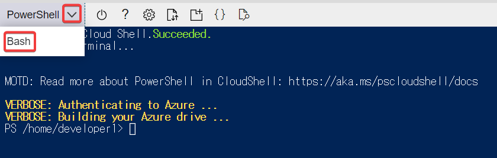


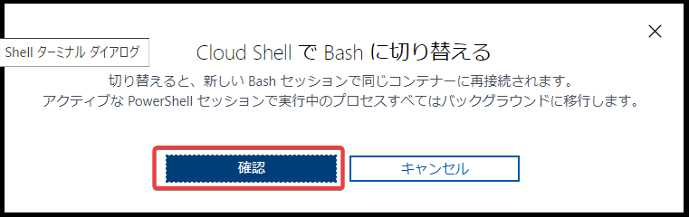

## Cloud Shell用のリソースグループ

Cloud Shellを起動すると、「cloud-shell-storage-southeastasia」というリソースグループが作成されます。Cloud Shellが内部的に使用するリソースが格納されます。これは削除しないでください。

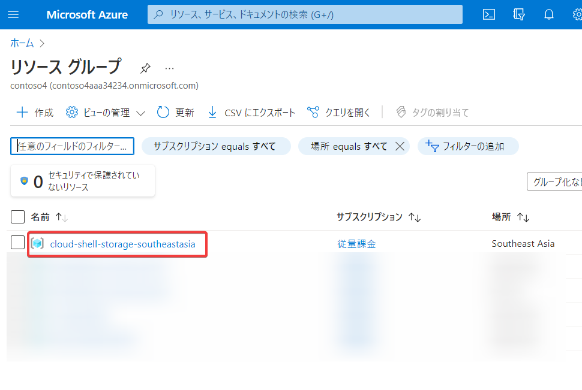

### セッション

Cloud Shellは、20分間操作を行なわないと、切断されてしまい、操作ができなくなります。その場合は「Cloud shellの再起動」（電源ボタン）をクリックすると再接続できます。

## Cloud Shell 発展的な知識

[組み込まれているオープンソースツール](https://docs.microsoft.com/ja-jp/azure/cloud-shell/features#deep-integration-with-open-source-tooling)

[Azure ドライブ](https://docs.microsoft.com/ja-jp/azure/cloud-shell/features#azure-drive-azure)

[clouddriveコマンド](https://docs.microsoft.com/ja-jp/azure/cloud-shell/persisting-shell-storage#clouddrive-commands)

[VNetにCloud Shellをデプロイする](https://docs.microsoft.com/ja-jp/azure/cloud-shell/private-vnet)

[Azure Cloud Shellは今後、Ubuntu 16.04 LTSからDebian 10ベースに切り替え](https://www.atmarkit.co.jp/ait/articles/2012/07/news009.html)

[ローカルDockerでCloud Shellを実行する](https://github.com/Azure/CloudShell)


## 参考

[AzureのCloud Shell (Linux: 2017/5～)](https://www.publickey1.jp/blog/17/azurebashcloud_shellpowershellbuild_2017.html)

[AzureのCloud Shell (PowerShell: 2018/9～)](https://azure.microsoft.com/en-us/updates/powershell-in-azure-cloud-shell-now-generally-available/)

[GCPのCloud Shell（2016/8～）](https://cloudplatform-jp.googleblog.com/2016/08/cloud-shell-ga.html)

[AWSのCloudShell（2020/12～）](https://aws.amazon.com/jp/blogs/news/aws-cloudshell-command-line-access-to-aws-resources/)


