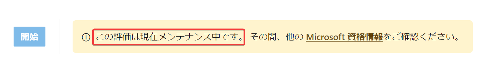

# Microsoft Applied Skills

無料のオンライン・アセスメント（評価）である「[Microsoft Applied Skills](https://learn.microsoft.com/ja-jp/credentials/support/appliedskills-process-overview)」に合格することで、本コースで学習したスキルを証明できる。

## アセスメント（評価）

「アセスメント（評価）」に合格することで、「資格証明」を取得し、スキルを証明できる。

「アセスメント（評価）」では、画面内に表示される案内に従い、Azure操作やコードの作成を行いる。

以下のページの「評価を受ける」からアセスメント（評価）を受験できる。

https://learn.microsoft.com/ja-jp/credentials/applied-skills/develop-ai-agents-using-microsoft-azure-openai-and-semantic-kernel/

## アセスメント（評価）のメンテナンス

アセスメント（評価）はメンテナンスのため開始できない場合がある。

## 「資格証明」の活用方法

「アセスメント（評価）」に合格したら、デジタル証明書やPDFを使用して、資格証明を活用（アピール）できる。

たとえば、LinkedIn で資格証明を共有したり、電子メール署名に資格証明のリンクを追加したりできる。

詳しくは以下のページを確認。

https://learn.microsoft.com/ja-jp/credentials/certifications/cred-share-validate
